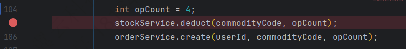

---

Created at: 2024-11-18
Last updated at: 2025-03-08
Source URL: https://vonng.gitbooks.io/ddia-cn/content/ch9.html


---

# 8-分布式事务与Seata


**分布式事务理论**
多个节点达成共识的场景：

* 领导选举
* 原子提交

共识的一般形式是，所有参与者都可以提议，允许就任意一个参与者提出的候选值达成一致。但原子提交的形式化与共识稍有不同，只有一个主节点可以提议，并且只有在所有参与者投票提交的情况下才能提交，如果有任何参与者需要中止，则必须中止。然而，原子提交和共识可以相互简化为对方。
解决原子提交的共识算法是两阶段提交（2PC, two-phase commit）算法。2PC有两种角色：协调者（coordinator）（也称为事务管理器（transaction manager）） 和 参与者（participants）。协调者通常在请求事务的相同应用进程中以库的形式实现（例如，嵌入在Java EE容器中），但也可以是单独的进程或服务。
两阶段分别指 准备阶段 和 提交阶段：

1. 准备阶段：协调者发送一个准备（prepare）请求到每个参与者，询问它们是否能够提交。
2. 提交阶段：
	* 如果所有参与者都回答“是”，表示它们已经准备好提交，那么协调者在阶段 2 发出提交（commit）请求，然后提交真正发生。
	* 如果任意一个参与者回复了“否”，则协调者在阶段2 中向所有节点发送中止（abort）请求。


2PC看上去很简单，以至于你可能会质疑该算法正确性，比如如果在第2阶段向所有参与者发送提交（commit）请求，但是就在此时Database2挂了，或者网络出现了问题，以至于提交请求无法到达Database2，而Database1却已经收到提交请求完成了提交，那么Database1和Database2不就出现了不一致。
理解2PC的关键在于：
协调者发送准备请求，再收到所有参与者的回复之后，会就提交或中止事务作出明确的决定（只有在所有参与者投赞成票的情况下才会提交），协调者必须把这个决定写到磁盘，这被称为**提交点（commit point）**，一旦协调者的决定落盘，就没有回头路了，一定要将提交或回滚的决定发送给所有参与者，如果这个请求失败或超时（比如参与者在此期间崩溃，网络出现问题等），协调者必须永远保持重试，直到成功为止（可以是故障自动恢复，实在不行就人为介入解决问题，反正最后一定要能提交）。
还有一点，如果参与者在准备阶段回复了“是”，那么最终决定如果是“提交”，参与者必须确保在任意情况下可以提交事务，这包括将所有事务数据写入磁盘（出现故障，电源故障，或硬盘空间不足都不能是稍后拒绝提交的理由）以及检查是否存在任何冲突或违反约束。
所以2pc协议包含两个关键的“不归路”点，这两个承诺保证了2PC的原子性，也是理解该协议的关键点：

* 当参与者投票“是”时，它承诺它稍后肯定能够提交（尽管协调者可能仍然选择放弃）。
* 一旦协调者做出决定，这一决定是不可撤销的。协调者把最终的决定写到磁盘这一动作和数据库常规的单点事务提交是一样的，也就是说2PC的提交点归结为协调者上的常规单节点原子提交。

所以上述质疑算法正确性提出问题2pc其实已经解决了。

2pc协议唯一存在的问题是协调者的单点故障问题，如果协调者在准备阶段挂，那些还没有回复是否准备好的参与者还可以通过超时回滚事务，但是那些已经回复可以提交的参与者则因为不知道最终的决定而不得不一直阻塞，既不能提交也不能回滚。如果协调者在提交阶段挂，则所有没有收到最终决定的参与也必须一直阻塞，既不能提交也不能回滚。总的来说就是，任何准备好了但未提交的参与者都会在疑虑中卡死。2pc依赖本地事务，这种存疑的本地事务一直无法提交会使系统性能严重下降的原因就是长事务的危害，长事务会导致锁得不到释放，undo log无法释放等。唯一方法是等待协调者恢复，这就是为什么协调者必须在向参与者发送提交或中止请求之前，将其提交或中止决定写入磁盘上的事务日志：协调者恢复后，通过读取其事务日志来确定所有存疑事务的状态。任何在协调者日志中没有提交记录的事务都会中止。解决这个问题的方法是使用Paxos、Raft等协议实现协调者的高可用。

关于线性一致性：
线性一致性分为写一致和读一致，只有实现了读写一致性才能算实现了线性一致性。数据库会对写加锁，保证不出现脏写，所以写一致性保证了，但是读一致性只在串行化级别才能保证，在读已提交或者快照读级别下是不满足读一致性的。在2pc中也是一样的。

**2pc的实现**
Seata对分布式事务的区分：

* 全局事务（Global Transaction）：也就是整个分布式事务。
* 分支事务（Branch Transaction）：每一个参与者的事务，也被称为本地事务。

Seata中的角色：

* 事务协调者（Transaction Coordinator，TC）：维护全局和分支事务的状态，驱动全局事务提交或回滚。
* 事务管理者（Transaction Manager，TM）：定义全局事务的范围：开始全局事务、提交或回滚全局事务。
* 资源管理者（Resource Manager，RM）：管理分支事务处理的资源，与TC交谈以注册分支事务和报告分支事务的状态，并驱动分支事务提交或回滚。

Seata管理分布式事务的流程：

1. TM告诉TC开启一个分布式事务，TC生成一个代表全局事务的XID
2. 微服务之间的开始调用并传递XID
3. RM收到XID之后向TC注册本地事务
4. TM告诉TC可以提交或者回滚全局事务了（意思是前面的数据库操作已经做完了，现在告诉TC可以开始两阶段提交了。@GlobalTransactional注解标注的方法正常结束的话就可以告诉TC可以提交了，至于最终是否可以提交还要看接下来两阶段的结果，如果方法发生异常，那肯定是直接告诉TC可以回滚了）
5. TC驱动所有分支事务提交或者回滚（TC先询问所有参与者是否准备好了，然后再决定提交或者回滚）

总结来说，Seata把2pc的协调者分成了两个角色，TM和TC，独立TC的进程方便使用Paxos等共识算法实现高可用，分布式事务的提交点肯定是持久化在TC中。

**1、XA**
X/Open XA（扩展架构（eXtended Architecture）的缩写）是跨异构技术实现两阶段提交的标准。许多传统关系数据库（包括PostgreSQL，MySQL，DB2，SQL Server和Oracle）和消息代理（包括ActiveMQ，HornetQ，MSMQ和IBM MQ） 都支持XA。简单理解，XA是参与者实现的协议，异构系统只要实现了XA协议，就能被组合在一个分布式事务中。协调者由应用实现，比如Seata框架。
示例：
用户购买商品的业务逻辑。整个业务逻辑由 3 个微服务提供支持：

1. 仓储服务：对给定的商品扣除仓储数量。
2. 订单服务：根据采购需求创建订单。
3. 帐户服务：从用户帐户中扣除余额。


1、从 https://github.com/apache/incubator-seata/releases,下载服务器软件包，将其解压缩，启动TC：
```
sh seata-server.sh -p 8091 -h 127.0.0.1 -m file
```
2、application.properties
```
seata.application-id=springboot-feign-seata-business
seata.tx-service-group=my_test_tx_group
```
下面是Seata相关的配置文件，具体含义见官网
3、file.conf
4、registry.conf
5、@EnableAutoDataSourceProxy(dataSourceProxyMode = "XA")
```
@SpringBootApplication
@EnableFeignClients
@EnableAutoDataSourceProxy(dataSourceProxyMode = "XA")
public class SpringbootFeignSeataBusinessApplication  {
    public static void main(String[] args) {
        SpringApplication.run(SpringbootFeignSeataBusinessApplication.class, args);
    }
}
```
6、分布式事务发起的地方加上全局事务的注解@GlobalTransactional(timeoutMills = 300000, name = "springboot-feign-seata-xa")
```
@GlobalTransactional(timeoutMills = 300000, name = "springboot-feign-seata-xa")
public void purchase(String userId, String commodityCode, int orderCount, boolean forceRollback) {
    LOGGER.info("purchase begin ... xid: " + RootContext.getXID());
    stockFeignClient.deduct(commodityCode, orderCount);
    orderFeignClient.create(userId, commodityCode, orderCount);
    if (forceRollback) {
        throw new RuntimeException("force rollback!");
    }
}
```
5、在分支事务上加上普通的事务注解@Transactional
```
@Transactional
public void deduct(String commodityCode, int count) {
    LOGGER.info("Stock Service Begin ... xid: " + RootContext.getXID());
    LOGGER.info("Deducting inventory SQL: update stock_tbl set count = count - {} where commodity_code = {}", count,
            commodityCode);
    jdbcTemplate.update("update stock_tbl set count = count - ? where commodity_code = ?",
            count, commodityCode);
    LOGGER.info("Stock Service End ... ");
}
```
XA是强一致的分布式事务的实现方案，在没有收到第二阶段的提交或者回滚请求之前本地事务不会结束，各个参与者对本地资源一直占有，不会释放，性能较低，于是出现牺牲部分一致性换取更高性能的最终一致性方案，最终一致性方案的实现方式很朴素，那就是在准备阶段直接提交本地事务，后续第二阶段如果需要回滚，那就再使用另外一个本地事务进行补偿，所以最终一致性方案也称为补偿性分布式事务，最终一致性允许出现中间状态，也就是不一致的状态，系统最终要达到一致状态。（提交事务的结果有可能通过事后执行另一个补偿事务来取消，但从数据库的角度来看，这是一个单独的事务，因此任何关于跨事务正确性的保证都是应用自己的问题。）XA协议依赖数据库层的实现，但是补偿性分布式事务则完全依赖应用层的实现，最终一致性事务的典型代表是TCC。

**2、TCC模式**
TCC指Try-Confirm-Cancel：

1. Try：对业务资源的检查并预留；
2. Confirm：对业务处理进行提交，即 commit 操作，只要 Try 成功，那么该步骤一定成功；
3. Cancel：对业务处理进行取消，即回滚操作，该步骤回对 Try 预留的资源进行释放。

TCC有三个问题：

1. 空回滚：Try还没执行却执行了Cancel。
2. 悬挂：Cancel都执行了却又执行了迟到的Try。
3. 幂等：Try、Confirm、Cancel三个阶段都有可能重复执行。

解决这三个问题的共同思想是，三个方法都作为本地事务方法，在事务即将结束的时候向数据库日志表中插入一条数据表示本方法已经执行过了，在事务开始的时候首先检查方法有没有执行过。

1. 针对空回滚问题：Cancel方法开始时检查Try方法有没有执行过，如果数据库中存在相同XID的Try方法日志，就表示已经执行过了，此时Cancel方法直接返回，从而避免空回滚。
2. 针对悬挂问题：Try方法开始时检查Cancel方法有没有执行过，如果已经执行过了，则直接返回，避免Try锁定的资源永得不到释放，也即悬挂。
3. 针对幂等问题：Try、Confirm、Cancel三个方法在开始时检查自己有没有执行过，如果执行过就直接返回，从而实现幂等。

Seata的TCC模式：
1、全局事务加@GlobalTransactional
```
@GlobalTransactional
public String doTransactionCommit() {
    //第一个TCC 事务参与者
    boolean result = tccActionOne.prepare(null, 1);
    if (!result) {
        throw new RuntimeException("TccActionOne failed.");
    }
    List<String> list = new ArrayList<>();
    list.add("c1");
    list.add("c2");
    result = tccActionTwo.prepare(null, "two", list);
    if (!result) {
        throw new RuntimeException("TccActionTwo failed.");
    }
    return RootContext.getXID();
}
```
2、分支事务使用@TwoPhaseBusinessAction，TccActionOne是自定义的接口，不是Seata TCC模式所必须的
```
public class TccActionOneImpl implements TccActionOne {
    @Override
    @TwoPhaseBusinessAction(name = "DubboTccActionOne", commitMethod = "commit", rollbackMethod = "rollback")
    public boolean prepare(BusinessActionContext actionContext,@BusinessActionContextParameter(paramName = "a") int a) {
        String xid = actionContext.getXid();
        System.out.println("TccActionOne prepare, xid:" + xid + ", a:" + a);
        return true;
    }
    @Override
    public boolean commit(BusinessActionContext actionContext) {
        String xid = actionContext.getXid();
        Assert.isTrue(actionContext.getActionContext("a") != null);
        System.out.println("TccActionOne commit, xid:" + xid + ", a:" + actionContext.getActionContext("a"));
        ResultHolder.setActionOneResult(xid, "T");
        return true;
    }
    @Override
    public boolean rollback(BusinessActionContext actionContext) {
        String xid = actionContext.getXid();
        Assert.isTrue(actionContext.getActionContext("a") != null);
        System.out.println("TccActionOne rollback, xid:" + xid + ", a:" + actionContext.getActionContext("a"));
        ResultHolder.setActionOneResult(xid, "R");
        return true;
    }
}
```
针对空回滚、悬挂、幂等三个问题，Seata已经自动解决了。

**3、AT模式**
TCC的补偿事务需要用户编写，AT模式则是自动生成回滚SQL，不过自动生成也有一定的限制，并不是所有DML语句都可以生成相应的回滚SQL。AT模式是Seata主推的方式。
AT模式生成的回滚SQL保存在数据库中，需要用户自己创建：
回滚日志表
```
-- 注意此处0.7.0+ 增加字段 context
CREATE TABLE `undo_log` (
  `id` bigint(20) NOT NULL AUTO_INCREMENT,
  `branch_id` bigint(20) NOT NULL,
  `xid` varchar(100) NOT NULL,
  `context` varchar(128) NOT NULL,
  `rollback_info` longblob NOT NULL,
  `log_status` int(11) NOT NULL,
  `log_created` datetime NOT NULL,
  `log_modified` datetime NOT NULL,
  PRIMARY KEY (`id`),
  UNIQUE KEY `ux_undo_log` (`xid`,`branch_id`)
) ENGINE=InnoDB AUTO_INCREMENT=1 DEFAULT CHARSET=utf8;
```
AT模式和TCC一样，也是Try-Cancel-Confirm：

* 一阶段：将业务数据的修改和生成的 UNDO LOG 作为一个事务提交。
* 二阶段-回滚：1.收到 TC 的分支回滚请求，开启一个本地事务，2.通过 XID 和 Branch ID 查找到相应的 UNDO LOG 记录，执行回滚SQL和删除 UNDO LOG 记录，提交本地事务，3.并把本地事务的执行结果（即分支事务回滚的结果）上报给 TC。
* 二阶段-提交：1. 收到 TC 的分支提交请求，把请求放入一个异步任务的队列中，马上返回提交成功的结果给 TC。2. 异步任务批量地删除相应 UNDO LOG 记录。

XA 模式使用起来与 AT 模式基本一致，使用SpringBoot的话把启动类上的@EnableAutoDataSourceProxy(dataSourceProxyMode = "XA")改成"AT"或者不写就行，因为默认值就是AT。
使用官网最普通的AT示例（at-api模块）做如下实验，在全局事务中间打断点， 使其只执行一个分支事务，

然后直接停止程序，这个时候Seata的控制台会一直循环打印error日志，提示重试回滚全局事务失败
```
19:55:45.261 ERROR --- [     RetryRollbacking_1_1] [server.coordinator.DefaultCore] [               error]  [10.55.120.139:8091:588106398957589] : Rollback branch transaction exception, xid = 10.55.120.139:8091:588106398957589 ,branchId = 588106398957590 ,retrying=true ,exception = rm client is not connected. dbkey:jdbc:mysql://127.0.0.1:3306/seata,clientId:api:127.0.0.1:14805, global rollback failed
19:55:45.262 ERROR --- [     RetryRollbacking_1_1] [coordinator.DefaultCoordinator] [leRetryRollbacking$2]  [10.55.120.139:8091:588106398957589] : Failed to retry rollbacking [10.55.120.139:8091:588106398957589] Unknown java.lang.RuntimeException: rm client is not connected. dbkey:jdbc:mysql://127.0.0.1:3306/seata,clientId:api:127.0.0.1:14805
19:55:46.261  INFO --- [     RetryRollbacking_1_1] [.core.rpc.netty.ChannelManager] [          getChannel]  [10.55.120.139:8091:588106398957589] : No channel is available for resource[jdbc:mysql://127.0.0.1:3306/seata] as alternative of api:127.0.0.1:14805
19:55:46.261 ERROR --- [     RetryRollbacking_1_1] [server.coordinator.DefaultCore] [               error]  [10.55.120.139:8091:588106398957589] : Rollback branch transaction exception, xid = 10.55.120.139:8091:588106398957589 ,branchId = 588106398957590 ,retrying=true ,exception = rm client is not connected. dbkey:jdbc:mysql://127.0.0.1:3306/seata,clientId:api:127.0.0.1:14805, global rollback failed
19:55:46.262 ERROR --- [     RetryRollbacking_1_1] [coordinator.DefaultCoordinator] [leRetryRollbacking$2]  [10.55.120.139:8091:588106398957589] : Failed to retry rollbacking [10.55.120.139:8091:588106398957589] Unknown java.lang.RuntimeException: rm client is not connected. dbkey:jdbc:mysql://127.0.0.1:3306/seata,clientId:api:127.0.0.1:14805
19:55:47.261  INFO --- [     RetryRollbacking_1_1] [.core.rpc.netty.ChannelManager] [          getChannel]  [10.55.120.139:8091:588106398957589] : No channel is available for resource[jdbc:mysql://127.0.0.1:3306/seata] as alternative of api:127.0.0.1:14805
19:55:47.261 ERROR --- [     RetryRollbacking_1_1] [server.coordinator.DefaultCore] [               error]  [10.55.120.139:8091:588106398957589] : Rollback branch transaction exception, xid = 10.55.120.139:8091:588106398957589 ,branchId = 588106398957590 ,retrying=true ,exception = rm client is not connected. dbkey:jdbc:mysql://127.0.0.1:3306/seata,clientId:api:127.0.0.1:14805, global rollback failed
```
这个时候数据库处于不一致的状态：库存已经扣除，UNDO LOG表保存着库存扣除的回滚SQL，订单表没有新增记录。此时再次重启程序（注意注释掉重置数据的代码），这时TM和RM重新向TC注册，然后开始驱动事务的回滚，从而保证最终一致性得以实现。这个小实验说明了除非协调者把“提交”的决定写到磁盘，其他情况发生意外一律回滚事务。

**4、可靠消息最终一致性**
可靠消息最终一致性是多个服务之间通过消息队列传递远程调用的消息，这种方案能保证最终一致性的核心原理是消息队列为服务调用提供了一种可靠的通信方式（保证远程调用一定能传递到），而这种可靠通信的实现原理其实是消息队列利用2pc协议完成了生产者和消息队列之间 以及 消费者和消息队列 之间 的原子性。
可能有些消息队列既实现了XA协议又实现了协调者的功能，如果没有实现协调者功能，也可以借助Seata完成。

**5、最大努力通知**
最大努力通知的例子：事务A执行完之后通知事务B执行，事务B最好能执行成功，即使失败了也不要紧，事务A也不必回滚。所以我感觉最大努力通知这种方案应该不能算作是分布式事务的实现方案。

