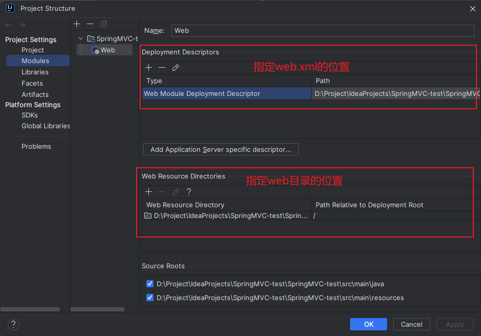

---

Created at: 2024-03-13
Last updated at: 2025-03-08
Source URL: about:blank


---

# 1-理解SpringMVC


**1、理解MVC**
MVC是构建Web应用的一种软件架构，是一种思想，脱离于具体的实现，它将软件按照Model（模型）、View（视图）、Controller（控制器）来划分：

* M：Model，模型层，指承载数据的JavaBean。
* V：View，视图层，指html或jsp等页面，作用是与用户交互，动态地展示Model中的数据。
* C：Controller，控制层，作用是接收请求和响应浏览器。

简单来讲，MVC是指Controller将Model发送给View展示，具体实施时有着不同的实现形式。
通过原始Servlet API构建Web应用时：

* M：仍然是指承载数据的JavaBean（或者说是往Request域中添加的数据）。
* V：是jsp页面，作用是动态地展示Model中的数据（通过转发的方式实现）。
* C：指Servlet。

Controller通过转发的方式将Model发送给View，主要是往Request域中添加数据。
SpringMVC中的MVC也是同样的意思，只不过在具体的实现形式与原始的Servlet有了些许的区别：

* M：指ModelAndView中的Model，同样是承载数据的JavaBean，往Model中添加数据就是在往Request域中添加数据。
* V：指ModelAndView中的View，JSP页面或者Thymeleaf页面，作用是动态地展示Model中的数据。
* C：指Controller。

Controller同样是通过转发将Model送给View。
相比于使用原始的Servlet API，利用SpringMVC构建Web应用更加方便快捷，但他们都是实现MVC的传统架构，在前后端分离架构的背景下MVC有了新的形式：

* M：仍然是指承载数据的JavaBean，但不是将数据添加到Request域转发给View，而是将JavaBean序列化成JSON格式写到Response给View展示。
* V：MVC传统架构下，View在后端服务器通过Java等后端编程语言动态生成，然后写到Response，而在前后端分离架构中，View由前端服务器通过JavaScript语言动态生成响应给浏览器。
* C：仍然是SpringMVC中Controller。

Controller将Model序列化成JSON格式的字符串通过HttpResponse发送给View。

**2、利用SpringMVC构建Web工程**
2.1 引入依赖

* SpringMVC基于Spring，引入spring-webmvc工件之后会引入Spring的依赖。
* SpringMVC只是在Servlet基础之上做了进一步的封装，所以还需要引入Servlet API。
* thymeleaf模版引擎不在spring-webmvc里，需要另外引入（SpringMVC只是保留了模版引擎的调用，并没有强行绑定任何一种模板引擎的实现，所以需要另外引入，此外前后端分离项目并不需要模版引擎这个功能）。

```
<dependencies>
    <!-- SpringMVC -->
    <!-- `SpringMVC基于Spring，引入spring-webmvc工件之后自然会引入Spring的依赖。`-->
    <dependency>
        <groupId>org.springframework</groupId>
        <artifactId>spring-webmvc</artifactId>
        <version>5.3.1</version>
    </dependency>

    <!-- ServletAPI -->
    <!-- SpringMVC只是在Servlet基础之上做了进一步的封装，所以还需要引入Servlet API。-->
    <dependency>
        <groupId>javax.servlet</groupId>
        <artifactId>javax.servlet-api</artifactId>
        <version>3.1.0</version>
        <scope>provided</scope>
    </dependency>

    <!-- Spring5和Thymeleaf整合包 -->
    <dependency>
        <groupId>org.thymeleaf</groupId>
        <artifactId>thymeleaf-spring5</artifactId>
        <version>3.0.12.RELEASE</version>
    </dependency>
</dependencies>
```

2.2 配置Web工程
SpringMVC并不是Web容器，它也没有像后来的SpringBoot那样直接集成一个Web容器，所以利用SpringMVC构建Web工程还需要像传统的Web项目那样配置好Web容器。


2.3 配置web.xml
SpringMVC如何在Servlet基础的封装？简单来说就是把处理请求的逻辑封装在了一个Servlet中，即DispatcherServlet，所以使用SpringMVC之后唯一需要在web.xml里配置的是 DispatcherServlet 的请求路径。

* 也可以在web.xml中配置其他的Servlet，这时DispatcherServlet和其他的Servlet是并列的关系，在Tomcat中的地位相同（或者说都在Tomcat的Map中）。
* DispatcherServlet对象初始化时会初始化IOC容器，所以需要指定Spring的配置文件，Spring配置文件中至少应该指定包扫描的路径，这样才能让IOC容器顺利初始化。

```
<!-- 配置前端控制器 -->
<servlet>
  <servlet-name>dispatcherServlet</servlet-name>
  <servlet-class>org.springframework.web.servlet.DispatcherServlet</servlet-class>
  <!--
  1.指定spring配置文件的位置（ioc、aop和springmvc有关的配置信息），
    如果不指定默认会找 /WEB-INF/(<servlet-name>)-servlet.xml
    ioc容器的初始化是在DispatcherServlet的构造器中调用的，SpringMVC九大组件的初始化都依赖ioc容器
  -->
  <init-param>
    <param-name>contextConfigLocation</param-name>
    <param-value>classpath:springmvc.xml</param-value>
  </init-param>
  <!--
  2.tomcat启动时创建该servlet对象，值越小优先级越高，
    如果不配置，则会在第一次访问请求路径时创建servlet，严重影响第一访问的速度
  -->
  <load-on-startup>1</load-on-startup>
</servlet>
<servlet-mapping>
  <servlet-name>dispatcherServlet</servlet-name>
  <!--
  3.设置访问 DispatcherServlet 的请求路径
  ① / 拦截除 *.jsp 以外的所有请求，也就是当访问地址是以.jsp结尾时，会由tomcat直接返回（即由tomcat默认的JspServlet处理返回），
        而当访问其它不是以.jsp结尾的地址时，tomcat会将请求交给DispatcherServlet
  ② /* 拦截所有请求，*.jsp的请求也会交给DispatcherServlet处理
  -->
  <url-pattern>/</url-pattern>
</servlet-mapping>
```

2.4 SpringMVC配置文件
在SpringMVC的配置文件中指定要扫描哪些包，并向IOC容器中注入Thymeleaf视图解析器ThymeleafViewResolver。
```
<!-- 自动扫描包 -->
<context:component-scan base-package="com.atguigu.mvc.controller"/>

<!-- 配置Thymeleaf视图解析器 -->
<bean id="viewResolver" class="org.thymeleaf.spring5.view.ThymeleafViewResolver">
    <property name="order" value="1"/>
    <property name="characterEncoding" value="UTF-8"/>
    <property name="templateEngine">
        <bean class="org.thymeleaf.spring5.SpringTemplateEngine">
            <property name="templateResolver">
                <bean class="org.thymeleaf.spring5.templateresolver.SpringResourceTemplateResolver">
                    <!-- 视图前缀 -->
                    <property name="prefix" value="/WEB-INF/templates/"/>
                    <!-- 视图后缀 -->
                    <property name="suffix" value=".html"/>
                    <property name="templateMode" value="HTML5"/>
                    <property name="characterEncoding" value="UTF-8" />
                </bean>
            </property>
        </bean>
    </property>
</bean>

<!--
    DispatcherServlet无法处理的资源交给Tomcat默认的Servlet处理，比如处理静态资源：html、js、css、jpg（不能放在/WEB-INF）。
    若只设置该标签，则只能访问静态资源，其他请求则无法访问，必须同时设置<mvc:annotation-driven/>解决问题。
-->
<mvc:default-servlet-handler/>
```
/WEB-INF下的文件无法直接通过浏览器访问，但是可以在服务器端被访问。比如重定向无法访问到/WEB-INF，但是转发可以访问到。

2.5 创建Controller

* @Controller注解：标识类为一个控制层组件。
* @RequestMapping注解：处理请求和控制器方法之间的映射关系。

浏览器请求 localhost:8080/项目名/ 会跳转到 index.html 页面。
```
@Controller
public class HelloController {
    /*
     *  @RequestMapping注解：处理请求和控制器方法之间的映射关系
     *  @RequestMapping注解的value属性用于配置请求地址，/ 表示的当前工程的上下文路径，即 localhost:8080/项目名/
     */
    @RequestMapping("/")
    public String index() {
        //设置视图名称
        return "index";
    }
}
```

2.6 运行流程总结

1. 在启动Tomcat的时候会初始化DispatcherServlet，在DispatcherServlet的初始化方法中会根据Spring的配置文件初始化IOC容器，接着还会将@RequestMapping注解的value属性值与方法放到Map中。
2. 当Tomcat接收到请求，就会找到DispatcherServlet，然后通过Map找到对应的方法，之后调用方法拿到返回值，也就是视图名称，之后视图名称会被视图解析器解析，解析的过程是，视图名称加上前缀和后缀组成视图的路径，通过该路径找到文件，然后像模板引擎会像Tomcat解析JSP页面那样解析页面，最后将解析好了的页面发送给浏览器展示。

