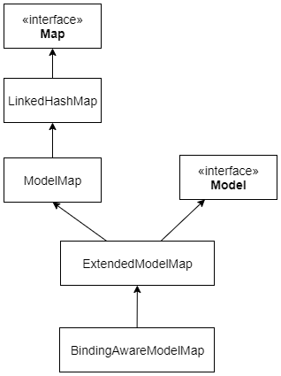

---

Created at: 2024-04-02
Last updated at: 2024-04-07
Source URL: https://blog.csdn.net/abc997995674/article/details/80462450


---

# 5-ModelAndView（域对象共享数据 与 视图）


**一、域对象共享数据（****Model****）**
**1、向request域中对象共享数****据**
1.1 使用ServletAPI向request域共享数据（不常用）
```
@RequestMapping("/testServletAPI")
public String testServletAPI(HttpServletRequest request){
    request.setAttribute("testScope", "hello,servletAPI");
    return "success";
}
```
1.2 使用Model向request域共享数据
```
@RequestMapping("/testModel")
public String testModel(Model model){
    model.addAttribute("testScope", "hello,Model");
    return "success";
}
```
1.3 使用map向request域共享数据
```
@RequestMapping("/testMap")
public String testMap(Map<String, Object> map){
    map.put("testScope", "hello,Map");
    return "success";
}
```
1.4 使用ModelMap向request域共享数据
```
@RequestMapping("/testModelMap")
public String testModelMap(ModelMap modelMap){
    modelMap.addAttribute("testScope", "hello,ModelMap");
    return "success";
}
```
1.5 使用ModelAndView向request域共享数据
```
@RequestMapping("/testModelAndView")
public ModelAndView testModelAndView(){
    /**
     * ModelAndView有Model和View的功能
     * Model用于向请求域共享数据
     * View用于设置视图，实现页面跳转
     */
    ModelAndView mav = new ModelAndView();
    //向请求域共享数据
    mav.addObject("testScope", "hello,ModelAndView");
    //设置视图，实现页面跳转
    mav.setViewName("success");
    return mav;
}
```
1.6 使用@ModelAndAttribute向request域共享数据
被 @ModelAttribute 注解标注的方法会先于同一类中其他@RequestMapping方法执行，这个方法向Model中添加数据就是在向request域共享数据，并且该方法的返回值也会被共享到request域。
```
@ModelAttribute
public void queryBook(ModelMap modelMap){
    Book book = new Book(1, "西游记", "吴承恩", null, 99.9);
    modelMap.put("book", book);
}
```
```
@ModelAttribute
public Book queryBook02(){
    return new Book(1, "西游记", "吴承恩", null, 99.9);
}
```

当使用Model、Map、ModelMap向request域共享数据时，传入的参数的实际类型其实是BindingAwareModelMap，然后在方法中向BindingAwareModelMap添加数据，方法的返回值作为View，之后DispatcherServlet会将BindingAwareModelMap和View组合成ModelAndView实现数据的展示，与最后使用ModelAndView向request域共享数据的方式不谋而合。

**2、向session域共享数据**
2.1 使用ServletAPI向session域共享数据
```
@RequestMapping("/testSession")
public String testSession(HttpSession session){
    session.setAttribute("testSessionScope", "hello,session");
    return "success";
}
```

2.2 使用@SessionAttributes注解（不常用）
@SessionAttributes注解需要标注@Controller类上，SpringMVC会把Model中数据在Session中也保存一份（只是暂时保存在Session中（存入sessionAttributeStore），不是长期保存，在Session中长期保存使用第一种方式）。@SessionAttributes有两个属性：

* value：把Model中特定属性名的数据存到Session中。
* type：把Model中特定类型的数据存到Session中。
* value和type之间是并集关系

例如：

* @SessionAttributes(types=User.class)会将model中所有类型为 User的属性添加到会话中。
* @SessionAttributes(value={“user1”, “user2”}) 会将model中属性名为user1和user2的属性添加到会话中。
* @SessionAttributes(types={User.class, Dept.class}) 会将model中所有类型为 User和Dept的属性添加到会话中。
* @SessionAttributes(value={“user1”,“user2”}, types={Dept.class})会将model中属性名为user1和user2以及类型为Dept的属性添加到会话中。

```
@Controller
@SessionAttributes(value={"user"})
public class UserController {
    @RequestMapping("/testSessionAttributes")
    public String testSessionAttributes(Model model){
        User user = new User("jack","123456");
        model.addAttribute("user", user); //同时会被放到Session域中
        return "success";
    }
}
```

**3、向application域共享数据（不常用）**
```
@RequestMapping("/testApplication")
public String testApplication(HttpSession session){
    ServletContext application = session.getServletContext();
    application.setAttribute("testApplicationScope", "hello,application");
    return "success";
}
```

**二、获取域对象中的数据**
1、@ModelAttribute
被 @ModelAttribute 注解标注的形参可以获取Model中指定的数据，不指定@ModelAttribute 注解的value值，默认使用类名首字母小写后作为key从Model中获取数据。
```
@RequestMapping("/ModelAndView")
public String modelAndViewTest(@ModelAttribute("book") Book book, Model model){
    System.out.println(book);
    return "success";
}
```
注意：

* 不使用@ModelAttribute 注解，如果请求体不能给自定义实体类对象赋值，则也会在Model中再找一找，如果使用了@ModelAttribute则直接在Model中找。
* 从一个Controller方法以转发的方式访问另外一个Controller方法，并不会传递Model，因为在转发之前Model把数据设置到了Request中之后ModelAndView就销毁了，然后每次请求经历到doDispatch方法都会再重新创建ModelAndView，所以@ModelAttribute注解标注在形参上仅仅是用来与@ModelAttribute标注在方法上一起使用的。

**2、@SessionAttribute**
@SessionAttribute注解标注在形参上用于获取Session域中的数据，不指定@SessionAttribute注解的value值，默认使用类名首字母小写后作为key从Session域l中获取数据。
```
@RequestMapping("/addBook02")
public String addBook02(@SessionAttribute("book") Book book) {
    System.out.println(book);
    return "success";
}
```

**三、视图（View）**
**1、****InternalResourceViewResolver**
SpringMVC默认使用InternalResourceViewResolver，在springmvc.xml中配置InternalResourceViewResolver的前后缀（不配置也会有这个Bean，只不过没有前后缀）。
```
<!-- 配置试图解释器，帮我们拼接地址 -->
<bean id="internalResourceViewResolver" class="org.springframework.web.servlet.view.InternalResourceViewResolver">
  <property name="prefix" value="/WEB-INF/pages/"/>
  <property name="suffix" value=".jsp"/>
</bean>
```
然后Controller方法中返回的字符串会作为viewName，也就是jsp页面的名字，视图解析器会拼接前后缀得到jsp页面的路径，即/WEB-INF/pages/viewName.jsp，最后把Model中的数据渲染到view上，然后返回给浏览器。
```
@RequestMapping("/hello")
public String hello(){
    System.out.println("hello springmvc....");
    return "success";
}
```
如果 Controller方法仅仅是用来进行页面跳转，那么可以直接使用view-controller标签进行表示：
```
<!--
    path：设置处理的请求地址
    view-name：设置请求地址所对应的视图名称
-->
<mvc:view-controller path="/hello" view-name="success"></mvc:view-controller>
```
需要注意的是，当SpringMVC中设置任何一个view-controller时，其它Controller中的请求映射将全部失效，此时需要在SpringMVC的核心配置文件中设置开启mvc注解驱动的标签：
```
<mvc:annotation-driven/>
```
jsp页面放在WEB-INF目录是可以直接访问的，不用配置URL与资源路径的映射关系，但是不这样做，反而把jsp页面放在WEB-INF目录下，必须经过DispatcherServlet的转发，这样做的原因是，本来就不应该直接访问jsp页面，因为jsp是动态页面，用来动态地展示数据，直接访问没有携带数据，jsp页面就乱了，所以在直接使用Servlet开发的时候，会让index.jsp页面转发请求到servlet中，现在在SpringMVC中我们就换了一种思路，把jsp页面放在WEB-INF目录下，不让直接访问，必须经过DispatcherServlet的转发，转发一是可以携带数据了，二是可以访问WEB-INF目录下的资源。
如果要转发请求，则为返回的字符串加上前缀forward:
```
/**
* 前缀 forward: 请求转发，不会拼串，从工程路径根开始
*/
@RequestMapping("/forward01")
public String forward01(){
    return "forward:/WEB-INF/pages/success.jsp";
}
```
如果要重定向，则为返回的字符串加上前缀forward:
```
/**
* 前缀 redirect: 请求重定向，不会拼串，也是从工程路径根开始
*/
@RequestMapping("/redirect01")
public String redirect01(){
    return "redirect:/hello";
}
```
DispatcherServlet 1360行的render方法，首先会解析viewName得到View，然后调用View的render方法进行渲染。
```
protected void render(`ModelAndView mv`, HttpServletRequest request, HttpServletResponse response) throws Exception {
    // Determine locale for request and apply it to the response.
    Locale locale =
          (this.localeResolver != null ? this.localeResolver.resolveLocale(request) : request.getLocale());
    response.setLocale(locale);

    View view;
    `String viewName = mv.getViewName();`
    if (viewName != null) {
       // We need to resolve the view name.
       `view = resolveViewName(viewName, mv.getModelInternal(), locale, request); //解析viewName获得View`
       if (view == null) {
          throw new ServletException("Could not resolve view with name '" + mv.getViewName() +
                "' in servlet with name '" + getServletName() + "'");
       }
    }
    else {
       // No need to lookup: the ModelAndView object contains the actual View object.
       view = mv.getView();
       if (view == null) {
          throw new ServletException("ModelAndView [" + mv + "] neither contains a view name nor a " +
                "View object in servlet with name '" + getServletName() + "'");
       }
    }

    // Delegate to the View object for rendering.
    if (logger.isTraceEnabled()) {
       logger.trace("Rendering view [" + view + "] ");
    }
    try {
       if (mv.getStatus() != null) {
          response.setStatus(mv.getStatus().value());
       }
       `view.render(mv.getModelInternal(), request, response); //调用View的render方法进行渲染（渲染的意思是指生成HTML页面）`
    }
    catch (Exception ex) {
       if (logger.isDebugEnabled()) {
          logger.debug("Error rendering view [" + view + "]", ex);
       }
       throw ex;
    }
}
```
resolveViewName方法在DispatcherServlet的1429行，循环调用ViewResolver的resolveViewName方法解析viewName得到View
```
protected View resolveViewName(String viewName, @Nullable Map<String, Object> model,
       Locale locale, HttpServletRequest request) throws Exception {
    if (this.viewResolvers != null) {
       for (ViewResolver viewResolver : this.viewResolvers) {
          `View view = viewResolver.resolveViewName(viewName, locale);`
          if (view != null) {
             return view;
          }
       }
    }
    return null;
}
```
resolveViewName方法先在缓存里找View对象，如果没找到就创建，创建完之后还会放到缓存里。
```
public View resolveViewName(String viewName, Locale locale) throws Exception {
    if (!isCache()) {
       return createView(viewName, locale);
    }
    else {
       Object cacheKey = getCacheKey(viewName, locale);
       View view = this.viewAccessCache.get(cacheKey);
       if (view == null) {
          synchronized (this.viewCreationCache) {
             view = this.viewCreationCache.get(cacheKey);
             if (view == null) {
                // Ask the subclass to create the View object.
                `view = createView(viewName, locale);`
                if (view == null && this.cacheUnresolved) {
                   view = UNRESOLVED_VIEW;
                }
                if (view != null && this.cacheFilter.filter(view, viewName, locale)) {
                   this.viewAccessCache.put(cacheKey, view);
                   this.viewCreationCache.put(cacheKey, view);
                }
             }
          }
       }
       else {
          if (logger.isTraceEnabled()) {
             logger.trace(formatKey(cacheKey) + "served from cache");
          }
       }
       return (view != UNRESOLVED_VIEW ? view : null);
    }
}
```
创建View的关键逻辑，如果以"redirect:"开头则最后创建的是RedirectView，如果以"forward:"开头，最后创建的是InternalResourceView，URL地址就是去掉前缀之后的地址。如果都不是，继续createView。
```
protected View createView(String viewName, Locale locale) throws Exception {
    // If this resolver is not supposed to handle the given view,
    // return null to pass on to the next resolver in the chain.
    if (!canHandle(viewName, locale)) {
       return null;
    }

    // Check for special "redirect:" prefix.
    if (viewName.startsWith(REDIRECT_URL_PREFIX)) {
       String redirectUrl = viewName.substring(REDIRECT_URL_PREFIX.length());
       `RedirectView view = new RedirectView(redirectUrl,`
             isRedirectContextRelative(), isRedirectHttp10Compatible());
       String[] hosts = getRedirectHosts();
       if (hosts != null) {
          view.setHosts(hosts);
       }
       return applyLifecycleMethods(REDIRECT_URL_PREFIX, view);
    }

    // Check for special "forward:" prefix.
    if (viewName.startsWith(FORWARD_URL_PREFIX)) {
       String forwardUrl = viewName.substring(FORWARD_URL_PREFIX.length());
       `InternalResourceView view = new InternalResourceView(forwardUrl);`
       return applyLifecycleMethods(FORWARD_URL_PREFIX, view);
    }

    // Else fall back to superclass implementation: calling loadView.
    return super.createView(viewName, locale);
}
```
createView方法首先创建了一个View，InternalResourceViewResolver创建的是InternalResourceView，然后URL地址是viewName加上前后缀的结果。
```
protected AbstractUrlBasedView buildView(String viewName) throws Exception {
    `AbstractUrlBasedView view = instantiateView();`
    `view.setUrl(getPrefix() + viewName + getSuffix());`
    view.setAttributesMap(getAttributesMap());

    String contentType = getContentType();
    if (contentType != null) {
       view.setContentType(contentType);
    }

    String requestContextAttribute = getRequestContextAttribute();
    if (requestContextAttribute != null) {
       view.setRequestContextAttribute(requestContextAttribute);
    }

    Boolean exposePathVariables = getExposePathVariables();
    if (exposePathVariables != null) {
       view.setExposePathVariables(exposePathVariables);
    }
    Boolean exposeContextBeansAsAttributes = getExposeContextBeansAsAttributes();
    if (exposeContextBeansAsAttributes != null) {
       view.setExposeContextBeansAsAttributes(exposeContextBeansAsAttributes);
    }
    String[] exposedContextBeanNames = getExposedContextBeanNames();
    if (exposedContextBeanNames != null) {
       view.setExposedContextBeanNames(exposedContextBeanNames);
    }

    return view;
}
```
DispatcherServlet1393行调用View的render方法进行渲染。InternalResourceView首先是合并HttpServletRequest和Model中的数据，然后就是将合并后的数据mergedModel在view中展示。
```
public void render(@Nullable Map<String, ?> model, HttpServletRequest request,
       HttpServletResponse response) throws Exception {

    if (logger.isDebugEnabled()) {
       logger.debug("View " + formatViewName() +
             ", model " + (model != null ? model : Collections.emptyMap()) +
             (this.staticAttributes.isEmpty() ? "" : ", static attributes " + this.staticAttributes));
    }

 `Map<String, Object> mergedModel = createMergedOutputModel(model, request, response); //合并HttpServletRequest和Model中的数据`
    prepareResponse(request, response);
    `renderMergedOutputModel(mergedModel, getRequestToExpose(request), response);  //将合并后的数据mergedModel在view中展示`
}
```
InternalResourceView将数据展示到view中的逻辑是，把请求转发给拼接得到的URL地址。这里是重点，**转发之后会重新走Tomcat的servlet-mapping，因为DispatcherServlet不会拦截.jsp的请求，所以会默认交给Tomcat的JspServlet处理，于是就正确地响应了JSP页面。相应地，****RedirectView的渲染逻辑就是重定向。**
```
@Override
protected void renderMergedOutputModel(
       Map<String, Object> model, HttpServletRequest request, HttpServletResponse response) throws Exception {

    // Expose the model object as request attributes.
    exposeModelAsRequestAttributes(model, request);

    // Expose helpers as request attributes, if any.
    exposeHelpers(request);

    // Determine the path for the request dispatcher.
    String dispatcherPath = prepareForRendering(request, response);

    // Obtain a RequestDispatcher for the target resource (typically a JSP).
 `RequestDispatcher rd = getRequestDispatcher(request, dispatcherPath);`
    if (rd == null) {
       throw new ServletException("Could not get RequestDispatcher for [" + getUrl() +
             "]: Check that the corresponding file exists within your web application archive!");
    }

    // If already included or response already committed, perform include, else forward.
    if (useInclude(request, response)) {
       response.setContentType(getContentType());
       if (logger.isDebugEnabled()) {
          logger.debug("Including [" + getUrl() + "]");
       }
       `rd.include(request, response);`
    }

    else {
       // Note: The forwarded resource is supposed to determine the content type itself.
       if (logger.isDebugEnabled()) {
          logger.debug("Forwarding to [" + getUrl() + "]");
       }
       `rd.forward(request, response);`
    }
}
```

**2、ThymeleafViewResolver**
引入thymeleaf视图前需要导入Thymeleaf的包，因为Thymeleaf视图是第三方的，不是SpringMVC自带的：
```
<dependencies>
    <!-- Spring5和Thymeleaf整合包 -->
    <dependency>
        <groupId>org.thymeleaf</groupId>
        <artifactId>thymeleaf-spring5</artifactId>
        <version>3.0.12.RELEASE</version>
    </dependency>
</dependencies>
```
配置Thymeleaf视图解析器
```
<!-- 配置Thymeleaf视图解析器 -->
<bean id="viewResolver" class="org.thymeleaf.spring5.view.ThymeleafViewResolver">
  <property name="order" value="1"/>
  <property name="characterEncoding" value="UTF-8"/>
  <property name="templateEngine">
    <bean class="org.thymeleaf.spring5.SpringTemplateEngine">
      <property name="templateResolver">
        <bean class="org.thymeleaf.spring5.templateresolver.SpringResourceTemplateResolver">
          <!-- 视图前缀 -->
          <property name="prefix" value="/WEB-INF/templates/"/>
          <!-- 视图后缀 -->
          <property name="suffix" value=".html"/>
          <property name="templateMode" value="HTML5"/>
          <property name="characterEncoding" value="UTF-8" />
        </bean>
      </property>
    </bean>
  </property>
</bean>
```
ThymeleafViewResolver的createView方法如果以"redirect:"开头则最后创建的是RedirectView，如果以"forward:"开头，最后创建的是InternalResourceView，URL地址是去掉前缀之后的地址。如果都不是则loadView创建ThymeleafView。最后渲染视图使用的是ThymeleafView的render方法（和jsp页面的解析一样，但是从源码上看这里没有使用转发的方式，而是直接拿Model中的数据渲染，与转发的方式的区别在于，转发相当于在服务器内二次请求了，通过Request对象传递数据。）
```
@Override
protected View createView(final String viewName, final Locale locale) throws Exception {
    // First possible call to check "viewNames": before processing redirects and forwards
    if (!this.alwaysProcessRedirectAndForward && !canHandle(viewName, locale)) {
        vrlogger.trace("[THYMELEAF] View \"{}\" cannot be handled by ThymeleafViewResolver. Passing on to the next resolver in the chain.", viewName);
        return null;
    }
    // Process redirects (HTTP redirects)
    if (viewName.startsWith(REDIRECT_URL_PREFIX)) {
        vrlogger.trace("[THYMELEAF] View \"{}\" is a redirect, and will not be handled directly by ThymeleafViewResolver.", viewName);
        final String redirectUrl = viewName.substring(REDIRECT_URL_PREFIX.length(), viewName.length());
        `final RedirectView view = new RedirectView(redirectUrl, isRedirectContextRelative(), isRedirectHttp10Compatible());`
        return (View) getApplicationContext().getAutowireCapableBeanFactory().initializeBean(view, REDIRECT_URL_PREFIX);
    }
    // Process forwards (to JSP resources)
    if (viewName.startsWith(FORWARD_URL_PREFIX)) {
        // The "forward:" prefix will actually create a Servlet/JSP view, and that's precisely its aim per the Spring
        // documentation. See http://docs.spring.io/spring-framework/docs/4.2.4.RELEASE/spring-framework-reference/html/mvc.html#mvc-redirecting-forward-prefix
        vrlogger.trace("[THYMELEAF] View \"{}\" is a forward, and will not be handled directly by ThymeleafViewResolver.", viewName);
        final String forwardUrl = viewName.substring(FORWARD_URL_PREFIX.length(), viewName.length());
        `return new InternalResourceView(forwardUrl);`
    }
    // Second possible call to check "viewNames": after processing redirects and forwards
    if (this.alwaysProcessRedirectAndForward && !canHandle(viewName, locale)) {
        vrlogger.trace("[THYMELEAF] View \"{}\" cannot be handled by ThymeleafViewResolver. Passing on to the next resolver in the chain.", viewName);
        return null;
    }
    vrlogger.trace("[THYMELEAF] View {} will be handled by ThymeleafViewResolver and a " +
                    "{} instance will be created for it", viewName, getViewClass().getSimpleName());
    return `loadView(viewName, locale);`
}
```

**3、自定义视图解析器**
还可以自定义视图（View）和视图解析器（ViewResolver）
```
/**
* 自定义视图解析器MyViewResolver解析自定义的前缀，创建自定义视图MyView
*/
public class MyViewResolver implements ViewResolver, Ordered {

    Integer order;

    /**
     * 解析自定义的前缀
     * @param viewName 视图名，传进来的是ModelAndView的view，也就是方法的返回值
     */
    @Override
    public View resolveViewName(String viewName, Locale locale) throws Exception {
        if (viewName.startsWith("myPrefix:")) {
            String url = viewName.substring("myPrefix:".length());
            return new MyView(url);
        }
        //如果这个视图解析器不能处理viewName，就返回null，前端控制器的processDispatchResult()会让下一个视图解析器尝试着继续解析
        return null;
    }

    //setter方法是在将这个视图解析器放进ioc容器中时方便设置值
    public void setOrder(Integer order) {
        this.order = order;
    }

    /**
     * 视图解析器的优先级，要想前端控制器能得到视图解析器的优先级，必须实现Ordered接口
     * 默认的InternalResourceViewResolver的order是Integer.MAX_VALUE，即优先级最低的，
     * 所以只要这个视图解析器的order小于Integer.MAX_VALUE即可
     */
    @Override
    public int getOrder() {
        return order;
    }
}
```
```
/**
* 自定义视图MyView实现自己想要的渲染逻辑
*/
public class MyView implements View {
    String url;

    public MyView(String url) {
        this.url = url;
    }

    @Override
    public void render(Map<String, ?> model, HttpServletRequest request, HttpServletResponse response) throws Exception {
        Object value1 = model.get("key1");
        request.setAttribute("key1", model.get("key1"));
        request.getRequestDispatcher("/WEB-INF/pages/" + url + ".jsp").forward(request, response);
        /*response.setContentType("text/html");
        PrintWriter writer = response.getWriter();
        writer.write("<h1>渲染结果：</h1");
        writer.write("<h1>"+ value1 +"</h1");*/
    }

    @Override
    public String getContentType() {
        return "text/html";
    }
}
```
```
/**
* 自定义视图和视图解析器步骤：
*  1.自定义视图实现 View接口，主要是render()方法的逻辑
*  2.自定视图解析器实现 ViewResolver接口 和 Ordered接口，主要是实现 ViewResolver接口的 resolveViewName方法，即如何解析视图名，然后创建View对象并返回
*  3.将自定义视图解析器加入到ioc容器中
*/
@Controller
public class MyViewAndViewResolverTest {
    /**
     * 使用自定义视图解析器解析自己定义的前缀
     */
    @RequestMapping("/customView")
    public String customView(Model model){
        model.addAttribute("key1", "value1");
        return "myPrefix:viewpage";
    }
}
```
```
<!--将自定义视图解析器放到ioc容器中，这样前端控制器才能拿到-->
<bean id="myViewResolver" class="view.MyViewResolver">
  <property name="order" value="1"/>
</bean>
```

**5、总结**
视图解析器（ViewResolver）解析viewName创建相应的View，每种View都有自己的render逻辑。其中InternalResourceViewResolver、InternalResourceView、RedirectView都是SpringMVC内置的， InternalResourceView的渲染逻辑就是转发，RedirectView的渲染逻辑是重定向（也可以认为他俩根本就没渲染，只是把生成页面的任务交给了后面的方法处理）。ThymeleafViewResolver和ThymeleafView都是第三方提供的。
InternalResourceViewResolver：

* forward前缀：InternalResourceView
* redirect前缀：RedirectView
* 没有前缀：InternalResourceView

ThymeleafViewResolver：

* forward前缀：InternalResourceView
* redirect前缀：RedirectView
* 没有前缀：ThymeleafView

