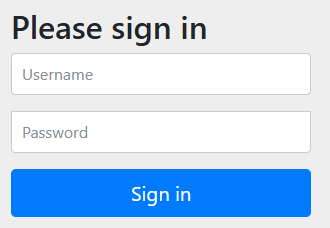
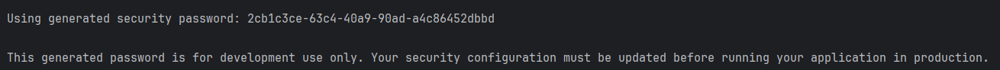
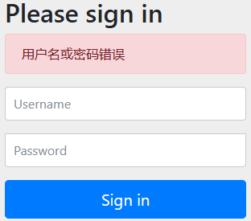
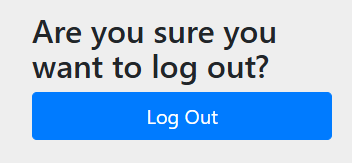
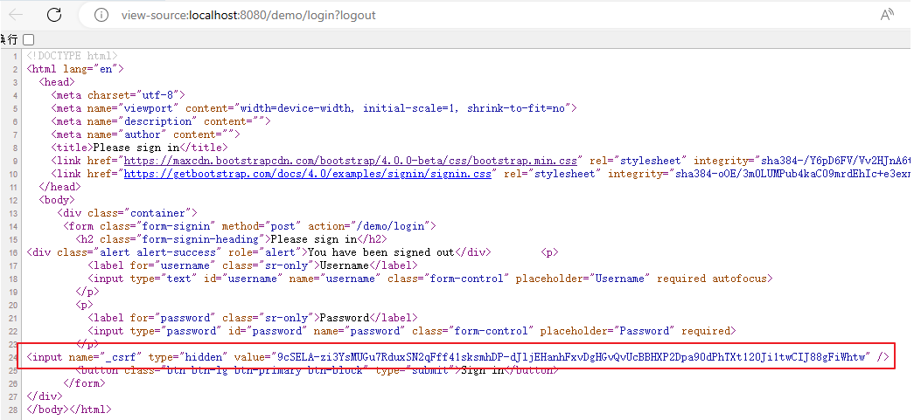
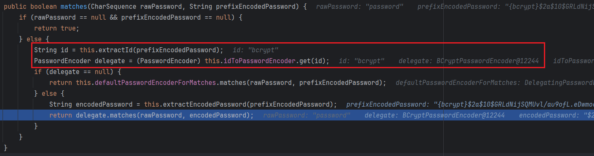
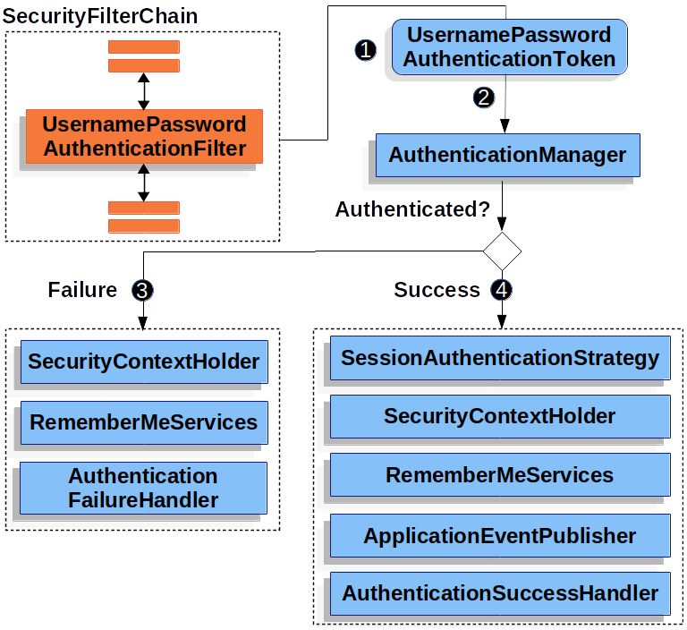

---

Created at: 2024-06-16
Last updated at: 2024-06-17
Source URL: about:blank


---

# SpringSecurity入门


**一、在spring-boot-starter-web中引入SpringSecurity**
1、引入SpringSecurity依赖
```
<dependency>
    <groupId>org.springframework.boot</groupId>
    <artifactId>spring-boot-starter-security</artifactId>
</dependency>
```
2、启动，访问http://localhost:8080/会自动重定向至http://localhost:8080/login，即未认证时都会被重定向到登录页

默认用户名：user，默认密码打印在控制台

认证成功后也会被重定向，重定向的逻辑是：

1. 如果最开始访问的是http://localhost:8080/login，那么重定向的URL是http://localhost:8080
2. 如果最开始访问的是http://localhost:8080/，那么重定向的URL是http://localhost:8080/?continue
3. 如果最开始访问的是http://localhost:8080/hello，那么重定向的URL是http://localhost:8080/hello?continue

其实第二种和第三种是同一种情况，最初访问的都是非登录页。
登录失败后则会被重定向至http://localhost:8080/login?error，也就是被重定向到了一个相同的页面，但是额外带了一个没有被赋值的error参数，通过判断有没有error参数来决定是否显示“用户名或密码错误”。

3、退出登录访问http://localhost:8080/logout


**二、认证流程**
SpringSecurity的实现简单讲就是一系列的拦截器，当访问http://localhost:8080/时，在拦截器里检查有没有Session，没有就重定向到http://localhost:8080/login，并设置Cookie；点击Sign in按钮会以Post方式提交至http://localhost:8080/login，然后进入认证流程：
1、首先进入`FilterChainProxy`.doFilter()方法
2、然后到FilterChainProxy.VirtualFilterChain.doFilter()方法，在这个方法中会一次执行additionalFilters列表中的16个过滤器
3、走到第8个过滤器`UsernamePasswordAuthenticationFilter`，该类继承了抽象类AbstractAuthenticationProcessingFilter，执行doFilter()方法
4、执行`UsernamePasswordAuthenticationFilter.attemptAuthentication()`方法，在该方法中首先获取请求中的"username"和"password"，包装成`UsernamePasswordAuthenticationToken`，然后调用ProviderManager的authenticate()方法，ProviderManager实现了AuthenticationManager接口
5、执行`DaoAuthenticationProvider.authenticate()`方法，DaoAuthenticationProvider继承自抽象类AbstractUserDetailsAuthenticationProvider，在该方法中调用retrieveUser()方法，接着调用`InMemoryUserDetailsManager的loadUserByUsername()方法`，InMemoryUserDetailsManager实现了`UserDetailsManager`接口，InMemoryUserDetailsManager的loadUserByUsername()方法的作用是通过"username"获取保存在内存中UserDetails，包含用户名、密码、权限等。
6、接着在DaoAuthenticationProvider.authenticate()方法将从内存中获取的User和从请求中得到的UsernamePasswordAuthenticationToken进行比较，如果认证失败就抛异常。
7、回到UsernamePasswordAuthenticationFilter的doFilter()方法，认证成功执行`successfulAuthentication(`)方法，认证失败执行`unsuccessfulAuthentication()`方法，成功和失败后的重定向逻辑分别在这两个方法里。
再次访问http://localhost:8080/时，拦截器检查Session，如果有并且通过认证那么不会再跳到/login。

**三、自定义用户名和密码**
方式一：在 application.properties 配置
```
spring.security.user.name=admin
spring.security.user.password=123
```

方式二：基于内存的用户认证
向容器中注入InMemoryUserDetailsManager组件
```
@Configuration
//@EnableWebSecurity //如果是SpringBoot项目可以不加这个注解，因为spring-boot-starter-security的自动配置类有加这个注解
public class WebSecurityConfig {
    @Bean
    public UserDetailsService userDetailsService() {
        InMemoryUserDetailsManager inMemoryUserDetailsManager = new InMemoryUserDetailsManager();
        inMemoryUserDetailsManager.createUser(User.withDefaultPasswordEncoder().username("admin").password("admin").roles("ADMIN").build());
        inMemoryUserDetailsManager.createUser(User.withDefaultPasswordEncoder().username("jack").password("jack").roles("ADMIN").build());
        return inMemoryUserDetailsManager;
    }
}
```
其实第一种方法也使用的是InMemoryUserDetailsManager。

方式三：基于数据库的用户认证
如果需要将用户信息放在数据库则需要实现UserDetailsService接口的loadUserByUsername方法。
```
@Component
public class DBUserDetailsManager implements UserDetailsManager, UserDetailsPasswordService {
    UserDao userDao;
    public DBUserDetailsManager(UserDao userDao) {
        this.userDao = userDao;
    }
    @Override
    public UserDetails updatePassword(UserDetails user, String newPassword) {
        return null;
    }
    @Override
    public void createUser(UserDetails user) {
    }
    @Override
    public void updateUser(UserDetails user) {
    }
    @Override
    public void deleteUser(String username) {
    }
    @Override
    public void changePassword(String oldPassword, String newPassword) {
    }
    @Override
    public boolean userExists(String username) {
        return false;
    }
    @Override
    public UserDetails loadUserByUsername(String username) throws UsernameNotFoundException {
        User user = userDao.getUserByName(username);
        if (user == null) {
            throw new UsernameNotFoundException(username);
        } else {
            Collection<GrantedAuthority> authorities = new ArrayList<>();
            return new org.springframework.security.core.userdetails.User(
                    user.getUsername(),
                    user.getPassword(),
                    user.getEnabled(),
                    true, //用户账号是否过期
                    true, //用户凭证是否过期
                    true, //用户是否未被锁定
                    authorities); //权限列表
        }
    }
}
```

**四、配置SpringSecurity**
4.1 SpringSecurity的默认配置
在配置类中重新往容器中注入SecurityFilterChain，SpringSecurity的默认配置相当于是这个SecurityFilterChain的配置。
```
@Configuration
//@EnableWebSecurity
public class WebSecurityConfig {
    @Bean
    public SecurityFilterChain filterChain(HttpSecurity http) throws Exception {
        http
                //authorizeRequests()：开启授权保护
                .authorizeRequests(
                        authorize -> authorize
                                //anyRequest()：对所有请求开启授权保护
                                .anyRequest()
                                //authenticated()：已认证请求会自动被授权
                                .authenticated()
                )
                .formLogin(withDefaults())//表单授权方式，前面看到的默认的登录页正是表单授权方式，注释掉这一行表示关闭默认的表单登录
                .httpBasic(withDefaults());//基本授权方式
        return http.build();
    }
}
```

4.2 CSRF攻击
SpringSecurity默认开启防御csrf攻击，也就是强制POST请求必须携带\_csrf参数。如果项目中使用了Thymeleaf，那么对于表单， SpringSecurity会自动生成一个隐藏的<input name="\_csrf">，可以配置关闭csrf攻击防御。

```
//关闭csrf攻击防御
http.csrf((csrf) -> {
    csrf.disable();
});
```

**五、密码加密器**
**5.1 密码相关概念**

* **Hash算法**：对密码单向转换需要用到哈希算法，例如MD5、SHA-256、SHA-512等，哈希算法是单向的，只能加密，不能解密。
* **彩虹表**：彩虹表就是一个庞大的、针对各种可能的字母组合预先生成的哈希值集合，有了它可以快速破解各类密码。越是复杂的密码，需要的彩虹表就越大，主流的彩虹表都是100G以上，目前主要的算法有LM, NTLM, MD5, SHA1, MYSQLSHA1, HALFLMCHALL, NTLMCHALL, ORACLE-SYSTEM, MD5-HALF。
* **加盐密码**：为每个用户的密码生成随机字节（称为盐）。盐和用户的密码将一起经过哈希函数运算，生成一个唯一的哈希，盐将以明文形式与用户的密码一起存储，然后当用户尝试进行身份验证时，盐和用户输入的密码一起经过哈希函数运算，再与存储的密码进行比较。唯一的盐意味着彩虹表不再有效，因为对于每个盐和密码的组合，哈希都是不同的。
* **自适应单向函数**：随着硬件的不断发展，加盐哈希也不再安全。开发人员开始使用自适应单向函数来存储密码。使用自适应单向函数验证密码时，故意占用资源（故意使用大量的CPU、内存或其他资源）。自适应单向函数允许配置一个“工作因子”，随着硬件的改进而增加。我们建议将“工作因子”调整到系统中验证密码需要约一秒钟的时间。这种权衡是为了让攻击者难以破解密码。自适应单向函数包括**bcrypt**、**PBKDF2**、**scrypt**和**argon2**。

**5.2 PasswordEncoder**
SpringSecurity的PasswordEncoder接口的实现类有：

* BCryptPasswordEncoder： 使用广泛支持的bcrypt算法来对密码进行哈希。为了增加对密码破解的抵抗力，bcrypt故意设计得较慢。和其他自适应单向函数一样，应该调整其参数，使其在您的系统上验证一个密码大约需要1秒的时间。BCryptPasswordEncoder的默认实现使用强度10。建议您在自己的系统上调整和测试强度参数，以便验证密码时大约需要1秒的时间。
* Argon2PasswordEncoder
* Pbkdf2PasswordEncoder
* SCryptPasswordEncoder

测试BCryptPasswordEncoder
```
@Test
void testPassword() {
    // 工作因子，默认值是10，最小值是4，最大值是31，值越大运算速度越慢
    PasswordEncoder encoder = new BCryptPasswordEncoder(31);
    //明文："password"
    //密文：result，即使明文密码相同，每次生成的密文也不一致
    String result = encoder.encode("password");
    System.out.println(result);
    //密码校验
    Assert.isTrue(encoder.matches("password", result), "密码不一致");
}
```

**5.3 DelegatingPasswordEncoder**
SpringSecurity校验密码用的 DelegatingPasswordEncoder的matches()方法，在这个方法中首先会提取存储的密码的前缀，形式是{xxx}，比如如果用的是bcrypt，那么存储的密码是 {bcrypt}$2a$10$GRLdNijSQMUvl/au9ofL.eDwmoohzzS7.rmNSJZ.0FxO/BTk76klW ，然后根据前缀找到对应的加密器BCryptPasswordEncoder，最后将用户提交的密码加密后与存储的密码比较。保存密码时加上前缀的目的是方便使用不同的密码加密器。


**六、自定义登录页面**
设置使用表单授权方式：
```
@Configuration
public class WebSecurityConfig {
    @Bean
    public SecurityFilterChain filterChain(HttpSecurity http) throws Exception {
        http
                //authorizeRequests()：开启授权保护
                .authorizeRequests(
                        authorize -> authorize
                                //anyRequest()：对所有请求开启授权保护
                                .anyRequest()
                                //authenticated()：已认证请求会自动被授权
                                .authenticated()
                )
 `.formLogin(form -> {`
 `form``.loginPage("/login").permitAll() //指定自定义登录页面的地址，并设置登录页面无需授权即可访问`
 `.usernameParameter("username") //自定义表单用户名参数，默认是username`
 `.passwordParameter("password") //自定义表单密码参数，默认是password`
 `.failureUrl("/login?error") //登录失败的返回地址，这个就是默认登录失败的地址，带了一个没有赋值的error参数`
 `//.failureUrl("/failure.html") //登录失败的返回地址`
 `;`
 `}); //使用表单授权方式`
        return http.build();
    }
}
```
创建登录Controller
```
@Controller
public class LoginController {
    @GetMapping("/login")
    public String login() {
        return "login";
    }
}
```
创建登录页面
resources/templates/login.html
```
<!DOCTYPE html>
<html xmlns:th="https://www.thymeleaf.org">
<head>
    <title>登录</title>
</head>
<body>
<h1>登录</h1>
<div th:if="${param.error}">错误的用户名和密码.</div>
`<!--method必须为"post"，因为Get获取的是当前的login.html-->`
<!--th:action="@{/login}" ，使用动态参数的作用：
`1、自动在路径前面添加配置的server.servlet.context-path=spring-security-demo，即自动添加 http:/localhost:8080/spring-security-demo`
`2、表单中会自动生成_csrf隐藏字段，用于防止csrf攻击`
-->
<form th:action="@{/login}" method="post">
    <div>
        <!--name必须为"username"-->
        <input type="text" name="username" placeholder="用户名"/>
    </div>
    <div>
        <!--name必须为"password"-->
        <input type="password" name="password" placeholder="密码"/>
    </div>
    <input type="submit" value="登录" />
</form>
</body>
</html>
```

**七、前后端分离**
**7.1 认证成功和失败后的响应**
在前面，认证成功或者失败之后会都会被重定向到新的URL，而在前后分离开发中，页面的跳转逻辑由前端实现，所以不能返回302的重定向响应，而是需要返回JSON格式的登录成功或者失败的信息。
在UsernamePasswordAuthenticationFilter的doFilter()方法里，认证成功会执行successfulAuthentication()方法，认证失败会执行unsuccessfulAuthentication()方法，执行流程如图所示：

重定向的逻辑都在最后一步，认证成功是AuthenticationSuccessHandler的onAuthenticationSuccess()方法，认证失败是AuthenticationFailureHandler的onAuthenticationFailure()方法，所以要想返回JSON，就要分别实现这两个接口的方法。
```
public class MyAuthenticationSuccessHandler implements AuthenticationSuccessHandler {
    @Override
    public void onAuthenticationSuccess(HttpServletRequest request, HttpServletResponse response, Authentication authentication) throws IOException, ServletException {
        Object principal = authentication.getPrincipal();//获取用户的信息
//        Object credentials = authentication.getCredentials(); //获取用户的凭证，账号密码登录的方式就是密码，但是在认证成功之后就被擦除了
//        Collection<? extends GrantedAuthority> authorities = authentication.getAuthorities(); //获取用的权限列表，其实Principal中已经包含了authorities
        //创建结果对象
        HashMap result = new HashMap();
        result.put("code", 0);
        result.put("message", "登录成功");
        result.put("principal", principal);
        //转换成json字符串
        String json = JSON.toJSONString(result);
        //返回响应
        response.setContentType("application/json;charset=UTF-8");
        response.getWriter().println(json);
    }
}
```
```
public class MyAuthenticationFailureHandler implements AuthenticationFailureHandler {
    @Override
    public void onAuthenticationFailure(HttpServletRequest request, HttpServletResponse response, AuthenticationException exception) throws IOException, ServletException {
        //获取错误信息
        String localizedMessage = exception.getLocalizedMessage();
        //创建结果对象
        HashMap result = new HashMap();
        result.put("code", -1);
        result.put("message", localizedMessage);
        //转换成json字符串
        String json = JSON.toJSONString(result);
        //返回响应
        response.setContentType("application/json;charset=UTF-8");
        response.getWriter().println(json);
    }
}
```
然后设置使用自定义的Handler：
```
http.formLogin(
    form -> {
        form.loginPage("/login").permitAll() //指定自定义登录页面的地址，并设置登录页面无需授权即可访问
                .usernameParameter("username") //自定义表单用户名参数，默认是username
                .passwordParameter("password") //自定义表单密码参数，默认是password
                .failureUrl("/login?error") //登录失败的返回地址，这个就是默认登录失败的地址，带了一个没有赋值的error参数
                //.failureUrl("/failure.html") //登录失败的返回地址)//表单授权方式，前面看到的默认的登录页正是表单授权方式，注释掉这一行表示关闭默认的表单登录
 `.successHandler(new MyAuthenticationSuccessHandler()); //认证成功时的处理`
 `.failureHandler(new MyAuthenticationFailureHandler()) //认证失败时的处理`
    });
```

7.2 注销的响应
退出登录访问http://localhost:8080/logout会弹窗提示是否确认注销，而不是响应JSON，如果想返回JSON则需要实现LogoutSuccessHandler接口：
```
public class MyLogoutSuccessHandler implements LogoutSuccessHandler {
    @Override
    public void onLogoutSuccess(HttpServletRequest request, HttpServletResponse response, Authentication authentication) throws IOException, ServletException {
        //创建结果对象
        HashMap result = new HashMap();
        result.put("code", 0);
        result.put("message", "注销成功");
        //转换成json字符串
        String json = JSON.toJSONString(result);
        //返回响应
        response.setContentType("application/json;charset=UTF-8");
        response.getWriter().println(json);
    }
}
```
然后配置使用自定义的LogoutSuccessHandler：
```
http.logout(logout -> {
    logout.logoutSuccessHandler(new MyLogoutSuccessHandler()); //注销成功时的处理
});
```

