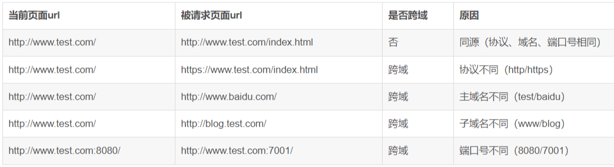
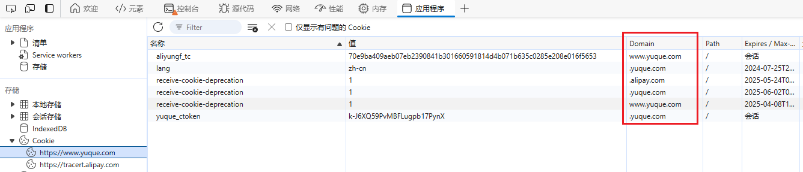
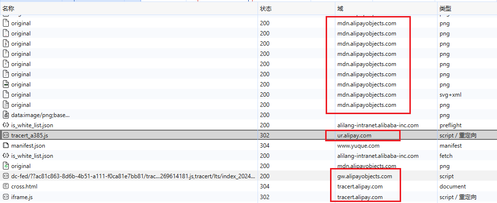
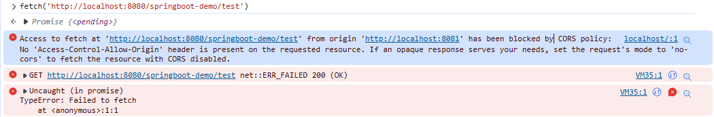
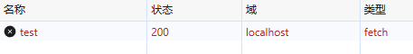
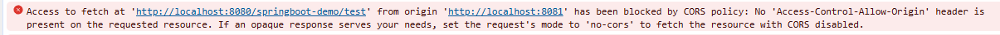
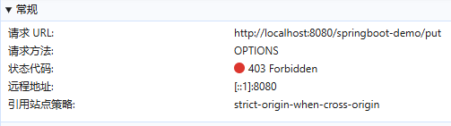
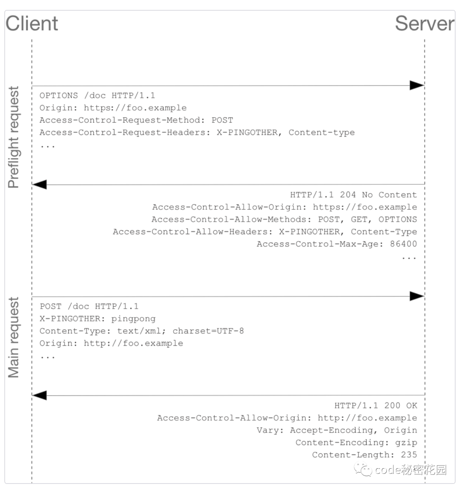

---

Created at: 2024-06-18
Last updated at: 2024-06-23
Source URL: https://blog.csdn.net/weixin_51484460/article/details/139456911


---

# 跨域


**一、什么是跨域？**
两个url的协议、域名、端口三者都相同才能称之为同一个域，只要三者之间有任意一个相同即为跨域。比如：

比如，访问同一个网站时的Cookie有不同的域：

访问同一个网站时有不同域的资源：

浏览器中的JavaScript脚本可以操作DOM、Cookie、发送Http请求，如果一个域的JavaScript脚本可以任意操作其他域的资源肯定会带来很多安全问题，所以浏览器针对JavaScript脚本的跨域操作做了限制，简单来讲，浏览器禁止一个域的JavaScript脚本与另一个域的资源进行交互，从而防止恶意网站通过一个域的网页访问另一个域的敏感数据，这便是浏览器的跨域策略（比较官方的解释是，同源策略（Same Origin Policy）是Web体系的一种基本的安全协议，跨域（Cross-Origin）是浏览器实现同源策略的一部分）。换句话说，跨域仅仅是针对于浏览器执行JavaScript脚本这一个场景而言的，浏览器禁止一个域的JavaScript脚本访问另一个域的资源，从而就无法实现以下操作，进而保证了安全：

* 无法访问来自不同源网页的Cookie、LocalStorage和IndexedDB。这意味着不同源的网页之间不能共享存储数据。
* 无法操作不同源网页的DOM。每个网页的DOM只能由其自己的脚本访问，不能被其他源的脚本操作。
* 无法向不同源地址发起AJAX请求（原生的XMLHttpRequest请求）。这限制了网页与不同源服务器之间的数据交互。

第三点，比如在www.a.com的域下不能使用JavaScript发送b.com的请求。但是正如上图，在访问一个站点时就是会跨域访问，那怎么办呢，所以，浏览器的跨域策略虽然确保了Web应用的安全性，防止恶意网站访问其他网站的敏感数据，但同时也给开发跨域Web应用带来了挑战，需要采取相应的跨域解决方案。
注意：
1、点击浏览器页面指向其他网站的超链接不是跨域，因为这个不是通过执行JavaScript脚本发送请求。
2、在Node.js里执行JavaScript发送请求不是跨域，因为Node.js执行的JavaScript脚本不是服务器发送过的，只有在浏览器里执行JavaScript才有跨域限制，因为浏览器是客户端才会面临这种安全问题，才必须做这种限制。
实验：启动两个服务，A：http://localhost:8081/，B：http://localhost:8080/，浏览器限制了从脚本内发起的跨源 HTTP 请求，例如 XMLHttpRequest 和 Fetch API 都是遵循的同源策略，当在A的页面控制台访问B，出现下面的错误，提示跨域请求失败。


**二、跨域解决方案**
**2.1 JSONP**
浏览器允许 link、img、script 等标签上url请求跨域，jsonp 的实现原理就是在 script 标签里指定一个跨域链接去访问服务器。该方式只支持get请求，不支持post请求。
```
<script src="http://test.com/data.php?callback=dosomething"></script> // 向服务器test.com发出请求，该请求的查询字符串有一个callback参数，用来指定回调函数的名字，处理服务器返回的数据
<script type="text/javascript">
   function dosomething(res){
       // 处理获得的数据
       console.log(res.data)
   }
</script>
```

**2.1 CORS (Cross-Origin Resource Sharing，跨域资源分享）**
CORS是 W3C 标准，它允许浏览器向跨源服务器发出XMLHttpRequest请求，但如果仅仅是浏览器放开了这个限制来解决跨域，那服务器肯定要遭殃，所以放开这个限制的同时必须在浏览器和服务器两端设置一些策略来解决恶意访问的问题。
**在浏览器端：**
浏览器将 CORS 请求分成两类：简单请求 和 非简单请求（not-so-simple request）。
若满足下述所有条件，则该请求可视为简单请求：

* 请求方法是以下三种之一：
	* HEAD
	* GET
	* POST
* HTTP 的头信息不超出以下几种字段：
	* Accept
	* Accept-Language
	* Content-Language
	* Content-Type
	* DPR
	* Downlink
	* Save-Data
	* Viewport-Width
	* Width
* Content-Type 的值仅限于以下三种之一
	* text/plain
	* multipart/form-data
	* application/x-www-form-urlencoded
* 请求中的任意 XMLHttpRequestUpload 对象均没有注册任何事件监听器。
* 请求中没有使用 ReadableStream 对象。

凡是不同时满足以上条件，均属于非简单请求。
**简单请求的请求过程：**
1、浏览器发送请求fetch('http://localhost:8080/springboot-demo/test')
HTTP请求头中包含了Origin: http://localhost:8081
```
GET /springboot-demo/test HTTP/1.1
Accept: */*
Accept-Encoding: gzip, deflate, br, zstd
Accept-Language: zh-CN,zh;q=0.9,en;q=0.8,en-GB;q=0.7,en-US;q=0.6
Connection: keep-alive
Host: localhost:8080
`Origin: http://localhost:8081`
Referer: http://localhost:8081/
Sec-Fetch-Dest: empty
Sec-Fetch-Mode: cors
Sec-Fetch-Site: same-site
User-Agent: Mozilla/5.0 (Windows NT 10.0; Win64; x64) AppleWebKit/537.36 (KHTML, like Gecko) Chrome/126.0.0.0 Safari/537.36 Edg/126.0.0.0
sec-ch-ua: "Not/A)Brand";v="8", "Chromium";v="126", "Microsoft Edge";v="126"
sec-ch-ua-mobile: ?0
sec-ch-ua-platform: "Windows"
```
2、服务器正常响应，服务器会完整执行了一次请求（所以同源策略并不能防止DDos，因为跨域的Ajax请求会被浏览器发出）
如果服务器端没有任何跨域设置，响应头中不会包含任何与跨域相关的信息
```
HTTP/1.1 200
Content-Type: text/plain;charset=UTF-8
Content-Length: 20
Date: Sun, 23 Jun 2024 10:46:11 GMT
Keep-Alive: timeout=60
Connection: keep-alive
```
如果在Controller方法上添加了@CrossOrigin注解，此时响应头中会有Access-Control-Allow-Origin: \*，
```
HTTP/1.1 200
Vary: Origin
Vary: Access-Control-Request-Method
Vary: Access-Control-Request-Headers
`Access-Control-Allow-Origin: *`
Content-Type: text/plain;charset=UTF-8
Content-Length: 20
Date: Sun, 23 Jun 2024 12:08:43 GMT
Keep-Alive: timeout=60
Connection: keep-alive
```
3、浏览器接收到响应之后检查响应头里有没有 Access-Control-Allow-Origin 
没有或者其值与请求URL不匹配，那么浏览器就会丢弃响应（或者说其实响应数据其实已经到了浏览器，只不过浏览器将数据隐藏起来了），即使响应状态码是200：


有Access-Control-Allow-Origin 且与请求URL匹配则一切正常。

**非简单请求的请求过程：**
从前面可以看到，简单请求发送到服务器，其实服务器会完整执行一次，简单请求的定义有限制，如果服务器的API设计遵守HTTP规范，大概不会引发安全问题，但是非简单请求比简单请求更加复杂，如果仍然直接将跨域请求发送到服务器很可能会有问题，所以非简单请求会先发送一个预检请求，如果预检请求的响应会返回Access-Control-Allow-Origin 等，这时浏览器再决定是否可以发送实际的跨域请求。
1、浏览器发送请求fetch('http://localhost:8080/springboot-demo/put', {method: 'PUT'})
预检请求的请求方式是OPTIONS，请求头会带上Origin: http://localhost:8081
```
OPTIONS /springboot-demo/put HTTP/1.1
Accept: */*
Accept-Encoding: gzip, deflate, br, zstd
Accept-Language: zh-CN,zh;q=0.9,en;q=0.8,en-GB;q=0.7,en-US;q=0.6
`Access-Control-Request-Method: PUT`
Connection: keep-alive
Host: localhost:8080
`Origin: http://localhost:8081`
Referer: http://localhost:8081/
Sec-Fetch-Dest: empty
Sec-Fetch-Mode: cors
Sec-Fetch-Site: same-site
User-Agent: Mozilla/5.0 (Windows NT 10.0; Win64; x64) AppleWebKit/537.36 (KHTML, like Gecko) Chrome/126.0.0.0 Safari/537.36 Edg/126.0.0.0
```
除了 Origin，“预检请求”的头信息还可以包括两个特殊字段：

* Access-Control-Request-Method：这个字段是必须的，用来列出浏览器的 CORS 请求会用到哪些 HTTP 方法，上面示例是 PUT。
* Access-Control-Request-Headers：这个字段是一个逗号分隔的字符串，指定浏览器 CORS 请求会额外发送的头信息字段，上面示例是 X-Custom-Header。

2、服务器响应预检请求，此时服务器并不会真正执行Controller方法
如果没有设置跨域，那么返回403 Forbidden

如果在Controller方法上添加了@CrossOrigin注解，此时响应头中会有以 Access-Control- 开头与 CORS 请求相关的头信息字段（Access-Control-Allow-Origin、Access-Control-Allow-Credentials、Access-Control-Expose-Headers ）：
```
HTTP/1.1 200
Vary: Origin
Vary: Access-Control-Request-Method
Vary: Access-Control-Request-Headers
`Access-Control-Allow-Origin: *`
`Access-Control-Allow-Methods: PUT`
`Access-Control-Max-Age: 1800`
Allow: GET, HEAD, POST, PUT, DELETE, OPTIONS, PATCH
Content-Length: 0
Date: Sun, 23 Jun 2024 12:36:52 GMT
Keep-Alive: timeout=60
Connection: keep-alive
```

* Access-Control-Allow-Origin：这个字段是必须的。它的值要么是请求时 Origin 字段的值，要么是一个 \*，表示接受任意的源（域名）的请求。
* Access-Control-Allow-Methods：这个字段是必须的，它的值是逗号 , 分隔的一个字符串，表明服务器支持的所有跨域请求。注意，返回的是所有支持的方法，而不单是浏览器请求的那个方法。这是为了避免多次“预检请求”。(本示例仅设置了一个 PUT 方法。)
* Access-Control-Allow-Headers：如果浏览器请求包括 Access-Control-Request-Headers 字段，则 Access-Control-Allow-Headers 字段是必须的，它也是一个逗号 , 分隔的字符串，表明服务器支持的所有头信息字段，不限于浏览器在“预检请求”的字段。
* Access-Control-Allow-Credentials：
	* 这个字段可选，它的值是一个布尔值，表示是否允许发送 Cookie，默认情况下，Cookie 不包括在 CORS 请求之中，设为 true表示服务器明确许可，Cookie 可以包含在请求中，一起发给服务器。这个值也只能设为 true，如果服务器不要浏览器发送 Cookie，删除该字段即可。
	* 如果Access-Control-Allow-Origin: \*，Access-Control-Allow-Credentials不能是true。
	* 允不允许跨域请求携带Cookie是需要很慎重的，不携带Cookie，请求发送到服务器肯定处于未登录状态，是安全的，反之如果允许携带Cookie，请求可能处于登录状态。
	* fetch在默认情况下，不管是同域还是跨域ajax请求都不会带上cookie，只有当设置了 credentials 时才会带上该ajax请求所在域的cookie（xhr.withCredentials = true），跨域的时候，额外还需要服务端响应预检请求Access-Control-Allow-Credentials: true，否则浏览器会因为安全限制而报错拿不到响应。还需要注意的是，如果服务器设置的Cookie是HttpOnly，JavaScript是读不到此Cookie的，也就是fetch/XHR请求都带不上此Cookie。
* Access-Control-Expose-Headers：这个字段可选。CORS 请求时，XMLHttpRequest 对象的 getResponseHeader() 方法只能拿到 6 个基本字段： Cache-Control、Content-Language、Content-Type、Expires、Last-Modified、Pragma。如果想要拿到其他字段，就必须在 Access-Control-Expose-Headers 里面指定。（但由于 W3C 的限制，不指定的情况下，客户端获取到的值可能为 null）例如，服务端将 Access-Control-Expose-Headers 指定为 "Date,Access-Control-Allow-Origin"，我们可以通过 XMLHttpRequest 对象的 getResponseHeader() 方法获取对应字段的值。
* Access-Control-Max-Age：这个字段可选，用来指定本次预检请求的有效期，单位为秒。

3、浏览器接着再完成一次简单请求
一旦服务器通过了“预检请求”，以后每次浏览器正常的 CORS 请求。

**非简单请求示意图**


**与 JSONP 的比较**
CORS 与 JSONP 的使用目的相同，但是比 JSONP 更强大。JSONP 只支持 GET 请求，CORS 支持所有类型的 HTTP 请求。JSONP 的优势在于支持老式浏览器，以及可以向不支持 CORS 的网站请求数据。

**服务器端：**
1、注解@CrossOrigin
标注在类或者方法上，可以设置以下属性：

* origins 和 value 属性：对应于HTTP响应头中的Access-Control-Allow-Origin，指定所支持域的集合，默认值为\*。
* allowedHeaders：对应于HTTP响应头中的Access-Control-Allow-OriginAccess-Control-Allow-Headers
* exposedHeaders：对应于HTTP响应头中的Access-Control-Expose-Headers
* methods：对应于HTTP响应头中的Access-Control-Allow-Methods
* allowCredentials：对应于HTTP响应头中的Access-Control-Allow-Credentials
* maxAge：对应于HTTP响应头中的Access-Control-Max-Age

2、实现WebMvcConfigurer接口
```
@Configuration
public class WebConfigurer implements WebMvcConfigurer {
     @Override
     public void addCorsMappings(CorsRegistry registry) {
         // 为url添加映射路径
         registry.addMapping("/**")
                 // 设置允许的域
                 .allowedOrigins("*")
                 // 设置允许请求的方式
                 .allowedMethods("*")
                 // 设置允许的header
                 .allowedHeaders("*")
                 // 设置是否发送cookie信息
                 .allowCredentials(true);
     }
}
```
3、实现过滤器
CorsFilter是Spring实现的Servlet的Filter
```
@Configuration
public class CorsConfig {
    public CorsConfig() {
    }
    @Bean
    public CorsFilter corsFilter() {
        // 1. 添加cors配置信息
        CorsConfiguration config = new CorsConfiguration();
        config.addAllowedOrigin("http://localhost:8080");
        config.addAllowedOrigin("http://localhost:8081");
        config.addAllowedOrigin("http://localhost:8082");
        config.addAllowedOrigin("*");
        // 设置是否发送cookie信息
        config.setAllowCredentials(true);
        // 设置允许请求的方式
        config.addAllowedMethod("*");
        // 设置允许的header
        config.addAllowedHeader("*");
        // 2. 为url添加映射路径
        UrlBasedCorsConfigurationSource corsSource = new UrlBasedCorsConfigurationSource();
        corsSource.registerCorsConfiguration("/**", config);
        // 3. 返回重新定义好的corsSource
        return new CorsFilter(corsSource);
    }
}
```

