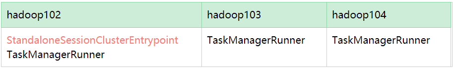
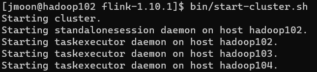

---

Created at: 2021-10-06
Last updated at: 2025-03-02


---

# 1-Flink快速上手


**Flink vs Spark Streaming**
Flink是真正面向流的，即使是处理批量数据也是当作流，即有界流。而SparkStreaming则是面向批量数据的，即使是实时数据也是当作批量数据处理，即微批。因为Flink是面向流的，所以Flink是没有stage划分的，因为数据是源源不断的过来，所以不可能等前一个阶段完成了才开始下一个阶段的计算，Flink是来一条数据就开始进行计算。

**IDEA本地测试环境下的WordCount**
依赖：
```
<dependency>
    <groupId>org.apache.flink</groupId>
    <artifactId>flink-java</artifactId>
    <version>1.10.1</version>
</dependency>

<dependency>
    <groupId>org.apache.flink</groupId>
    <artifactId>flink-streaming-java_2.12</artifactId>
    <version>1.10.1</version>
</dependency>

<!-- 如果想打印日志，可以引入slf4j-simple-->
<dependency>
    <groupId>org.slf4j</groupId>
    <artifactId>slf4j-simple</artifactId>
    <version>1.7.30</version>
</dependency>
```
words.txt文件：
```
hello world
hello Flink
hello spark
```
**批处理**
Java中没有元组类型，需要使用Flink Java版提供的元组类
```
public static void main(String[] args) throws Exception {
   //1.创建批处理执行环境
   ExecutionEnvironment env = `ExecutionEnvironment`.getExecutionEnvironment();
   //2.从文件中读取数据
   `DataSource`<String> ds = env.readTextFile("words.txt");
   //3.批量计算
   ds.flatMap(new FlatMapFunction<String, Tuple2<String, Integer>>() {
               @Override
               public void flatMap(String value, Collector<Tuple2<String, Integer>> out) throws Exception {
                   String[] words = value.split(" ");
                   for (String word : words) {
                       out.collect(`new Tuple2<>(word, 1)`);
                   }
               }
           })
           .groupBy(0)  // 按第一个位置的元素分组
           .sum(1)  // 对第二个位置上的元素求和
           .print();
}
```
输出结果：
```
(world,1)
(Flink,1)
(hello,3)
(spark,1)
```

**流处理**
从文件中读取数据
```
public static void main(String[] args) throws Exception {
       //1.创建流处理执行环境
       StreamExecutionEnvironment env = `StreamExecutionEnvironment`.getExecutionEnvironment();
       //2.从文件中读取数据
       `DataStreamSource`<String> dss = env.readTextFile("words.txt");
       //3.流式计算
       dss.flatMap(new FlatMapFunction<String, Tuple2<String, Integer>>() {
                   @Override
                   public void flatMap(String value, Collector<Tuple2<String, Integer>> out) throws Exception {
                       String[] words = value.split(" ");
                       for (String word : words) {
                           out.collect(new Tuple2<>(word, 1));
                       }
                   }
               })
               .keyBy(0)  // 按第一个位置的元素分组
               .sum(1)  // 对第二个位置上的元素求和
               .print();
      `//4.启动流式计算`
 `env.execute();`
   }
```
输出结果如下，第一个数字是slot的编号，每个slot其实就是一个线程，slot编号的输出只与print()算子的并行度有关，如果print()算子的并行度为1，那么print算子只在一个线程上执行，于是就不会输出slot的编号。在IDEA的本地测试环境下，只有一个taskmanager，该taskmanager的slot数等于本机cpu的最大线程数，如果不设置算子的并行度，那么每个算子的默认并行度也等于本机cpu的最大线程数。
还可以看到在流式计算的方式下，每读取一行数据就做一次计算，并且后面的计算基于前面计算的结果，前面计算的结果称为状态。
```
9> (world,1)
5> (hello,1)
1> (spark,1)
5> (hello,2)
16> (Flink,1)
5> (hello,3)
```

在代码中设置整个执行环境的并行度：
```
public static void main(String[] args) throws Exception {
   //1.创建流处理执行环境
   StreamExecutionEnvironment env = StreamExecutionEnvironment.getExecutionEnvironment();
 `//设置并行度`
 `env.setParallelism(1);`
   //2.从文件中读取数据
   DataStreamSource<String> dss = env.readTextFile("words.txt");
   //3.流式计算
   dss.flatMap(new FlatMapFunction<String, Tuple2<String, Integer>>() {
               @Override
               public void flatMap(String value, Collector<Tuple2<String, Integer>> out) throws Exception {
                   String[] words = value.split(" ");
                   for (String word : words) {
                       out.collect(new Tuple2<>(word, 1));
                   }
               }
           })
           .keyBy(0)
           .sum(1)
           .print();
   //4.启动流式计算
   env.execute();
}
```
此时print()算子的并行度为1，于是就不会输出线程id了：
```
(hello,1)
(world,1)
(hello,2)
(Flink,1)
(hello,3)
(spark,1)
```

还可以直接设置算子的并行度，直接设置算子的并行度会覆盖整个执行环境设置的并行度：
```
public static void main(String[] args) throws Exception {
   //1.创建流处理执行环境
   StreamExecutionEnvironment env = StreamExecutionEnvironment.getExecutionEnvironment();
    `//设置并行度`
 `env.setParallelism(1);`
   //2.从文件中读取数据
   DataStreamSource<String> dss = env.readTextFile("words.txt");
   //3.流式计算
   dss.flatMap(new FlatMapFunction<String, Tuple2<String, Integer>>() {
               @Override
               public void flatMap(String value, Collector<Tuple2<String, Integer>> out) throws Exception {
                   String[] words = value.split(" ");
                   for (String word : words) {
                       out.collect(new Tuple2<>(word, 1));
                   }
               }
           })
           .keyBy(0)
           .sum(1)
           `.print().setParallelism(2);`
   //4.启动流式计算
   env.execute();
}
```
此时print()算子的并行度为2，所以会输出线程id：
```
2> (hello,1)
2> (hello,2)
1> (world,1)
2> (hello,3)
1> (Flink,1)
1> (spark,1)
```

**Standalone模式**
使用Flink自带的资源管理器部署Flink集群，StandaloneSessionClusterEntrypoint类似于yarn的ResourceManager，TaskManagerRunner类似于yarn的NodeManager
集群规划：

1.解压
```
tar -zxvf /opt/software/flink-1.10.1-bin-scala_2.12.tgz -C /opt/module/
```
2.修改配置文件
修改/opt/module/flink-1.10.1/conf/flink-conf.yaml
```
# jobmanager的rpc通信地址
jobmanager.rpc.address: hadoop102
# 每个taskmanager的slot数，slot数就是taskmanager能启动的最大线程数
taskmanager.numberOfTaskSlots: 2
# 在不指定算子并行度时的默认并行度，算子的并行度指的是该算子会在多少个slot上开启计算任务
parallelism.default: 1
```
修改/opt/module/flink-1.10.1/conf/masters
```
hadoop102:8081
```
修改/opt/module/flink-1.10.1/conf/slaves
```
hadoop102
hadoop103
hadoop104
```
3.分发
```
xsync flink-1.10.1/
```
4.启动
```
bin/start-cluster.sh
```

5.webui查看集群的运行情况
```
http://hadoop102:8081
```
6.停止
```
bin/stop-cluster.sh
```
7.提交任务到集群
7.1 webui上提交job
7.2 命令行提交job，-p参数指定并行度
```
bin/flink run -c wordcount.StreamWordCount02 -p 2 /opt/software/Flink-1.0-SNAPSHOT.jar --host 192.168.10.1 --port 7777
```
8.查看正在运行的job
```
bin/flink list
```
查看所有已经提交的job
```
bin/flink list -a
```
9.取消正在运行的任务（用上面的那个命令先得到JobID）
```
bin/flink cancel 0329a7f45692a7e4e2118c27102d846c
```

conf/flink-conf.yaml配置文件：
```
# jobmanager的rpc通信地址
jobmanager.rpc.address: hadoop102

# jobmanager的rpc通信端口
jobmanager.rpc.port: 6123

# jobmanager的堆内存
jobmanager.heap.size: 1024m

# taskmanager堆内存和堆外内存之和，Flink的状态是放在taskmanager的堆外内存上
taskmanager.memory.process.size: 1728m，

# 每个taskmanager的slot数，slot数就是taskmanager能启动的最大线程数，所以这个只一般设置为cpu的线程数
taskmanager.numberOfTaskSlots: 1

# 一个算子没有明确指出并行度时的默认并行度，算子的并行度就是子任务的数量
parallelism.default: 1
```

**Yarn模式**
1.解压并重命名
```
tar -zxvf /opt/software/flink-1.10.1-bin-scala_2.12.tgz -C /opt/module/
```
```
mv flink-1.10.1 flink-yarn
```
2.下载flink-shaded-hadoop-2-uber-2.8.3-10.0.jar，并将其放到/opt/module/flink-yarn/lib下

Flink 提供了两种在 yarn 上运行的模式，分别为 Session-Cluster 和 Per-Job-Cluster模式。
**Session-Cluster模式**
Session-Cluster模式是先在 yarn 中初始化一个 flink 集群（yarn的一个application），开辟指定的资源，以后提交任务都向这里提交，这个 flink 集群会常驻在 yarn 集群中， 除非手工停止（与standalone模式很类似）。Session-Cluster模式需要先初始化 flink 集群并指定资源的数量，如果不能满足下一个作业所需要的资源，那么该作业就无法提交，只能等到前面的作业执行完成后， 释放了资源， 该作业才会能提交成功。所以在Session-Cluster模式下，所有作业共享资源，适合规模小执行时间短的作业。
1.启动hadoop集群
2.启动 yarn-session
```
bin/yarn-session.sh -n 2 -s 2 -jm 1024 -tm 1024 -nm flink-cluster -d
```
yarn-session.sh的参数：
```
-n,--container <arg> 表示分配容器的数量（也就是 TaskManager 的数量）。
-D <arg> 动态属性。
-d,--detached 在后台独立运行。
-jm,--jobManagerMemory <arg>：设置 JobManager 的内存，单位是 MB。
-nm,--name：在 YARN 上为一个自定义的应用设置一个名字。
-q,--query：显示 YARN 中可用的资源（内存、cpu 核数）。
-qu,--queue <arg>：指定 YARN 队列。
-s,--slots <arg>：每个 TaskManager 的 Slot 数量，默认每个taskmanager 的 slot 的个数为 1。
-tm,--taskManagerMemory <arg>：每个 TaskManager 的内存，单位是 MB。
-z,--zookeeperNamespace <arg>：针对 HA 模式在 ZooKeeper 上创建 NameSpace。
-id,--applicationId <yarnAppId>：指定 YARN 集群上的任务 ID，附着到一个后台独立运行的 yarn session 中。
```
3.提交job
```
bin/flink run -c wordcount.StreamWordCount02 -p 2 /opt/software/Flink-1.0-SNAPSHOT.jar --host 192.168.10.1 --port 7777
```
4.取消yarn-session，也就是直接杀死yarn应用
```
yarn application --kill application_1577588252906_0001
```

**Per-Job-Cluster模式**
每次提交都会创建一个新的 flink 集群，任务之间互相独立，互不影响，任务执行完成之后创建的集群也会消失。 Per-Job-Cluster模式下，一个 Job 会对应一个集群，每提交一个作业会根据自身的情况，都会单独向 yarn 申请资源，直到作业执行完成，一个作业的失败与否并不会影响下一个作业的正常提交和运行，适合规模大长时间运行的作业。
1.启动hadoop集群
2.不需要启动yarn-session，直接提交job即可
```
bin/flink run -m yarn-cluster -ynm flink-Per-Job-Cluster -c wordcount.StreamWordCount02 /opt/software/Flink-1.0-SNAPSHOT.jar --host 192.168.10.1 --port 7777
```
bin/flink run的参数：
```
-yn,--container <arg> 表示分配容器的数量，也就是 TaskManager 的数量。
-d,--detached：设置在后台运行。
-yjm,--jobManagerMemory<arg>:设置 JobManager 的内存，单位是 MB。
-ytm，--taskManagerMemory<arg>:设置每个 TaskManager 的内存，单位是 MB。
-ynm,--name:给当前 Flink application 在 Yarn 上指定名称。
-yq,--query：显示 yarn 中可用的资源（内存、cpu 核数）
-yqu,--queue<arg> :指定 yarn 资源队列
-ys,--slots<arg> :每个 TaskManager 使用的 Slot 数量。
-yz,--zookeeperNamespace<arg>:针对 HA 模式在 Zookeeper 上创建 NameSpace
-yid,--applicationID<yarnAppId> : 指定 Yarn 集群上的任务 ID,附着到一个后台独立运行的 Yarn Session 中。
```

