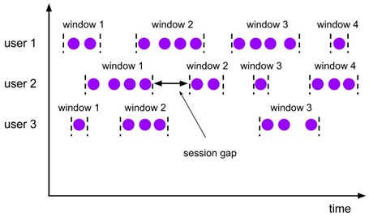

---

Created at: 2021-10-09
Last updated at: 2021-10-18

---

# 11-window的种类 和 时间语义

窗口可以把无限的数据流进行切分得到有限的数据集进行处理，也就是将无界流划分成有界流进行处理。
window的可分成两类：时间窗口 和 计数窗口。时间窗口是指按时间间隔划分窗口，而计数窗口是指按指定的数据个数划分窗口。
其中时间窗口（ Time Window）又可分为：

* 滚动时间窗口
* 滑动时间窗口
* 会话窗口

计数窗口（ Count Window）又可分为：

* 滚动计数窗口
* 滑动计数窗口

滚动窗口是指不会出现窗口重叠的窗口，只需要指定窗口的大小。

而滑动窗口需要指定 窗口大小 和 滑动步长，会重现窗口重叠。滚动窗口可以看作是滑动步长等于窗口大小的滑动窗口。

只有时间窗口有会话窗口类型，会话窗口指的是如果超过指定的时间间隔内没有收到数据，那么前面接收到的数据作为一个窗口内数据，接下来接收到的数据作为下一个窗口的数据。

时间窗口需要结合时间语义来使用，计数窗口并不需要，在Flink分布式流式数据处理的架构中有3种时间语义：Event Time、Ingestion Time、Window Processing Time，如下图所示：

* Event Time指的是数据产生的时间，这需要外部数据源在产生数据时带上时间戳。
* Ingestion Time指的是数据到达Flink的Source时的时间。

从产生数据的数据源到Flink系统，中间会经过消息中间件如Kafka，为什么要引入消息中间件呢？因为产生数据的数据源会有多个，发送的数据量很大，Flink接收和处理数据的能力并不能支撑如此大的数据量，所以这中间必须引入消息中间件来缓冲一下，Flink再结合自身的消费能力来接收数据。
因为产生数据的数据源有很多个，所以数据到达消息中间件的时间顺序肯定不是数据产生时的时间顺序，并且Flink在多个slot中并行接收数据的Source会同时消费Kafka同一topic的不同分区的数据，我们知道Kafka不同分区之间的数据是无序的，所以Flink接收到数据的时间顺序就更加不可能保持数据产生时的时间顺序了，所以每条数据就会一个Ingestion Time，表示数据到达Flink的Source时的时间。

* Window Processing Time是指到达窗口的时间。

因为Flink是分布式流处理架构，数据从上游算子的子任务 到 下游算子的子任务 可能需要跨越不同的slot，数据在不同的slot之间传递需要经过网络传输，所以这中间数据也会乱序，也就数据到达窗口的时间会与Ingestion Time不同。

注意：时间语义并不是时间窗口独有的一个概念，在整个Flink应用处理流程中，凡是涉及到时间的操作，其依据的时间标准都由时间语义来决定，比如时间窗口的开启与关闭、ProcessFunction中定时器的触发，把时间语义放在这里讲，只是因为时间窗口是最常用的涉及到时间的操作。

