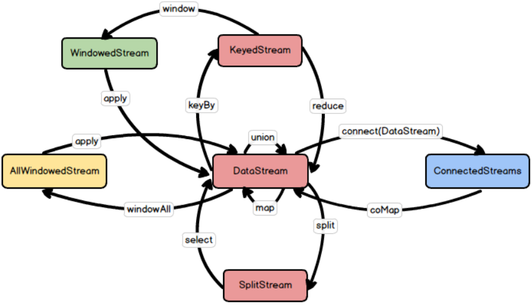

---

Created at: 2021-10-10
Last updated at: 2021-10-10

---

# 14-数据流类型转换总结

数据流类型的转换关系：

1\. KeyedStream 和 SplitStream 都是继承自 DataStream，而ConnectedStreams、 WindowedStream、 AllWindowedStream都是独立的类，并不继承自 DataStream。
2.只有 DataStream 及其子类才有keyBy、shuffle、broadcast、rebalance 和 global 这些会打乱数据的算子，因为这些方法都是在DataStream定义的，其它Stream并没有定义这些方法。
3.只有 DataStream 及其子类才有 Sink，所以 WindowedStream、AllWindowedStream都必须调用如聚合算子 以及 ConnectedStream 必须调用coMap算子 转换成DataStream才能输出结果，于是也就有上图中的 DataStream 转换成其它 Stream 后都会再转换成 DataStream 的工作流。
4.所有流的算子基本上都需要传递一个接口或者抽象类的实现类的对象，这些接口或抽象类的名字都是以Function结尾，都继承自Function接口，这是因为Java不像Scala可以直接将函数作为参数进行传递，Java只能把抽象方法（即只有方法的声明，类似于Scala函数的类型）封装在接口或抽象类，然后以接口或抽象类的实现类的对象来传递方法的具体实现。这些名字以Function结尾的接口或抽象类的定义是可以在各种流定义的算子中复用的，比如KeyedStream的reduce方法 和 WindowedStream的reduce方法 都需要传一个ReduceFunction接口的具体实现。

