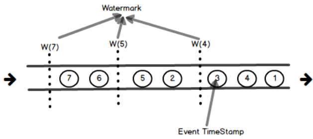
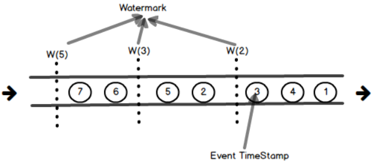
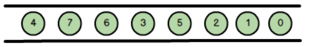
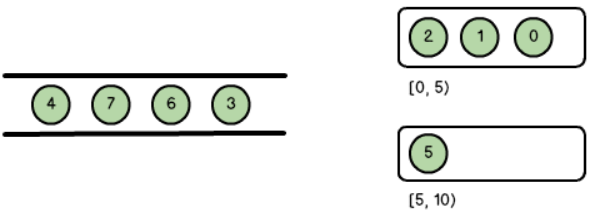
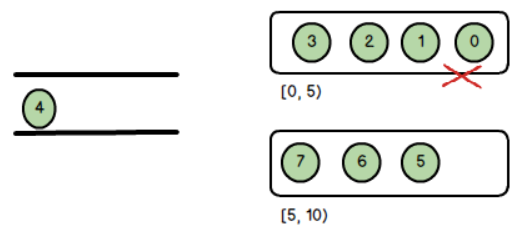

---

Created at: 2021-10-10
Last updated at: 2021-10-18


---

# 15-watermark


我们知道Event Time是数据的产生时间，那如何实现整个数据流处理过程中的时间与Event Time有关呢，答案就是watermark。再次强调，时间语义并不是时间窗口独有的一个概念，在整个Flink应用处理流程中，凡是涉及到时间的操作，其依据的时间标准都由时间语义来决定，比如时间窗口的开启与关闭、ProcessFunction中定时器的触发。watermark是EventTime的实现方式，如果ProcessFunction中的定时器的时间语义是EventTime，那么它触发的依据就是watermark中的时间，如果定义的时间窗口的语义是EventTime，那么该窗口的开启与关闭的依据也是watermark中的时间。因为时间窗口是最常用的涉及时间的操作，所以下面通过说明watermark是如何作用于时间窗口的开启与关闭的过程来说明watermark的原理。

首先计数窗口没有时间的概念，只有时间窗口才与时间语义有关，其次对于时间窗口而言，ProcessTime没有迟到的概念，只有EventTime才有迟到的概念。
因为对于ProcessTime来说，Flink对窗口计时的时间就是当前操作系统的时间，也就是整个Flink集群的同步时间，ProcessTime窗口处理数据时并不关心数据产生的时间，所以ProcessTime窗口没有迟到的概念，比如对于大小为5s的ProcessTime窗口，那就真的是系统时间走5s之后窗口关闭。
但是对于EventTime来说，Flink对窗口计时的时间取决于数据中的时间戳，与当前操作系统的时间没有关系，Flink会把数据中的时间戳赋值给watermark作为当前时间，如果某个窗口的截止时间小于watermark，那么该窗口就会被关闭。正是因为EventTime窗口的当前时间与取决于数据的时间戳，所以 EventTime窗口有迟到的概念。也正是因为EventTime窗口关心的是数据产生的时间，所以绝大多数Flink业务都会使用EventTime窗口。

也就是说，watermark是EventTime窗口的当前时间，它取决于数据的时间戳，某个窗口的截止时间小于watermark，那么该窗口就会被关闭。那watermark是如何取决于数据的时间戳呢，换言之，watermark是如何通过数据的时间戳计算得到的呢，是Flink直接把收到数据的时间戳赋值给watermark吗？答案是没这么简单，但也没那么复杂，将数据的时间戳赋值给watermark的具体策略取决于需求。

首先要设置时间语义为EventTime，因为只有时间语义是EventTime的时间窗口才有watermark，才有迟到数据的概念，才能进行下面的一系列的操作。注意Watermark是一个类，它里面保存的时间戳是以毫秒为单位。
```
env.setStreamTimeCharacteristic(TimeCharacteristic.EventTime);
```
然后要通过DataStream的assignTimestampsAndWatermarks()方法设置将时间戳赋值给watermark的策略，assignTimestampsAndWatermarks()方法需要传入AssignerWithPeriodicWatermarks接口 或者 AssignerWithPunctuatedWatermarks 接口的子类实现，这两个接口均是继承自TimestampAssigner接口，
TimestampAssigner接口有一个extractTimestamp()方法，表示如何从数据中提取时间戳，这个方法需要用户实现，然后TimestampAssigner接口的这两个子接口中又各自有自己将时间戳赋值给watermark的策略，即AssignerWithPeriodicWatermarks接口的getCurrentWatermark()方法 和 AssignerWithPunctuatedWatermarks接口的checkAndGetNextWatermark()方法，那这两个接口又什么区别呢？区别就在于Flink会周期性地调用AssignerWithPeriodicWatermarks接口的getCurrentWatermark()方法来生成watermark，而对于AssignerWithPunctuatedWatermarks 接口，Flink每接收一条数据都会调用这个接口的checkAndGetNextWatermark方法来生成watermark，可以从两个接口的名字中看到这一点。

`如果使用的是``AssignerWithPeriodicWatermarks接口，Flink会周期性地生成watermark，也就是说不管有没有数据到来，Flink都会在使用``assignTimestampsAndWatermarks``()方法的地方周期性地生成watermark向下游传递``，因为只有这样才能触发基于EventTime的操作，比如窗口的关闭 和 ProcessFunction中EventTime定时器。`这个周期的默认值是200ms，这个时间是系统时间，即时间语义是ProcessTime，在setStreamTimeCharacteristic()方法里被设置的，这个方法就是设置运行环境时间语义的方法：
```
@PublicEvolving
public void setStreamTimeCharacteristic(TimeCharacteristic characteristic) {
   this.timeCharacteristic = Preconditions.checkNotNull(characteristic);
   if (characteristic == TimeCharacteristic.ProcessingTime) {
      `getConfig().setAutoWatermarkInterval(0);`
   } else {
      `getConfig().setAutoWatermarkInterval(200);`
   }
}
```
可以看到当时间语义是ProcessingTime时，周期性生成watermark的时间是0ms，也就是并不会生成watermark。
也可以自己设置周期，单位是ms，这个值设置大点对计算结果应该没什么影响，只是窗口关闭得会慢点，也就是得到计算结果的延时会高点。
```
env.getConfig().setAutoWatermarkInterval(200);
```

Flink提供了AssignerWithPeriodicWatermarks接口的两个子抽象类实现，即AscendingTimestampExtractor 和 BoundedOutOfOrdernessTimestampExtractor，它俩均实现了getCurrentWatermark()方法，我们可以直接拿来使用，不过还需要实现这两个抽象类从TimestampAssigner接口继承来的extractTimestamp方法即可，因为这个方法与用户数据有关，所以必须由用户自定义。
那AscendingTimestampExtractor 和 BoundedOutOfOrdernessTimestampExtractor 的 getCurrentWatermark()方法有什么区别吗，换句话说，这两个子类将时间戳赋值给watermark的策略有什么区别呢？

首先在两个类中都有一个当前时间戳字段，这个字段的值是当前Flink系统收到的数据中的最大时间戳，因为Flink收到数据的顺序并不一定是数据中时间戳升序的顺序，所以Flink需要始终保留数据的最大时间戳，然后以这个时间戳计算得到watermark，这样才能保证了watermark值只会增加，不会减少，因为watermark作为当前时间不能后退。
其次就是这两个子类的具体是如何通过最大时间戳计算得到watermark的，也就它们的getCurrentWatermark()方法有什么区别？
AscendingTimestampExtractor 的 getCurrentWatermark()方法：
```
@Override
public final Watermark getCurrentWatermark() {
   return new Watermark(currentTimestamp == Long.MIN_VALUE ? Long.MIN_VALUE : `currentTimestamp - 1`);
}
```
可以看到 AscendingTimestampExtractor 直接将最大时间戳-1赋值给了watermark，也就是watermark是当前Flink接收到的数据的最大时间戳-1ms，这1ms忽略不计：

比如窗口大小是5s，因为窗口左闭右开的区间，所以第一个窗口是\[0ms, 5000ms)，也就是当Flink收到的最大时间戳为5000ms时， watermark=5000ms（那1ms忽略），因为当窗口的截止时间小于watermark时，该窗口会被关闭，所以此时第一个窗口会被关闭。
也就是说采用AscendingTimestampExtractor生成 watermark的策略，窗口并不会等迟到的数据，即第一个窗口\[0ms, 5000ms)中的数据必须在时间戳为5000+ms的数据之前到（5000+表示5000及以上），不然窗口就关闭了。这种策略适合窗口收到数据的顺序等于数据生成的顺序，即窗口以数据时间戳升序的形式接收数据的情况，从AscendingTimestampExtractor 的名字中也可以看到这一点。
通过DataStream的assignTimestampsAndWatermarks()方法设置watermark的生成策略为AscendingTimestampExtractor ：
```
dataStream.assignTimestampsAndWatermarks(new AscendingTimestampExtractor<Tuple3<String, Long, Integer>>() {
    @Override
    public long extractAscendingTimestamp(Tuple3<String, Long, Integer> element) {
        return element.f1;
    }
});
```

BoundedOutOfOrdernessTimestampExtractor 的 getCurrentWatermark()方法：
```
@Override
public final Watermark getCurrentWatermark() {
   // this guarantees that the watermark never goes backwards.
   long potentialWM = `currentMaxTimestamp - maxOutOfOrderness`;
   if (potentialWM >= lastEmittedWatermark) {
      lastEmittedWatermark = potentialWM;
   }
   return new Watermark(lastEmittedWatermark);
}
```
可以看到BoundedOutOfOrdernessTimestampExtractor 会将最大时间戳减去 maxOutOfOrderness 后赋给 watermark，maxOutOfOrderness 是最大乱序程度的意思，是一个时间间隔，比如maxOutOfOrderness=2：

再比如窗口大小为5s，maxOutOfOrderness大小为2s，那么第一个窗口是\[0ms, 5000ms)，当Flink收到的最大时间戳为5000ms时，此时watermark是5000ms-2000ms=3000ms，也就是说此时并不会关闭\[0ms, 5000ms)窗口，只有当Flink收到的最大时间戳为7000+ms时，watermark=5000+ms，此时才会关闭第一个窗口。
也就是说采用 BoundedOutOfOrdernessTimestampExtractor 生成 watermark的策略，窗口会等迟到的数据，即第一个窗口\[0ms, 5000ms)中的数据在时间戳为7000+ms的数据之前到都行，都会进到第一个窗口中，但是不能在时间戳为7000+ms的数据之后到，因为只要时间戳为7000+ms的数据一到，第一个窗口就会关闭。
再比如窗口大小为5，maxOutOfOrderness为2，数据以下面的顺序进入到窗口

当5到的时候，watermark=3，此时窗口中数据如下：

当7到的时候，watermark=5，此时窗口\[0,5)会被关闭，4属于迟到数据不会进入到窗口\[0,5)中：

设置watermark的生成策略为BoundedOutOfOrdernessTimestampExtractor ，通过匿名内部类调用父类构造方法传入maxOutOfOrderness的值：
```
dataStream.assignTimestampsAndWatermarks(
        new BoundedOutOfOrdernessTimestampExtractor<Tuple3<String, Long, Integer>>(`Time.seconds(2)`) {
            @Override
            public long extractTimestamp(Tuple3<String, Long, Integer> element) {
                return element.f1;
            }
        });
```

Flink没有自带的 AssignerWithPunctuatedWatermarks 接口的实现子抽象类，因为Flink每接收一条数据都会调用这个接口的checkAndGetNextWatermark方法来生成watermark，而watermark会作为一条特殊的数据从上游任务传到下游任务中，如果每来一条数据都生成一个watermark的话，那么传输的数据量将会翻倍，系统的效率将会降低。有需要可以自定义AssignerWithPunctuatedWatermarks 接口的实现，包括可以自定义AssignerWithPeriodicWatermarks接口的实现。

