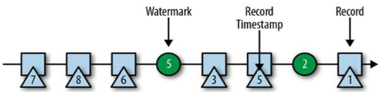
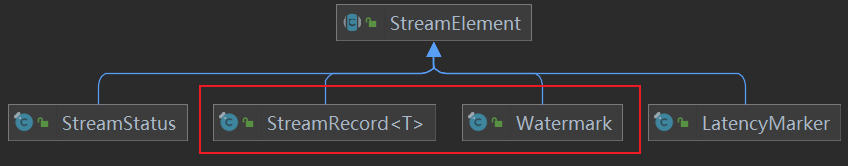
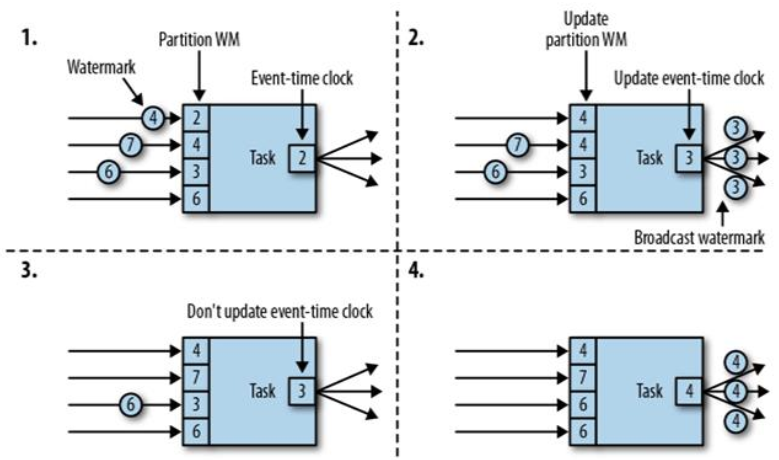
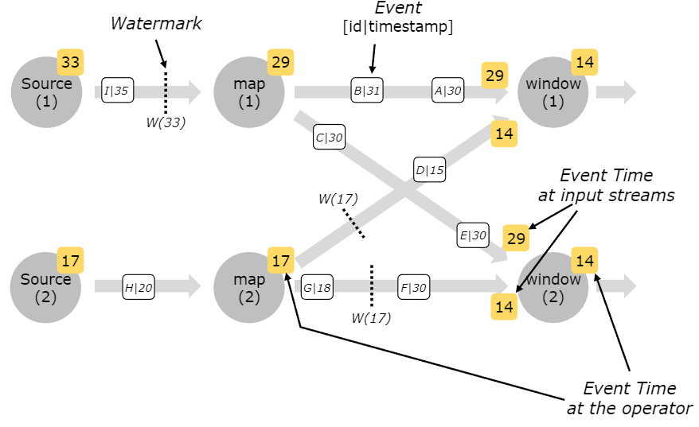

---

Created at: 2021-10-12
Last updated at: 2022-06-29

---

# 16-watermark的传递

当时间语义设置为EventTime后，窗口的时间就与数据的时间戳有关了，但是在Flink的分布式流处理中，数据会被分散到各条并行流中处理，这就会导致每条流感知到时间不一样，但是我们要求所有窗口感知到时间是一样的，也就是keyBy之后的每个分组的窗口感知到的watermark需要是一样的，这样才能保证所有分组的窗口同时关闭然后计算输出结果。为了实现这个目的，事实上watermark实际上也是一条数据，从调用assignTimestampsAndWatermarks()指定如何生成watermark开始，watermark会与业务数据一起从上游向下游传递。

watermark能作为数据与业务数据一起向下游传递是因为Watermark是一个类（里面只有一个时间戳），与普通的业务数据StreamRecord都继承自StreamElement抽象类。

但是与StreamRecord有一点不同，当数据发生Redistributing（不是one-to-one）时，watermark会以广播的方式向下游分区传递，这样才能保证所有Redistributing后的下游分区接收到相同的watermark。也就是说从调用assignTimestampsAndWatermarks()指定如何生成watermark起，数据以one-to-one模式传递时，每条并行流中的watermark并不相同，当数据发生第一次Redistributing时，Redistributing后的第一个算子的所有子任务会接收到相同的watermark，然后该算子的所有子任务会选出最小的那个watermark再向下游传递。再仔细一想，当发生第一次Redistributing后，后面不管是one-to-one还是再发生Redistributing，所有并行流中watermark都会是相同的，因为第一次Redistributing后的第一个算子的所有子任务向下游发送的是相同的watermark（rescale()的Redistributing可能例外）。又因为开窗之前一定会进行一次Redistributing（如果是DataStream开窗，则所有数据进入一个窗口中；如果是KeyedStream开窗，则会先进行一次keyBy），所以所有窗口感知到watermark一定是相同的。

下图展示了当一个下游分区收到多个上游分区的数据时，这个下游分区会先保存所有上游分区发送过来的watermark，然后从中选出最小的那个watermark再向下游传递，以后每当有一个上游分区发送过来新的watermark，这个下游分区就会先更新对应分区的watermark，之后再选出最小的watermark，如果这次选出的watermark与上次发送watermark不同（不同的话一定是比上次发送的watermark大），则将次watermark向下游发送，如果相同则不进行发送：

从下图中可以看到，窗口之前的各条并行流中的watermark可以不同，但是所有窗口感知到的watermark就是一样。这是因为在window之前有keyBy，keyBy会发生Redistributing，所以map的子任务会广播watermark到下游窗口所在的所有子任务中，然后所有子任务取最小的watermark作为当前的watermark，于是所有窗口感知到的watermark就是一样的了。

