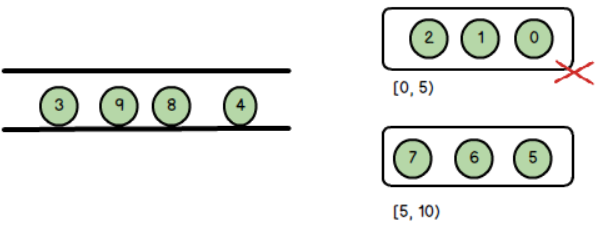
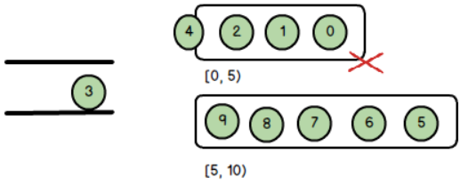
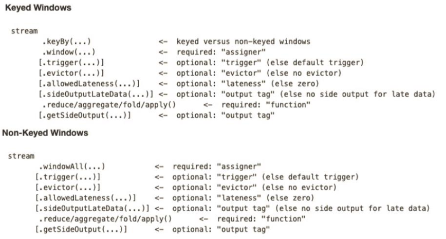

---

Created at: 2021-10-11
Last updated at: 2022-06-29


---

# 17-Window API 之 处理迟到数据


我们知道截止时间小于当前watermark的窗口都会被关闭，那迟到了的数据应该怎么处理呢。比如下图，窗口大小为5，maxOutOfOrderness为2，因为已接受数据的最大时间戳是7，所以此时watermark=5，窗口\[0,5)会被关闭，4和3属于迟到数据不会进入到窗口\[0,5)中。

那4和3该怎么处理呢，首先我们可以使用WindowedStream的allowedLateness()方法设置一个允许迟到的时间，这个时间仍是以watermark为准，比如allowedLateness(Time.seconds(2))表示允许数据迟到2s。设置允许迟到时间之后的计算过程是，在窗口关闭时，会对窗口中的数据进行一次计算然后输出结果，在允许迟到时间内来的迟到数据，每来一条都会与已关闭窗口中的数据重新做一次计算得到结果，然后输出这个结果。比如上图中窗口\[0,5)首先会基于(2,1,0)计算得到一个结果输出，然后数据4来了，此时的watermark仍然等于5，没有超过最大允许迟到时间，于是在基于(4,3,2,1,0)计算得到一个结果输出（具体怎么算要看是增量聚合函数还是全窗口函数）。
然后8和9来了，此时watermark=7，因为允许迟到时间到了，所以3来了不会再与窗口中的数据重新做一次计算。

那3该怎么处理呢，我们可以使用WindowedStream的sideOutputLateData()方法设置侧输出流，对于在允许时间之后迟到的数据直接扔进侧输出流中，再在侧输出流中做处理，比如，因为此时主输出流已关闭的窗口已经将计算结果保存在外部系统中了如MySQL，我们可以将这个结果取出来再与侧输出流中的数据聚合。

测试程序，注意：
1.socketTextStream读取数据时不会产生watermark，因为还没有调用assignTimestampsAndWatermarks()指定如何生成watermark。socketTextStream并行度始终为1，如果不设置env.setParallelism(1)，那么map的并行度等于cpu线程数，所以中间会发生Redistributing，默认是rebalance，即将数据轮询地发往每个map子任务，这中间没有watermark的广播。
2.必须设置env.setParallelism(1)，因为如果不设置env.setParallelism(1)，那么map的并行度等于cpu线程数，在并行流中下游的窗口取的是上游的传递过来的最小的watermark，所以只有输入大量数据让每条map流中的watermark更新，才能让下游窗口的watermark更新，于是才能输出比较靠前的窗口的计算结果，这样就不利于测试了。
3.得到侧输出流的getSideOutput()方法在SingleOutputStreamOperator类中，这个类是DataStream的子类。
4\. 必须创建的是OutputTag的匿名子类对象new OutputTag<>("late-data") {}; 这是由于Java泛型擦除引起的问题。
```
public static void main(String[] args) throws Exception {
    StreamExecutionEnvironment env = StreamExecutionEnvironment.getExecutionEnvironment();
    `env.setParallelism(1);`
    env.setStreamTimeCharacteristic(TimeCharacteristic.EventTime);
    env.getConfig().setAutoWatermarkInterval(100);
    `OutputTag<Tuple3<String, Long, Integer>> outputTag = new OutputTag<>("late-data") {};`
    SingleOutputStreamOperator<Tuple3<String, Long, Integer>> singleOutputStreamOperator = env.socketTextStream("localhost", 7777)
            .map(new MapFunction<String, Tuple3<String, Long, Integer>>() {
                @Override
                public Tuple3<String, Long, Integer> map(String value) throws Exception {
                    String[] split = value.split(",");
                    return new Tuple3<>(split[0], Long.parseLong(split[1]), Integer.parseInt(split[2]));
                }
            })
            `.assignTimestampsAndWatermarks(`
 `new BoundedOutOfOrdernessTimestampExtractor<Tuple3<String, Long, Integer>>(Time.seconds(2)) {`
 `@Override`
 `public long extractTimestamp(Tuple3<String, Long, Integer> element) {`
 `return element.f1;`
 `}`
 `})`
            .keyBy(0)
            `.timeWindow(Time.seconds(5))`
 `.allowedLateness(Time.seconds(2))`
 `.sideOutputLateData(outputTag)`
            .maxBy(2);

    singleOutputStreamOperator.print();
    DataStream<Tuple3<String, Long, Integer>> sideOutput = singleOutputStreamOperator.getSideOutput(outputTag);
    sideOutput.print("late-data");
    env.execute();
}
```

以上测试程序，窗口大小为5s，maxOutOfOrderness为2s，允许迟到时间为2s，有侧输出流。

输入如下数据：
```
k1,1633947551000,1
k1,1633947552000,2
k1,1633947553000,3
k1,1633947554000,4
k1,1633947554999,5
k1,1633947555000,5
k1,1633947556000,6
k1,1633947557000,7
```
出现第一条结果：
```
(k1,1633947554999,5)
```
可见第一个窗口是\[1633947550000，1633947555000)，为什么第一个窗口的起始时间不是1633947551000呢？
时间语义是EventTime的滚动时间窗口的窗口分配规则是TumblingEventTimeWindows类的assignWindows()方法：
```
@Override
public Collection<TimeWindow> assignWindows(Object element, long timestamp, WindowAssignerContext context) {
   if (timestamp > Long.MIN_VALUE) {
      // Long.MIN_VALUE is currently assigned when no timestamp is present
 `long start = TimeWindow.getWindowStartWithOffset(timestamp, offset, size);`
      return Collections.singletonList(new TimeWindow(start, start + size));
   } else {
      throw new RuntimeException("Record has Long.MIN_VALUE timestamp (= no timestamp marker). " +
            "Is the time characteristic set to 'ProcessingTime', or did you forget to call " +
            "'DataStream.assignTimestampsAndWatermarks(...)'?");
   }
}
```
起始时间的计算逻辑getWindowStartWithOffset()方法在TimeWindow类中：
```
public static long getWindowStartWithOffset(long timestamp, long offset, long windowSize) {
   return `timestamp - (timestamp - offset + windowSize) % windowSize;`
}
```
可以看到，如果offset设置为0，那么该数据所在窗口的起始时间就是窗口大小的整数倍，也就是说，每个窗口的时间范围在窗口大小给定时就已经确定了，每来一条数据都只是根据其时间戳计算其属于哪个窗口。所以对于EventTime时间窗口而言，无论是滚动还是滑动窗口，其实给定窗口大小和滑动步长之后，所有窗口就已经确定，`即窗口的起始时间就是窗口大小的整数倍`，Flink对接下来到来的数据所需要做的事情就是，`每到一条数据就先计算出它属于哪一个窗口，然后更新watermark，再看需要关闭哪些窗口`。
offset可以在使用window()方法创建窗口时的窗口分配器中指定，用于偏移窗口的起始值，这个一般用于调整数据源和Flink所在时区不一致的情况。

第二个窗口是\[1633947555000，1633947560000)，又maxOutOfOrderness为2s，所以输入时间戳为1633947562000才会输出第二窗口的结果：
```
k1,1633947562000,8
```
输出第二窗口的结果：
```
(k1,1633947557000,7)
```
此时第二个窗口已经关闭，但因为允许迟到时间为2s，所以下面每输入一条属于第二个窗口的数据，就会输出第二个窗口的一个聚合结果
输入：
```
k1,1633947558000,9
```
输出：
```
(k1,1633947558000,9)
```
输入：
```
k1,1633947559000,0
```
输出：
```
(k1,1633947558000,9)
```

此时输入时间戳为1633947564000的数据，导致允许迟到时间失效
```
k1,1633947564000,10
```
再输入第二个窗口的数据，那么该数据会进入侧输出流：
输入：
```
k1,1633947558500,12
```
输出：
```
late-data> (k1,1633947558500,12)
```

综上，对于乱序迟到数据，EventTime时间窗口有3种依次递进的策略：
1.watermark设置maxOutOfOrderness
2.allowedLateness允许迟到时间
3.sideOutputLateData侧输出流

于是Flink的Window API调用顺序如下，加方括号的表示是可选API调用，没有加方括号的表示是必须被调用的API。


