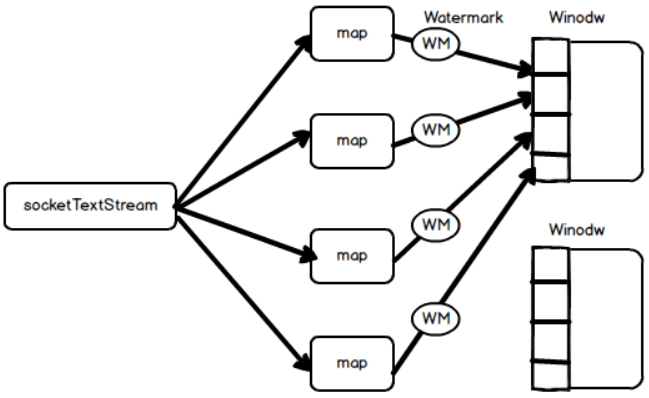

---

Created at: 2021-10-12
Last updated at: 2021-10-13


---

# 18-并行流watermark传递测试


设置并行度为4，于是map算子的并行度会是4，socketTextStream固定是1：
```
public static void main(String[] args) throws Exception {
    StreamExecutionEnvironment env = StreamExecutionEnvironment.getExecutionEnvironment();
    `env.setParallelism(4);`
    env.setStreamTimeCharacteristic(TimeCharacteristic.EventTime);
    env.getConfig().setAutoWatermarkInterval(100);
    OutputTag<Tuple3<String, Long, Integer>> outputTag = new OutputTag<>("late-data") {};
    env.socketTextStream("localhost", 7777)
            .map(new MapFunction<String, Tuple3<String, Long, Integer>>() {
                @Override
                public Tuple3<String, Long, Integer> map(String value) throws Exception {
                    String[] split = value.split(",");
                    return new Tuple3<>(split[0], Long.parseLong(split[1]), Integer.parseInt(split[2]));
                }
            }).assignTimestampsAndWatermarks(
                    new BoundedOutOfOrdernessTimestampExtractor<Tuple3<String, Long, Integer>>(Time.seconds(2)) {
                        @Override
                        public long extractTimestamp(Tuple3<String, Long, Integer> element) {
                            return element.f1;
                        }
                    })
            .keyBy(0)
            .timeWindow(Time.seconds(5))
            .maxBy(2)
            .print();
    env.execute();
}
```
socketTextStream会轮询地向map的子任务发数据，map的每个子任务会根据收到数据的时间戳产生watermark，然后广播到下游的每个窗口，因为map的每个子任务接收到的数据不同，所以产生的watermark也不同，不过这些watermark下游的所有窗口都会收到，然后所有窗口会选取最小watermark：

于是输入如下数据才会输出第一个窗口\[1633947550000,1633947555000)的结果：
```
k1,1633947551000,1
k1,1633947552000,2
k1,1633947553000,3
k1,1633947554000,4
k1,1633947557000,5
k1,1633947557000,5
k1,1633947557000,5
k1,1633947557000,5
```
输出：
```
1> (k1,1633947554000,4)
```

可以把assignTimestampsAndWatermarks放在Source后面，这样在socketTextStream读取数据后就会产生watermark，因为socketTextStream和map之间有Redistributing，所以socketTextStream会广播watermark到map算子的所有子任务中，map算子的子任务不存在选取最小watermark，因为只有一个上游分区，然后map算子的所有子任务广播watermark到所有窗口中，窗口会选取最小watermark，但是上游每个分区发送过来的 watermark都一样，所以窗口的watermark也是实时更新的：
```
public static void main(String[] args) throws Exception {
    StreamExecutionEnvironment env = StreamExecutionEnvironment.getExecutionEnvironment();
    env.setParallelism(4);
    env.setStreamTimeCharacteristic(TimeCharacteristic.EventTime);
    env.getConfig().setAutoWatermarkInterval(100);
    OutputTag<Tuple3<String, Long, Integer>> outputTag = new OutputTag<>("late-data") {};
    env.socketTextStream("localhost", 7777)
 `.assignTimestampsAndWatermarks(`
 `new BoundedOutOfOrdernessTimestampExtractor<String>(Time.seconds(2)) {`
 `@Override`
 `public long extractTimestamp(String element) {`
 `return Long.parseLong(element.split(",")[1]);`
 `}`
 `})`
            .map(new MapFunction<String, Tuple3<String, Long, Integer>>() {
                @Override
                public Tuple3<String, Long, Integer> map(String value) throws Exception {
                    String[] split = value.split(",");
                    return new Tuple3<>(split[0], Long.parseLong(split[1]), Integer.parseInt(split[2]));
                }
            })
            .keyBy(0)
            .timeWindow(Time.seconds(5))
            .maxBy(2)
            .print();
    env.execute();
}
```
于是输入如下数据就会输出第一个窗口\[1633947550000,1633947555000)的结果：
```
k1,1633947551000,1
k1,1633947552000,2
k1,1633947553000,3
k1,1633947554000,4
k1,1633947557000,5
```
输出：
```
1> (k1,1633947554000,4)
```

