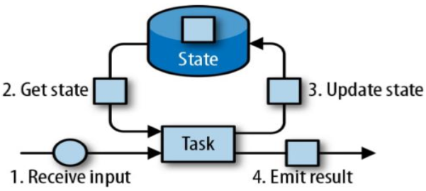
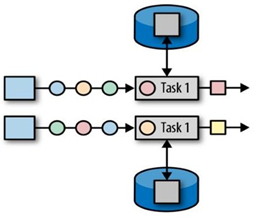
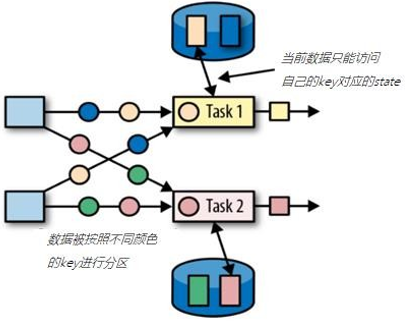
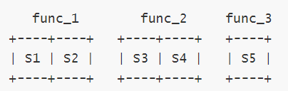
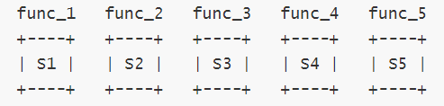
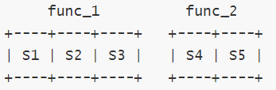
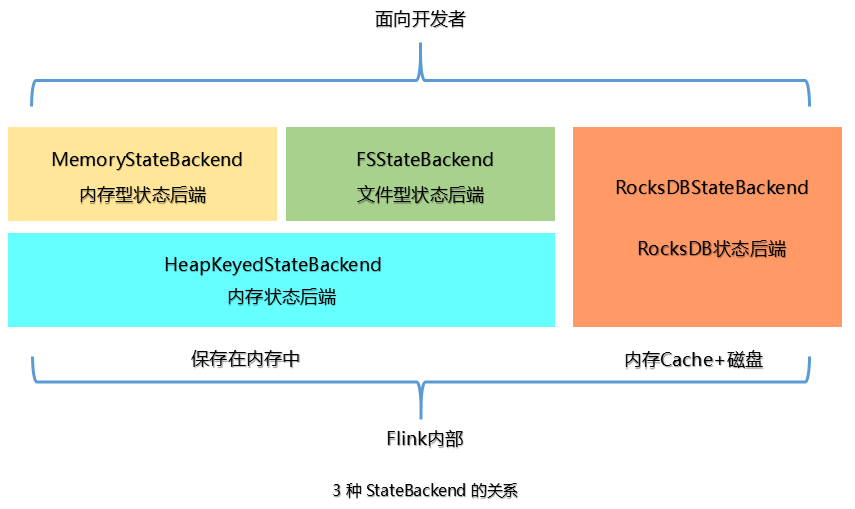

---

Created at: 2021-10-12
Last updated at: 2025-03-20


---

# 19-状态编程 与 状态后端


流式计算分为无状态和有状态两种情况。状态是指中间计算结果。无状态不会保存中间计算结果，数据来一条处理一条，比如map算子；有状态会保存中间计算结果，数据来一条就会基于之前保存的状态计算一个结果，并把这个结果更新到状态中（如下图所示），比如聚合算子就是有状态的计算。在Flink中，聚合算子因为其计算特点，本身就会维护一个状态，而map等简单转换算子本身是没有状态的，但也可以在算子为其定义状态。


状态又分为类型：

* 算子状态（ Operator State）
* 键控状态（ Keyed State）

首先无论是算子状态还是键控状态，状态都是在算子中定义。
算子状态：因为同一个算子会有多个并行子任务，所以如果是有状态的算子，那么该算子的每一个子任务都会有自己状态，算子状态正是指的这种情况，即算子的每一个子任务都会维护一份自己的状态，互不干扰。

键控状态：对流keyBy分组之后，每一组数据都会有一个状态，互不干扰，这就是键控状态，也就是说对分组操作的有状态算子的每一个子任务都可能会有多个键控状态，因为每一个子任务可能会处理多个分组的数据。


**算子状态**
为map算子定义一个算子状态，用于统计流经每个子任务数据的个数：
```
public static void main(String[] args) throws Exception {
    StreamExecutionEnvironment env = StreamExecutionEnvironment.getExecutionEnvironment();
    `env.setParallelism(2);`
    DataStream<String> dataStream = env.socketTextStream("localhost", 7777);
    dataStream.map(new MapFunction<String, Integer>() {
        `// 定义一个变量作为算子状态`
 `private int count = 0;`
        @Override
        public Integer map(String value) throws Exception {
            return ++count;
        }
    }).print();
    env.execute();
}
```
这里是直接在匿名内部类中定义了一个字段作为算子状态，这是可以的，因为该匿名内部类的对象会在JobManager上实例化，然后被序列化发送到每个map算子的子任务上，每个子任务反序列化之后都会独立地拥有一份这个对象，于是每个子任务就都拥有了一个状态，只不过Flink并不知道这个算子状态，所以该状态不能被保存在checkpoint里，也就无法使用到Flink提供的故障恢复机制和状态一致性。
要想算子状态使用到Flink提供的故障恢复机制和状态一致性保障，就需要实现ListCheckpointed接口，指定如何保存你自己定义的算子状态：
```
static class MyCountState implements MapFunction<String, Integer>, `ListCheckpointed`<Integer> {
    private int count = 0;
    @Override
    public Integer map(String value) throws Exception {
        return ++count;
    }
    @Override
    public List<Integer> snapshotState(long checkpointId, long timestamp) throws Exception {
        return Collections.singletonList(count);
    }
    @Override
    public void restoreState(List<Integer> state) throws Exception {
        for (Integer cnt : state) {
            count += cnt;
        }
    }
}
```
```
public static void main(String[] args) throws Exception {
    StreamExecutionEnvironment env = StreamExecutionEnvironment.getExecutionEnvironment();
    env.setParallelism(2);
    DataStream<String> dataStream = env.socketTextStream("localhost", 7777);
    dataStream.map(new MyCountState()).print();
    env.execute();
}
```
snapshotState()方法会在生成checkpoint时调用，用于保存状态到checkpoint中，返回值是一个列表，表示一个子任务可以保存多个状态。故障恢复时会调用restoreState()方法恢复子任务的状态，传入的也是一个列表，因为可能会有多个状态分配到这个子任务上，这时需要对状态进行合并。
故障恢复时，如果并行度发生变化，那么每个子任务从checkpoint中分配到的状态的数量就会与发生故障之前的状态数量不同：
比如发生故障之前并行度为3，3个子任务分别有2、2、1个状态：

故障恢复之后并行度变为5，于是状态重新分配：

或者故障恢复之后并行度变为2：


**键控状态**
如果直接对KeyedStream使用匿名内部类中定义了一个字段的方式定义状态，那这个状态仍是算子状态，更新这个状态的值时与分组的key无关，每来一条数据都会更新字段的值：
```
public static void main(String[] args) throws Exception {
    StreamExecutionEnvironment env = StreamExecutionEnvironment.getExecutionEnvironment();
    env.setParallelism(2);
    DataStream<String> dataStream = env.socketTextStream("localhost", 7777);
    dataStream.keyBy(v -> v)
            /`/一个子任务只在一个线程上执行，一个线程有一个MapFunction的匿名子类对象，`
 `//所以即使keyBy分组之后，只要分组在一个分区(子任务)上，那么都是通过这个线程调用这个匿名子类对象的方法，`
 `//所以处于同一个分区的分组会是共享算子的状态（即count变量）`
            .map(new MapFunction<String, Tuple2<String, Integer>>() {
                `private int count = 0;`
                @Override
                public Tuple2<String, Integer> map(String value) throws Exception {
                    return new Tuple2<>(value, ++count);
                }
            }).print();
    env.execute();
}
```

如果想每个分组一个状态需要使用键控状态接口，以下键控状态接口均继承自State接口：

* 值状态（ Value state）：将状态表示为单个的值

ValueState<T>保存单个的值，值的类型为 T，其基本操作如下：
ValueState.value()，即get 操作
ValueState.update(T value)，即set 操作

* 列表状态（ List state）：将状态表示为一组数据的列表

ListState<T>保存一个列表，列表元素的数据类型为T，其基本操作如下：
ListState.add(T value)
ListState.addAll(List<T> values)
ListState.get()，返回Iterable<T>
ListState.update(List<T> values)

* 映射状态（ Map state）：将状态表示为一组 Key-Value 对

MapState<K, V>保存 Key-Value 对，其基本操作如下：
MapState.get(UK key)
MapState.put(UK key, UV value)
MapState.contains(UK key)
MapState.remove(UK key)

* 聚合状态（ Reducing state & Aggregating State）：将状态表示为一个用于聚合操作的列表

ReducingState<T>
AggregatingState<I, O>
State.clear()是所有状态都有的清空操作，直接将分组对应的状态值置为null。

使用键控状态必须实现富函数，因为键控状态需要从运行时上下文中获取，而且键控状态的赋值只能在open()方法中进行，因为每个子任务的运行时上下文是不同的。使用ValueState统计每个分组数据的数量：
```
public static void main(String[] args) throws Exception {
    StreamExecutionEnvironment env = StreamExecutionEnvironment.getExecutionEnvironment();
    env.setParallelism(2);
    DataStream<String> dataStream = env.socketTextStream("localhost", 7777);
    dataStream.keyBy(v -> v)
            .map(
                    `// KeyedStream使用Keyed state键控状态时候，会根据传进来元素的分组字段找到对应的键控状态`
 `// valueState.value()是获取键控状态的值，valueState.update()是更新键控状态的值，`
 `// 所以每个组都会有一个键控状态，这与是不是map算子无关，键控状态只能用在KeyedStream中使用。`
 `//（其实就是HashMap通过key找value，因为反序列化之后，每个子任务都有且只有一份valueState，`
 `// 但是一个子任务会有多个处理多个key，所以子任务在处理每一个key，都是去valueState里通过key找对应的值），`
                    new RichMapFunction<String, Tuple2<String, Integer>>() {
                        `private ValueState<Integer> valueState;`
                        `@Override`
 `public void open(Configuration parameters) throws Exception {`
 `valueState = getRuntimeContext().getState(new ValueStateDescriptor<>("count", Integer.class));`
 `}`
                        @Override
                        public Tuple2<String, Integer> map(String value) throws Exception {
                            /`/键控状态第一次获取值时为null`
 `Integer count = valueState.value();`
                            count = count == null ? 1 : count + 1;
                            `valueState.update(count);`
                            return new Tuple2<>(value, count);
                        }
                        @Override
                        public void close() throws Exception {
                            valueState.clear();
                        }
                    }).print();
    env.execute();
}
```
在生成checkpoint时，Flink会自动保存你从运行时上下文中生成的键控状态。需要注意的是虽然键控状态和算子状态一样会被保存在checkpoint中，但是键控状态在故障恢复不需要指定如何合并状态，因为键控状态是和分组绑定在一起，发生故障前有几个分组，故障恢复之后还是那几个分组，与并行度无关，所以不需要合并。
注意：Keyed state只能用于KeyedStream，不能用于DataStream、WindowedStream等其它流，因为DataStream没有key，WindowedStream虽然有key，但它视为有界流不需要一直维护一个中间状态，WindowedStream的增量聚合函数和全窗口聚合函数可以直接得到整个窗口的聚合结果。

**状态后端**
状态后端主要负责两件事：一是维护本地状态（就是对键控状态的维护，从键控状态中取值和更新键控状态的值），二是生成checkpoint并写到远程存储中。Flink提供了3种状态后端可供选择：

* MemoryStateBackend：内存级的状态后端，会将状态放在 TaskManager 的 JVM 堆内存中作为对象进行管理，而将 checkpoint 存储在 JobManager 的内存中。优点是快速、低延迟，缺点是不可靠，主要用于测试。
* FsStateBackend：将 checkpoint 存到远程的持久化文件系统（ FileSystem） 上， 比如HDFS，而对于本地状态， 跟 MemoryStateBackend 一样，放在 TaskManager 的 JVM 堆上，此种方式同时拥有内存级的本地访问速度，对于checkpoint也有容错保证，生产环境首选。
* RocksDBStateBackend：本地状态一部分放在内存中，一部分序列化后存入 RocksDB，这样可以避免OOM，checkpoint可以持久化到HDFS上。

设置状态后端
1.在conf/flink-conf.yaml配置文件中设置Flink集群使用的状态后端：
```
# state.backend: filesystem
# state.checkpoints.dir: hdfs://namenode-host:port/flink-checkpoints
```

2.代码中设置，这样每个作业就可以选择不同的状态后端了
```
env.setStateBackend(new MemoryStateBackend());
env.setStateBackend(new FsStateBackend(""));
/*
RocksDBStateBackend状态后端需要引入依赖
<dependency>
    <groupId>org.apache.flink</groupId>
    <artifactId>flink-statebackend-rocksdb_2.12</artifactId>
    <version>1.10.1</version>
</dependency>
*/
env.setStateBackend(new RocksDBStateBackend(""));
```
上面提到的 StateBackend是面向用户的，在Flink内部3种 State 的关系如下图：
在运行时，**MemoryStateBackend** 和 **FSStateBackend** 本地的 State 都保存在TaskManager的内存中，所以其底层都依赖于**HeapKeyedStateBackend**。HeapKeyedStateBackend面向Flink 引擎内部，使用者无须感知。


参考： [史上最全干货！Flink面试大全总结（全文6万字、110个知识点、160张图）](https://mp.weixin.qq.com/s?__biz=Mzg5NDY3NzIwMA==&mid=2247497240&idx=1&sn=954c0702a2d842f9facb4e36c8c44563&source=41#wechat_redirect)

