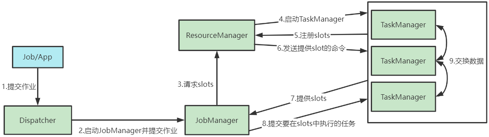
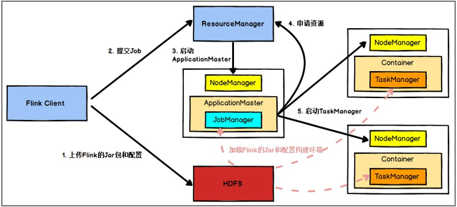

---

Created at: 2021-10-07
Last updated at: 2025-03-23

---

# 2-Flink运行架构

**一、Flink 运行时的组件**
Flink 运行时架构主要包括四个不同的组件： 作业管理器（JobManager）、资源管理器（ResourceManager）、任务管理器（TaskManager）， 以及分发器（Dispatcher）。因为 Flink 是用 Java 和 Scala 实现的，所以所有组件都会运行在Java 虚拟机上。

**1.作业管理器（ JobManager ）**
JobManager是控制一个应用程序执行的主进程（类似于Spark的Driver），也就是说，每向Flink提交一个job就会启动一个JobManager来控制整个作业的执行。

**2.任务管理器（ TaskManager ）**
TaskManager是Flink中的工作进程（类似于Spark的Executor）。
通常在Flink集群中会有多个TaskManager运行，每一个TaskManager都包含了一定数量的插槽（ slots），插槽数就是TaskManager可以启动的最大线程数，一个线程可以用来执行一个或多个任务，所以插槽的数量限制了TaskManager能够执行的任务数量。
TaskManager由ResourceManager控制启动， TaskManager启动之后，会向 ResourceManager注册它的插槽。TaskManager收到 ResourceManager的指令后，TaskManager 就会将一个或者多个插槽提供给 JobManager 调用，于是JobManager 就可以向插槽分配任务（tasks）。在执行过程中，一个 TaskManager 可以和同一应用程序的其它 TaskManager 交换数据。

**3.资源管理器（ ResourceManager ）**
ResourceManager主要负责管理 TaskManager 的插槽（slot），当 JobManager 申请slot资源时，ResourceManager 会将有空闲插槽的 TaskManager 分配给 JobManager。
 Flink 为不同的资源管理平台都提供了不同的ResourceManager，比如YARN、Mesos、K8s，以及 standalone模式。如果 ResourceManager 没有足够的插槽来满足 JobManager 的请求，它还可以向资源提供平台发起会话，申请提供启动 TaskManager 进程的容器。另外，ResourceManager 还负责终止空闲的 TaskManager，释放计算资源。

**4.分发器（ Dispatcher ）**
Dispatcher用于接收并提交作业。用户不仅可以通过命令行提交作业，还可以通过Dispatcher提供的用于接收作业的REST接口来提交作业，由于是 REST 接口，所以 Dispatcher 可以作为集群的一个 HTTP 接入点，这样就能够不受防火墙阻挡。
Dispatcher接收到作业之后就需要向JobManager提交作业，这时Dispatcher会先启动一个 JobManager，然后将应用提交给JobManager。
Dispatcher 还会启动一个Web UI，用来方便地展示和监控作业执行的信息。
Dispatcher 在架构中可能并不是必需的，这取决于应用提交运行的方式。

**二、任务提交流程**
**不考虑资源管理平台，Flink作业提交流程如下：**

1. 向Dispatcher提交作业，或者说应用，作业和应用是一个意思，但任务是作业的一部分
2. Dispatcher启动一个 JobManager，然后将应用提交给JobManager
3. JobManager向ResourceManager请求slots
4. ResourceManager启动TaskManager
5. TaskManager向ResourceManager注册自己拥有的slot数量
6. ResourceManager向TaskManager发送命令，要求TaskManager向JobManager提供slot
7. TaskManager向JobManager提供slots
8. JobManager向slot提交任务
9. TaskManager开启线程执行任务，具有先后顺序的任务会在执行时交换数据

**在 YARN Per-Job-Cluster模式下的任务提交流程：**
****
Flink 任务提交后，Client 向 HDFS 上传 Flink 的 Jar 包和配置， 之后向 Yarn ResourceManager 提交任务， ResourceManager 分配 Container 资源并通知对应的NodeManager 启动 ApplicationMaster， ApplicationMaster 启动后加载 Flink 的 Jar 包和配置构建环境，然后启动 JobManager，之后 ApplicationMaster 向 ResourceManager 申请资源启动 TaskManager，ResourceManager 分配 Container 资 源 后 ， 由ApplicationMaster 通 知 资 源 所 在 节 点 的 NodeManager 启动 TaskManager，NodeManager 加载 Flink 的 Jar 包和配置构建环境并启动 TaskManager，TaskManager 启动后向 JobManager 发送心跳包， 并等待 JobManager 向其分配任务。

**三、任务调度**

当Flink集群启动后，首先会启动一个 JobManger 和 一个或多个的TaskManager，接着由 Client 提交任务给 JobManager，JobManager 再调度任务到各个TaskManager 去执行， 然后 TaskManager 将心跳和统计信息汇报给 JobManager。TaskManager 之间以流的形式进行数据的传输。
Client、JobManger、TaskManager均为独立的 JVM 进程：

* Client 为提交 Job 的客户端，可以是运行在任何机器上（ 与 JobManager 环境连通即可）。Client不是分布式计算程序的一部分，它用于准备并发送dataflow(JobGraph)给 Master(JobManager)，提交 Job 后， Client 可以结束进程，也可以不结束并等待结果返回。
* JobManager 主要负责调度任务并协调 TaskManager 做 checkpoint 。JobManager 从 Client 处接收到 Job 和 JAR 包等资源后，会生成优化后的执行计划，并将任务调度到各个 TaskManager 去执行。
* TaskManager 在启动的时候就设置好了槽位数（slot），slot数就是TaskManager能启动的最大线程数。TaskManager 从 JobManager 处接收任务后，就会启动线程来执行任务，处于不同线程上的任务会与自己的上游任务建立 Netty 连接，用于接收并处理数据。

