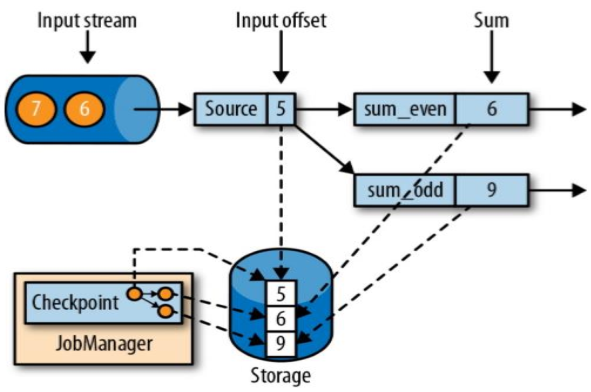
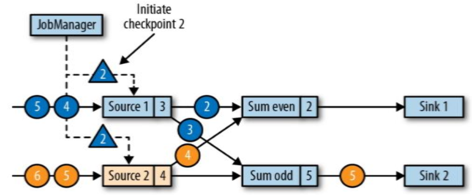
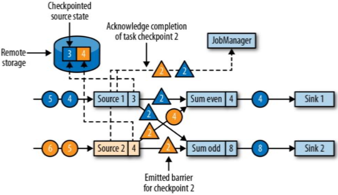
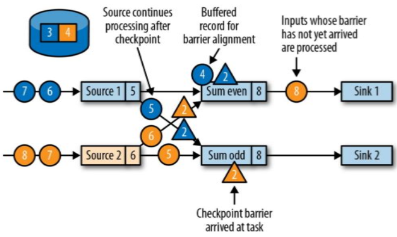
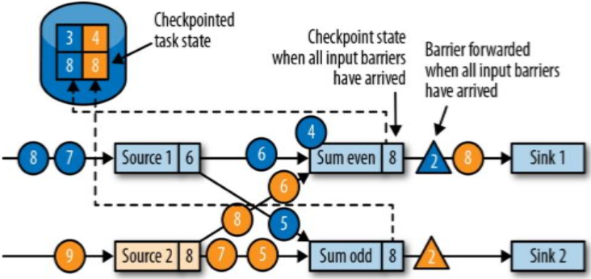
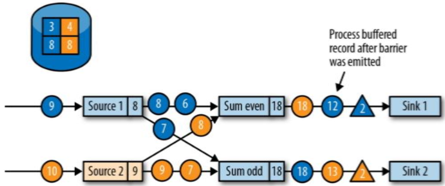
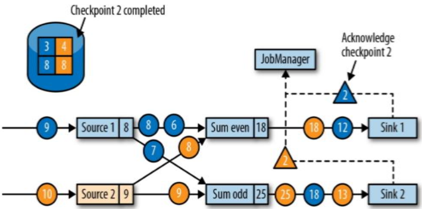
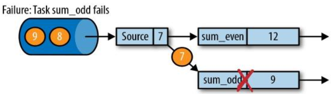
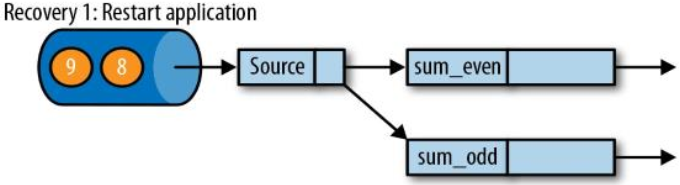
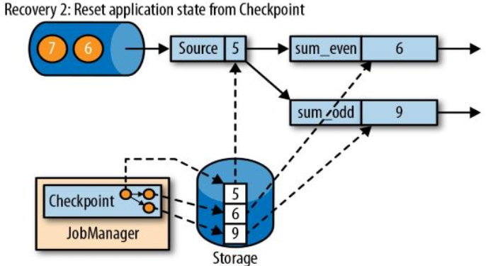

---

Created at: 2021-10-14
Last updated at: 2021-11-14


---

# 20-Flink容错机制


容错机制指的是集群的工作节点宕机之后如何重新恢复计算的方法。Flink的容错机制是定期生成检查点checkpoint，checkpoint中保存的是状态，当进行故障恢复时，只需加载最近一次的checkpoint，然后从checkpoint处恢复计算，这样就无需从头开始计算（无状态的子任务不需要考虑故障恢复，因为没有中间结果需要保存，子任务挂了就挂了，数据走其它子任务就好）。
比如有一个分别计算数据中的奇数之和和偶数之和的作业：

此时source任务中的状态是5，表示读完了1,2,3,4,5，这里的5既是数据5，又是位置5，但source保存在checkpoint中的状态是位置5。也就是source中保存的状态应该是从数据源读取数据的位置（比如当数据源是Kafka时，这个位置就是offset），这样才能知道在故障恢复后该从数据源的哪个位置开始读取数据。
sum\_even的状态是6，表示处理完2+4。sum\_odd的状态是9，表示处理完1+3+5。它门此刻的状态都由状态后端保存在了外部存储上，这个外部存储可能是JobManager的内存或者是HDFS。

从上面可以知道，每个有状态的子任务生成checkpoint的时间点应该是在处理完source状态对应那条数据之后，在处理下一条数据之前，只有这样才能在故障恢复时，保证source读进来的数据都是所有子任务的状态没有处理过数据，这样的检查点也称为**一致性检查点**，一致性检查点中保存的状态也称为一致性状态。
想实现一致性检查点有两种思路，一是在source生成检查点后，就不再向下游发送数据了，只有等到下游所有有状态子任务都保存完检查点后，再由JobManager通知Source向下游发送数据。因为所有子任务都需要等待其它有状态子任务保存完checkpoint才能继续进行下一条数据的计算，所以这是一种同步保存checkpoint的方式，其好处是实现简单，坏处是效率低。
第二种思路与watermark类似，就是在source生成检查点的那条数据之后加上一条特殊数据，当下游有状态子任务收到这条数据之后就会保存checkpoint，这条数据的传递和watermark一样，当发生数据的Redistributing，就会以广播的方式传递到下游，从而保证下游的所有子任务都会收到这条数据。在这种方式中，每个子任务都不用等待其它有状态子任务（而且还可以异步地保存checkpoint，即将此时的状态复制一份后立刻处理下一条数据，然后再新启动一个线程去保存原来的状态到checkpoint），所以这是一种异步保存checkpoint的方式。 

因为Flink的目标是低延时，所以当然会选择第二种保存checkpoint的思路，也称为基于 Chandy-Lamport 算法的分布式快照。那条特殊的数据在Flink中称为 **检查点分界线（ Checkpoint Barrier）**。 在有状态子任务中，分界线之前到来的数据导致的状态更改，都会被包含在当前分界线所属的检查点中；而基于分界线之后的数据导致的所有更改，就会被包含在新的的检查点中。

**Flink保存状态到检查点的****具体过程：**
1. JobManager 会向每个source子任务发送一条带有新检查点 ID 的消息，通过这种方式来启动生成检查点。


2\. 状态后端会先将source的状态写入检查点，写入完成后会通知source，之后source 向 JobManager 发送检查点保存完成的确认消息，并向下游广播Checkpoint Barrier。


3.**当一个下游子任务会收到多个上游子任务的数据时，也就会收到多个barrier，与watermark取最小值不同的是，此时下游子任务会等所有source的barrier到齐之后才开始保存状态到checkpoint（称为****barrier对齐****）**，这是因为barrier含义是所有barrier之前的数据都应该是已经处理完保存在状态中了，而barrier之后的数据应该保存在下一个状态中，所以在barrier尚未到齐之前，对于barrier已经到达的分区，继续到达的数据会被缓存， 而barrier尚未到达的分区，数据会被正常处理。


4.在下游子任务收到所有上游输入分区的barrier后， 该子任务就将其状态保存到checkpoint中，然后将barrier继续向下游发送。


5\. 向下游转发检查点 barrier 后，任务继续正常的数据处理


6\. sink任务收到barrier之后，会向JobManager确认状态保存到checkpoint完毕，sink任务本身没有状态需要保存到checkpoint。 当所有sink任务都已向JobManager发送确认消息后，检查点才算真正保存完成了。


**Flink从检查点中恢复计算的过程：**
如果发生故障， Flink 会使用最近的检查点来一致恢复应用程序的状态，并重新启动处理流程，这个应该是由Flink集群自动完成，并不是人为手动地去重新提交应用：
1.发生故障

2\. 重启应用

3\. 从检查点中恢复状态
从检查点重新启动应用程序后，其内部状态与检查点完成时的状态完全相同（并行度发生变化会造成算子状态的合并，但合并前后状态是一致的），也就是说source会从检查点中保存的偏移量开始读取数据源的数据，所以会有重复消费数据的情况，但是因为从检查点中恢复的状态并没有包含这部分数据，所以并不会造成影响， 这种检查点的保存和恢复机制可以为应用程序状态提供**“精确一次”****（ exactly-once）**的一致性保障。


以上是发生故障后以重启整个应用的方式来恢复计算，现在以默认开启区域化重新启动，即当某个子任务失败后可以自动重新启动（并不是很清楚区域化重新启动的过程，如果直接重启这个任务，然后从checkpoint中读取之前状态继续计算会造成数据的丢失啊，因为只要source不重新从checkpoint中恢复状态，就会不会重新读取数据），conf/flink-conf.yaml配置文件：
```
jobmanager.execution.failover-strategy: region
```

**保存点（Savepoints）**
保存点与检查点原理一样，也可用于恢复程序。保存点与检查点不同之处就在于：
1.保存点需要人为手动地触发，而检查点是由Flink周期性地生成。
2.从保存点中恢复程序需要在提交应用时指定保存点的位置，而检查点是用于故障恢复的，其恢复过程由Flink自动进行。

默认不开启checkpoint，需要在代码中配置开启checkpoint，以及相关策略：
```
// 1.开启检查点配置，每300ms触发一次保存
env.enableCheckpointing(300);

// 2.高级选项
// checkpoint的模式，EXACTLY_ONCE 或 AT_LEAST_ONCE
env.getCheckpointConfig().setCheckpointingMode(CheckpointingMode.EXACTLY_ONCE);
// checkpoint的保存的超时时间
env.getCheckpointConfig().setCheckpointTimeout(60000L);
// 最多同时进行两个checkpoint的保存
env.getCheckpointConfig().setMaxConcurrentCheckpoints(2);
// 前一个checkpoint保存结束到后一个checkpoint开始之间的最小间隔的时间，
// 配置这个之后会和触发检查点保存的时间间隔共同决定下一次检查点的开始时间，即取二者中的大者
env.getCheckpointConfig().setMinPauseBetweenCheckpoints(100L);
// 倾向于从检查点中恢复应用，而不是从保存点，设置为false之后会选二者中更近的那一次
env.getCheckpointConfig().setPreferCheckpointForRecovery(true);
// 允许容忍checkpoint保存失败多少次
env.getCheckpointConfig().setTolerableCheckpointFailureNumber(0);

// 3. 故障恢复的重启策略
// 交给资源管理平台处理，比如yarn
env.setRestartStrategy(RestartStrategies.fallBackRestart());
// 最多尝试重启3次，每次重启间隔10s，3次之内重启失败就算了
env.setRestartStrategy(RestartStrategies.fixedDelayRestart(3, 10000L));
// 10分钟之内最多尝试重启3次，每次重启间隔1分钟，最要是考虑到了重启的时间消耗
env.setRestartStrategy(RestartStrategies.failureRateRestart(3, Time.minutes(10), Time.minutes(1)));
```

