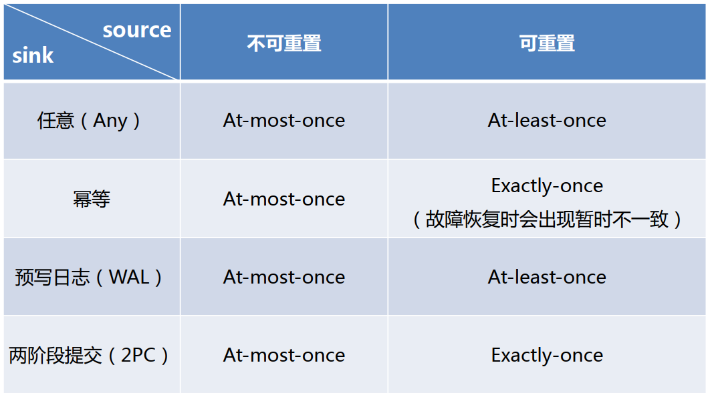

---

Created at: 2021-10-14
Last updated at: 2021-12-01

---

# 21-状态一致性

状态一致性并不是Flink特有的概念，对于分布式应用而言，任何一个环节出现异常都可能会导致数据的重复计算，从而造成结果错误。比如因为系统的卡顿造成用户的请求被提交了两次，那么就可能会向数据库中插入两条重复记录；再比如消息中间件的生产者可能会重复发送消息，消费者也可能会重复消费消息，这都会造成数据重复，从而引发结果错误。
一致性可分为3个等级：

* at-most-once：数据最多被消费一次
* at-least-once：数据最少消费一次
* exactly-once：数据恰好被消费一次

对于Flink而言，会导致数据重复计算的因素就是故障恢复，因为Flink的source状态恢复后会从上次保存在检查点中的偏移量开始重新读取数据，而Flink的checkpoint机制可以保证内部状态的exactly-once，但整个处理流程的一致性级不光取决于Flink内部，还取决于Flink的source与sink连接的外部系统，换句话说，整个系统的一致性级别取决于所有组件中一致性最弱的那一个，这也被称为**端到端（end-to-end）状态一致性**。
Flink source端一致性级别取决于外部系统可不可以重设数据的读取位置，如socket不可以重设读取位置，那么source端一致性级别就是at-most-once，Kafka可以设置offset，那么source端就是exactly-once。

要保证sink端的exactly-once，就需要保证从故障恢复时，数据不会重复写入外部系统，具体有两种实现方式：幂等（Idempotent）写入和事务性（Transactional）写入。

所谓幂等写入，就是指外部系统对于重复的写入操作只会保留一次结果。比如数据库的唯一主键可以阻止重复的插入操作，Redis的setnx命令的语义本事就具有幂等性，但是对于map这种数据结构，在Flink故障恢复之后的重新计算可能会引起短暂地结果回退，但是最终还是可以达到状态一致性。

事务性写入需要构建事务来写入外部系统，具有事务的特点，即要么全部写入成功，要么全部失败，从而保证了不会重复数据。事务的开始对应着保存checkpoint的开始，checkpoint真正完成时事务结束，这时才把所有结果提交到sink所连接的外部系统中。
对于事务性写入，具体又有两种实现方式：预写日志（WAL）和两阶段提交（2PC）。DataStream API 提供了 GenericWriteAheadSink 抽象类 和 TwoPhaseCommitSinkFunction 接口，用户只需要实现数据如何输出，即可很方便地实现这两种事务性写入外部系统。

两阶段提交（2PC）需要外部系统支持事务，两阶段提交（2PC）的意思是，先将这些数据写入外部 sink 系统，但不提交它们，这就是所谓的预提交， 当它收到 checkpoint 完成的通知时，它才正式提交事务，完成写入。

不同 Source 和 Sink 的一致性保证：

Kafka作为source支持offset，作为sink支持事务，所以Flink的source和sink均为Kafka时支持exactly-once。

