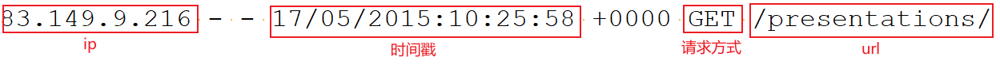

---

Created at: 2021-10-17
Last updated at: 2021-10-19


---

# 23-案例一（统计）：热门页面


需求：每5s统计一次最近10分钟的热门页面，要求允许数据迟到1分钟，对于迟到一分钟以上的数据输出到侧输出流
数据：

pojo：
日志：
```
@Data
@AllArgsConstructor
@NoArgsConstructor
public class ApacheLogEvent {
    private String ip;
    private String userId;
    private Long timestamp;
    private String method;
    private String url;
}
```
中间结果：
```
@Data
@AllArgsConstructor
@NoArgsConstructor
public class PageViewCount {
    private String url;
    private Long windowEnd;
    private Long count;
}
```

```
public class HotPages {
    public static void main(String[] args) throws Exception {
        StreamExecutionEnvironment env = StreamExecutionEnvironment.getExecutionEnvironment();
        env.setStreamTimeCharacteristic(TimeCharacteristic.EventTime);
        env.setParallelism(1);

        //DataStream<String> inputStream = env.readTextFile("Data/apache.log");
        DataStream<String> inputStream = env.socketTextStream("localhost", 7777);

        DataStream<ApacheLogEvent> dataStream = inputStream
                .map(line -> {
                    String[] fields = line.split(" ");
                    SimpleDateFormat simpleDateFormat = new SimpleDateFormat("dd/MM/yyyy:HH:mm:ss");
                    Long timestamp = simpleDateFormat.parse(fields[3]).getTime();
                    return new ApacheLogEvent(fields[0], fields[1], timestamp, fields[5], fields[6]);
                })
                .assignTimestampsAndWatermarks(new AscendingTimestampExtractor<ApacheLogEvent>() {
                    @Override
                    public long extractAscendingTimestamp(ApacheLogEvent element) {
                        return element.getTimestamp();
                    }
                })
                // 过滤get请求
                .filter(new FilterFunction<ApacheLogEvent>() {
                    @Override
                    public boolean filter(ApacheLogEvent value) throws Exception {
                        String regex = "^((?!\\.(css|js|png|ico)$).)*$";
                        return "GET".equals(value.getMethod()) && Pattern.matches(regex, value.getUrl());
                    }
                });

        // dataStream.print("data");
        // 定义一个侧输出流标签
        OutputTag<ApacheLogEvent> lateTag = new OutputTag<ApacheLogEvent>("late") {};

        SingleOutputStreamOperator<PageViewCount> windowAggStream = dataStream
                // 按照url分组
                .keyBy(ApacheLogEvent::getUrl)
                //每5s统计一次最近10分钟的热门页面
                .timeWindow(Time.minutes(10), Time.seconds(5))
                //允许迟到1分钟
                .allowedLateness(Time.minutes(1))
                //迟到1分钟的数据输出到侧输出流中去
                .sideOutputLateData(lateTag)
                //聚合得到窗口内每个页面的访问量
                .aggregate(new PageCountAgg(), new PageCountResult());

        // windowAggStream.print("agg");
        windowAggStream.getSideOutput(lateTag).print("late");

        // 按窗口结束时间聚合，排序输出
        windowAggStream.keyBy(PageViewCount::getWindowEnd)
                .process(new TopNHotPages(3))
                .print();
        env.execute("hot pages job");
    }

    static class PageCountAgg implements AggregateFunction<ApacheLogEvent, Long, Long> {
        @Override
        public Long createAccumulator() {
            return 0L;
        }
        @Override
        public Long add(ApacheLogEvent value, Long accumulator) {
            return ++accumulator;
        }
        @Override
        public Long getResult(Long accumulator) {
            return accumulator;
        }
        @Override
        public Long merge(Long a, Long b) {
            return null;
        }
    }

    static class PageCountResult implements WindowFunction<Long, PageViewCount, String, TimeWindow> {
        @Override
        public void apply(String key, TimeWindow window, Iterable<Long> input, Collector<PageViewCount> out) throws Exception {
            out.collect(new PageViewCount(key, window.getEnd(), input.iterator().next()));
        }
    }

    public static class TopNHotPages extends KeyedProcessFunction<Long, PageViewCount, String> {

        private final Integer topSize;
        public TopNHotPages(Integer topSize) {
            this.topSize = topSize;
        }

        private MapState<String, Long> mapState;
        @Override
        public void open(Configuration parameters) throws Exception {
            mapState = getRuntimeContext().getMapState(new MapStateDescriptor<String, Long>("hot-pages-count", String.class, Long.class));
        }

        @Override
        public void processElement(PageViewCount value, Context ctx, Collector<String> out) throws Exception {
            //使用Map结构可以对迟到数据更新
            mapState.put(value.getUrl(), value.getCount());
            //等数据到齐之后触发定时器排序输出
            ctx.timerService().registerEventTimeTimer(value.getWindowEnd() + 1);
            //只允许窗口内的数据迟到一分钟，一分钟之后不再对此窗口的数据聚合，所以需要设置定时器清理状态
            ctx.timerService().registerEventTimeTimer(value.getWindowEnd() + 60 * 1000L);
        }

        @Override
        public void onTimer(long timestamp, OnTimerContext ctx, Collector<String> out) throws Exception {
            if (timestamp == ctx.getCurrentKey() + 60 * 1000L) {
                mapState.clear();
                return;
            }
            // 排序
            ArrayList<Map.Entry<String, Long>> arrayList = Lists.newArrayList(mapState.entries().iterator());
            arrayList.sort((a, b) -> (int) (b.getValue() - a.getValue()));

            // 取前3输出
            StringBuilder resultBuilder = new StringBuilder();
            resultBuilder.append("===================================\n");
            resultBuilder.append("窗口结束时间：").append(new Timestamp(timestamp - 1)).append("\n");
            for (int i = 0; i < Math.min(topSize, arrayList.size()); i++) {
                Map.Entry<String, Long> entry = arrayList.get(i);
                resultBuilder.append("NO ").append(i + 1).append(":")
                        .append(" 页面URL = ").append(entry.getKey())
                        .append(" 浏览量 = ").append(entry.getValue())
                        .append("\n");
            }
            out.collect(resultBuilder.toString());
            resultBuilder.append("===============================\n\n");
        }
    }
}
```

