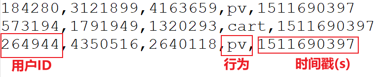

---

Created at: 2021-10-17
Last updated at: 2025-03-20


---

# 24-案例二（统计）：布隆过滤器的应用


**布隆过滤器**
一共有10亿条不同的数据，每条数据占4个字节，想要精确地判断某一个数据在不在这个10亿条数据中，有两种方法：
一是把10亿条数据全放在set中，此时需要占用内存40亿字节，约为4GB。
二是使用位图，将数据映射成数字之后，取值范围大约为0-40亿，使用与取值范围相同的bit位，40亿bit位为512MB，就可以精确地表达40亿条数据中有哪10亿条数据，即10亿条数据对应的bit位为1，其它为0。
可见第一种方法的set集合的大小只与数据的个数有关；第二种方法的位图大小只与数据的取值范围有关，与数据个数没有关系。所以第一种方法适合在小量数据的场景下使用，而第二种方法适合大量数据，比如数据映射成数字之后，取值范围为0-40亿，但是不同数据只有100条，要判断一个数据在不在这个100条数据中，那么肯定使用第一种方法更划算。

位图的大小只与数据的取值范围有关，如果想要精确地判断某一个数据在不在数据集中，当数据的取值范围很大时，位图也会很大，直接放在内存还是很难以接收。如果我们降低这个标准，只要近似地判断一个数据在不在数据集中，那么使用布隆过滤器的方法就会大大减少位图的大小。
布隆过滤器就是用小位图表示大取值范围时，近似准确地判断一条数据在不在数据集的一种算法。比如取值范围为0-40亿，如果想准确地判断一个数在不在数据集中，就需要512MB大小的位图，但布隆过滤器的算可能只需要16MB大小的位图就可以百分之百的告诉你这条数据不在数据集中，和以百分之九十几的概率告诉你这条数据可能在数据集中，即使用布隆过滤器可以告诉**某条数据一定不存在或者****某条数据****可能存在。**比如把这10亿条数据映射到布隆过滤器的位图上后，这10亿条数据的每一条数据通过布隆过滤器判断，都不能百分之百告诉你这条数据在10亿条数据中，剩下30亿条数据有百分之九十的数据数据通过布隆过滤器判断是可以告诉你这条数据一定不在10亿条数据中，而剩下百分之十会告诉你这条数据可能在10亿条数据中。

准确地进行判断需要将所有可能的数据映射不同数字，这是一种全量的一 一对应关系，而布隆过滤器不能准确地进行判断就是因为它没有进行全量的映射，其做法就是使用多个哈希函数对数据映射，于是可能出现不同的数据映射到相同的数字上，但正是因为使用多个好的哈希函数才使得误判率能大大降低。布隆过滤器的具体算法过程请参考：<https://zhuanlan.zhihu.com/p/43263751>

因为从位图中我们还可以知道它包含了多少条不同数据，所以建构位图不光可以用来判断数据在不在数据集中，还求有重复数据的数据集包含多少条不相同的数据。也就是说通过构建与取值范围相同的位图，我们可以精确地知道数据集中有多少条不同的数据，或者构建布隆过滤器，近似地知道有多少条不同的数据。
**案例二：使用布隆过滤器近似地统计一个小时内有多少不同的用户访问过**
数据：


```
public static void main(String[] args) throws Exception {
    StreamExecutionEnvironment env = StreamExecutionEnvironment.getExecutionEnvironment();
    //并行度为4
    env.setParallelism(4);
    env.setStreamTimeCharacteristic(TimeCharacteristic.EventTime);
    env.readTextFile("Data/UserBehavior.csv")
            //数据源会将数据轮询地发送到每一个map子任务，因为前后两个算子的并行度不同
            .flatMap(new RichFlatMapFunction<String, Tuple3<Integer, String, Long>>() {
                private int key;

                @Override
                public void open(Configuration parameters) throws Exception {
                    //分组key等于当前子任务编号，这样可以在下次keyBy分组不用在不同子任务之间发送数据，分组的目的是为了能并行计算
                    key = getRuntimeContext().getIndexOfThisSubtask();
                }

                @Override
                public void flatMap(String value, Collector<Tuple3<Integer, String, Long>> out) throws Exception {
                    String[] fields = value.split(",");
                    //只统计pv数据
                    if ("pv".equals(fields[3])) {
                        //(分组key, userId, 时间戳)
                        out.collect(new Tuple3<>(key, fields[0], Long.valueOf(fields[4])));
                    }
                }
            })
            //分配watermark
            .assignTimestampsAndWatermarks(new AscendingTimestampExtractor<Tuple3<Integer, String, Long>>() {
                @Override
                public long extractAscendingTimestamp(Tuple3<Integer, String, Long> element) {
                    return element.f2 * 1000L;
                }
            })
            //按上面指定的key分组，数据并不需要在不同的slot间传递，因为每个slot中的数据的key就是slot的编号
            .keyBy(v -> v.f0)
            //一个小时的滚动窗口
            .timeWindow(Time.hours(1))
            //聚合，统计一个小时内不同用户的数量
            .aggregate(new UVAggregateFunction(), new UVWindowFunction())
            //按窗口分组，这里是为了把前面不同子任务上相同的窗口中数据汇聚到一个slot中
            .keyBy(v -> v.f0)
            //把相同窗口统计的数据累加就得到了最后该窗口的结果了
            .process(new UVKeyedProcessFunction())
            .print();
    env.execute("UniqueVisitor count with bloom filter job");
}
```
```
private static class UVAggregateFunction implements AggregateFunction<Tuple3<Integer, String, Long>, Tuple2<BloomFilter<String>, Integer>, Integer> {
    // 必须在createAccumulator方法里创建布隆过滤器，因为一个分组前后不同的窗口需要各自统计各自的，
    // 如果作为类的字段，就属于算子状态了，所有该子任务上的分组共用，一个分组前后不同的窗口也共用，
    @Override
    public Tuple2<BloomFilter<String>, Integer> createAccumulator() {
        // org.apache.flink.shaded.guava18.com.google.common.hash.BloomFilter
        // 初始化一个存储string数据的布隆过滤器，预计会插入一百万条不同的数据，期望错误率为0.1%
        // 不用考虑数据的取值范围是多少，只要指出预计会插入多少条不同的数据 和 期望的错误率即可，
        // 对于用于构建布隆过滤器的那一百万条数据，布隆过滤器不确定它们在不在，mightContain返回true，
        // 对于不是那一百万条构建布隆过滤器的数据，
        // 其中99.9%的数据布隆过滤器会肯定它们不在，即mightContain()方法会返回false，
        // 剩下0.1%的数据，布隆过滤器不确定它们在不在，mightContain返回true，
        BloomFilter<String> bloomFilter = BloomFilter.create(Funnels.stringFunnel(Charsets.UTF_8), 1_000_000, 0.001);
        return new Tuple2<>(bloomFilter, 0);
    }

    @Override
    public Tuple2<BloomFilter<String>, Integer> add(Tuple3<Integer, String, Long> value, Tuple2<BloomFilter<String>, Integer> accumulator) {
        BloomFilter<String> bloomFilter = accumulator.f0;
        if (!bloomFilter.mightContain(value.f1)) {
            bloomFilter.put(value.f1);
            accumulator.f1++;
        }
        return accumulator;
    }

    @Override
    public Integer getResult(Tuple2<BloomFilter<String>, Integer> accumulator) {
        return accumulator.f1;
    }

    @Override
    public Tuple2<BloomFilter<String>, Integer> merge(Tuple2<BloomFilter<String>, Integer> a, Tuple2<BloomFilter<String>, Integer> b) {
        return null;
    }
}
```
```
private static class UVWindowFunction implements WindowFunction<Integer, Tuple2<Long, Integer>, Integer, TimeWindow> {
    //就是为了把前面的结果加上一个窗口结束时间
    @Override
    public void apply(Integer key, TimeWindow window, Iterable<Integer> input, Collector<Tuple2<Long, Integer>> out) throws Exception {
        out.collect(new Tuple2<>(window.getEnd(), input.iterator().next()));
    }
}
```
```
private static class UVKeyedProcessFunction extends KeyedProcessFunction<Long, Tuple2<Long, Integer>, String> {

    private ValueState<Integer> uv;

    @Override
    public void open(Configuration parameters) throws Exception {
        uv = getRuntimeContext().getState(new ValueStateDescriptor<>("uv", Integer.class));
    }

    @Override
    public void processElement(Tuple2<Long, Integer> value, Context ctx, Collector<String> out) throws Exception {
        //把前面所有并行任务计算的相同时间的窗口的结果累加
        if (uv.value() == null) {
            uv.update(value.f1);
        } else {
            uv.update(uv.value() + value.f1);
        }
        //创建一个1ms的定时器是为了等到前面相同窗口的所有数据都到齐，为什么能等到，因为时间语义是EventTime
        ctx.timerService().registerEventTimeTimer(ctx.getCurrentKey() + 1);
    }

    @Override
    public void onTimer(long timestamp, OnTimerContext ctx, Collector<String> out) throws Exception {
        //定时器触发就打印结果
        out.collect(ctx.getCurrentKey() + ": " + uv.value());
        //并清空键控状态
        uv.clear();
    }
}
```

参考： [详解布隆过滤器的原理，使用场景和注意事项 - 知乎](https://zhuanlan.zhihu.com/p/43263751)

