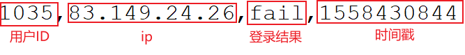

---

Created at: 2021-10-18
Last updated at: 2021-10-18


---

# 25-案例三（风控）：检测连续登录失败事件


需求：检测2秒内连续登录失败超过2次的事件
时间戳不存在乱序的数据：
```
1035,83.149.9.216,fail,1558430842
1035,83.149.9.216,fail,1558430843
1035,83.149.24.26,fail,1558430844
```

pojo:
登录事件
```
@Data
@AllArgsConstructor
@NoArgsConstructor
public class LoginEvent {
    private Long userId;
    private String ip;
    private String loginState;
    private Long timestamp;
}
```
输出结果
```
@Data
@AllArgsConstructor
@NoArgsConstructor
public class LoginFailWarning {
    private Long userId;
    private Long firstFailTime;
    private Long lastFailTime;
    private String warningMsg;
}
```

做法一：时间语义为EventTime的2s定时器，在定时器内清空状态
```
public static void main(String[] args) throws Exception {
    StreamExecutionEnvironment env = StreamExecutionEnvironment.getExecutionEnvironment();
    env.setParallelism(1);
    env.setStreamTimeCharacteristic(TimeCharacteristic.EventTime);
    env.readTextFile("Data/LoginLog.csv")
            .map(line -> {
                String[] fields = line.split(",");
                return new LoginEvent(Long.valueOf(fields[0]), fields[1], fields[2], Long.valueOf(fields[3]));
            })
            .assignTimestampsAndWatermarks(
                    new AscendingTimestampExtractor<LoginEvent>() {
                        @Override
                        public long extractAscendingTimestamp(LoginEvent element) {
                            return element.getTimestamp() * 1000L;
                        }
                    })
            //按用户id分组
            .keyBy(LoginEvent::getUserId)
            //检测连续登录失败事件
            .process(new LoginFailDetectWarning(2, 2))
            .print();
    env.execute("login fail detect job");
}
```
```
private static class LoginFailDetectWarning extends KeyedProcessFunction<Long, LoginEvent, LoginFailWarning> {
    // 多少秒内
    private final int timeInterval;
    // 最大连续登录失败次数
    private final int maxFailTimes;

    public LoginFailDetectWarning(int timeInterval, int maxFailTimes) {
        this.timeInterval = timeInterval;
        this.maxFailTimes = maxFailTimes;
    }

    // timeInterval秒后触发的定时器的时间
    ValueState<Long> onTimer;
    // timeInterval秒内登录失败次数
    ValueState<Integer> failCount;

    @Override
    public void open(Configuration parameters) throws Exception {
        onTimer = getRuntimeContext().getState(new ValueStateDescriptor<Long>("onTimer", Long.class));
        failCount = getRuntimeContext().getState(new ValueStateDescriptor<Integer>("login-fail-count", Integer.class));
    }

    @Override
    public void processElement(LoginEvent value, Context ctx, Collector<LoginFailWarning> out) throws Exception {
        // 如果登录失败
        if ("fail".equals(value.getLoginState())) {
            // 如果第一次登录 或者 定时器触发了
            if (onTimer.value() == null) {
                onTimer.update(ctx.timestamp() + timeInterval * 1000L);
                ctx.timerService().registerEventTimeTimer(onTimer.value());
                failCount.update(1);
            } else {
                failCount.update(failCount.value() + 1);
            }
        } else {
            //登录成功，删除定时器，清空状态
            if (onTimer.value() != null) {
                ctx.timerService().deleteEventTimeTimer(onTimer.value());
                onTimer.clear();
            }
            failCount.clear();
        }
    }

    @Override
    public void onTimer(long timestamp, OnTimerContext ctx, Collector<LoginFailWarning> out) throws Exception {
        // 如果登录失败次数大于最大允许登录失败次数
        if (failCount.value() >= maxFailTimes) {
            // 输出报警
            out.collect(
                    new LoginFailWarning(ctx.getCurrentKey(),
                            timestamp / 1000L - timeInterval,
                            timestamp / 1000L,
                            "连续" + failCount.value() + "次登录失败")
            );
        }
        //清空状态重新计数
        onTimer.clear();
        failCount.clear();
    }
}
```
输出：
```
LoginFailWarning(userId=1035, firstFailTime=1558430842, lastFailTime=1558430844000, warningMsg=连续3次登录失败)
```

做法二：做法一在定时器内清空状态会导致可以2s内尝试登录尽可能多的次数，只要有一次成功就行了，这并不符合安全要求。如果在处理每条数据时检测失败次数是否大于2次，在定时器中清除状态，那么就可以限制2s内最多连续失败2次。
主程序不变：
```
private static class LoginFailDetectWarning extends KeyedProcessFunction<Long, LoginEvent, LoginFailWarning> {
    // 多少秒内
    private final int timeInterval;
    // 最大连续登录失败次数
    private final int maxFailTimes;

    public LoginFailDetectWarning(int timeInterval, int maxFailTimes) {
        this.timeInterval = timeInterval;
        this.maxFailTimes = maxFailTimes;
    }

    // timeInterval秒后触发的定时器的时间
    ValueState<Long> onTimer;
    // timeInterval秒内登录失败次数
    ValueState<Integer> failCount;

    @Override
    public void open(Configuration parameters) throws Exception {
        onTimer = getRuntimeContext().getState(new ValueStateDescriptor<Long>("onTimer", Long.class));
        failCount = getRuntimeContext().getState(new ValueStateDescriptor<Integer>("login-fail-count", Integer.class));
    }

    @Override
    public void processElement(LoginEvent value, Context ctx, Collector<LoginFailWarning> out) throws Exception {
        // 如果登录失败
        if ("fail".equals(value.getLoginState())) {
            // 如果第一次登录 或者 定时器触发了
            if (onTimer.value() == null) {
                onTimer.update(ctx.timestamp() + timeInterval * 1000L);
                ctx.timerService().registerEventTimeTimer(onTimer.value());
                failCount.update(1);
            } else {
                failCount.update(failCount.value() + 1);
                // 加1后如果登录次数达到最大
                if (failCount.value() >= maxFailTimes) {
                    // 输出报警
                    out.collect(
                            new LoginFailWarning(value.getUserId(),
                                    onTimer.value() / 1000L - timeInterval,
                                    value.getTimestamp(),
                                    "连续" + maxFailTimes + "次登录失败")
                    );
                    /*
                    //输出报警后，如果想重新开始计数就不注释这两行
                    failCount.clear();
                    onTimer.clear();
                    */
                }
            }
        } else {
            //登录成功，删除定时器，清空状态
            if (onTimer.value() != null) {
                ctx.timerService().deleteEventTimeTimer(onTimer.value());
                onTimer.clear();
            }
            failCount.clear();
        }
    }

    @Override
    public void onTimer(long timestamp, KeyedProcessFunction<Long, LoginEvent, LoginFailWarning>.OnTimerContext ctx, Collector<LoginFailWarning> out) throws Exception {
        `//定时器触发，清空状态重新计数`
        onTimer.clear();
        failCount.clear();
    }
}
```
输出：
```
LoginFailWarning(userId=1035, firstFailTime=1558430842, lastFailTime=1558430843, warningMsg=连续2次登录失败)
LoginFailWarning(userId=1035, firstFailTime=1558430842, lastFailTime=1558430844, warningMsg=连续2次登录失败)
```

做法三：不使用定时器，键控状态中记录第一次失败的数据，然后只要再来一次登录失败事件就判断与第一次登录失败事件之间的时间间隔是否大于2s，并且判断加上本次登录失败是否失败次数已经到达2次：
此做法并不需要watermark：
```
public static void main(String[] args) throws Exception {
    StreamExecutionEnvironment env = StreamExecutionEnvironment.getExecutionEnvironment();
    env.setParallelism(1);
    env.setStreamTimeCharacteristic(TimeCharacteristic.EventTime);
    env.readTextFile("Data/LoginLog.csv")
            .map(line -> {
                String[] fields = line.split(",");
                return new LoginEvent(Long.valueOf(fields[0]), fields[1], fields[2], Long.valueOf(fields[3]));
            })
            .keyBy(LoginEvent::getUserId)
            //检测连续登录失败事件
            .process(new LoginFailDetectWarning(2, 2))
            .print();
    env.execute("login fail detect job");
}
```
```
private static class LoginFailDetectWarning extends KeyedProcessFunction<Long, LoginEvent, LoginFailWarning> {
    // 多少秒内
    private final int timeInterval;
    // 最大连续登录失败次数
    private final int maxFailTimes;

    public LoginFailDetectWarning(int timeInterval, int maxFailTimes) {
        this.timeInterval = timeInterval;
        this.maxFailTimes = maxFailTimes;
    }

    // timeInterval秒内第一次登录失败事件
    ValueState<LoginEvent> firstLoginFailEvent;
    // timeInterval秒内登录失败次数
    ValueState<Integer> failCount;

    @Override
    public void open(Configuration parameters) throws Exception {
        firstLoginFailEvent = getRuntimeContext().getState(new ValueStateDescriptor<LoginEvent>("first-Login-fail-event", LoginEvent.class));
        failCount = getRuntimeContext().getState(new ValueStateDescriptor<Integer>("login-fail-count", Integer.class));
    }

    // 以登录事件作为判断报警的触发条件，不再注册定时器
    @Override
    public void processElement(LoginEvent value, Context ctx, Collector<LoginFailWarning> out) throws Exception {
        // 如果登录失败
        if ("fail".equals(value.getLoginState())) {
            //第一次登录失败
            if (failCount.value() == null || firstLoginFailEvent.value() == null) {
                failCount.update(1);
                firstLoginFailEvent.update(value);
                return;
            }
            //如果本次登录失败的时间与第一次登录失败的时间之差小于timeInterval，那么登录失败次数加1
            if (value.getTimestamp() - firstLoginFailEvent.value().getTimestamp() <= timeInterval) {
                failCount.update(failCount.value() + 1);
                // 加1后如果登录次数达到最大
                if (failCount.value() >= maxFailTimes) {
                    // 输出报警
                    out.collect(
                            new LoginFailWarning(value.getUserId(),
                                    firstLoginFailEvent.value().getTimestamp(),
                                    value.getTimestamp(),
                                    "连续" + maxFailTimes + "次登录失败")
                    );
                    /*
                    //输出报警后，如果想重新开始计数就不注释这两行
                    failCount.clear();
                    firstLoginFailEvent.clear();
                    */
                }
            } else {
                //否则表示本次登录失败与上次登录失败的时间间隔相差timeInterval以上，应该重新计数，以本次登录失败为第一次开始计数
                firstLoginFailEvent.update(value);
                failCount.update(1);
            }
        } else {
            //登录成功，清空状态
            failCount.clear();
            firstLoginFailEvent.clear();
        }
    }
}
```
输出：
```
LoginFailWarning(userId=1035, firstFailTime=1558430842, lastFailTime=1558430843, warningMsg=连续2次登录失败)
LoginFailWarning(userId=1035, firstFailTime=1558430842, lastFailTime=1558430844, warningMsg=连续2次登录失败)
```

