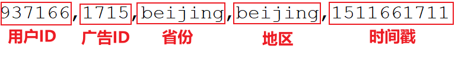

---

Created at: 2021-10-17
Last updated at: 2021-10-18


---

# 26-案例四（风控+统计）：过滤异常点击行为 和 统计广告点击次数


需求：每10秒统计一次最近10分钟每个省份每个广告的点击次数，如果一个用户在一分钟之内点击某个广告的次数达到了20次，就把该用户以后的所有广告点击屏蔽，不计入统计，并将该用户输出报警,，一天后解除屏蔽。
数据：

pojo类：
点击记录
```
@Data
@AllArgsConstructor
@NoArgsConstructor
public class AdClick {
    String userId;
    String adId;
    String province;
    String city;
    Long timestamp;
}
```
统计结果
```
@Data
@AllArgsConstructor
@NoArgsConstructor
public class AdClickByProvince {
    private String windowEnd;
    private String province;
    private String adId;
    private Integer count;
}
```

```
public static void main(String[] args) throws Exception {
    StreamExecutionEnvironment env = StreamExecutionEnvironment.getExecutionEnvironment();
    env.setParallelism(1);
    env.setStreamTimeCharacteristic(TimeCharacteristic.EventTime);
    OutputTag<String> outputTag = new OutputTag<>("BlockList") {};
    SingleOutputStreamOperator<AdClick> singleOutputStreamOperator = env.readTextFile("Data/AdClickLog.csv")
            .map(new MapFunction<String, AdClick>() {
                @Override
                public AdClick map(String value) throws Exception {
                    String[] split = value.split(",");
                    return new AdClick(split[0], split[1], split[2], split[3], Long.valueOf(split[4]));
                }
            })
            .assignTimestampsAndWatermarks(new AscendingTimestampExtractor<AdClick>() {
                @Override
                public long extractAscendingTimestamp(AdClick element) {
                    return element.getTimestamp() * 1000L;
                }
            })
            //按用户id分组，以便统计每个用户点击广告的情况
            .keyBy(AdClick::getUserId)
            //如果一个用户在一分钟之内点击某个广告的次数达到了20次，就把该用户屏蔽，并输出到侧输出流中
            .process(new MaliciousClickFilter(20, outputTag));
    //输出侧输出流的数据
    singleOutputStreamOperator.getSideOutput(outputTag).print("BlockList");

    singleOutputStreamOperator
            //按省份和广告id分组
            .keyBy("province", "adId")
            //每10秒统计一次最近10分钟每个省份每个广告的点击次数
            .timeWindow(Time.minutes(10), Time.seconds(10))
            //聚合
            .aggregate(new AdClickAggregateFunction(), new AdClickWindowFunction())
            .print();
    env.execute();
}
```

```
private static class MaliciousClickFilter extends KeyedProcessFunction<String, AdClick, AdClick> {

    private final Integer threshold;
    private final OutputTag<String> outputTag;

    private ValueState<Long> oneMinuteTimer;
    private MapState<String, Integer> clickCountMap;
    private ValueState<Boolean> isBlocked;

    public MaliciousClickFilter(Integer threshold, OutputTag<String> outputTag) {
        this.threshold = threshold;
        this.outputTag = outputTag;
    }

    @Override
    public void open(Configuration parameters) throws Exception {
        clickCountMap = getRuntimeContext().getMapState(new MapStateDescriptor<String, Integer>("click-count", String.class, Integer.class));
        oneMinuteTimer = getRuntimeContext().getState(new ValueStateDescriptor<>("on-timer", Long.class));
        isBlocked = getRuntimeContext().getState(new ValueStateDescriptor<>("isBlocked", Boolean.class));
    }

    @Override
    public void processElement(AdClick value, Context ctx, Collector<AdClick> out) throws Exception {
        //如果用户已经被列入黑名单了
        if (isBlocked.value() != null) {
            return;
        }
        // 第一条数据来，或者定时器已经触发了
        if (oneMinuteTimer.value() == null) {
            long oneMinute = 60 * 1000L;
            oneMinuteTimer.update(oneMinute);
            //设置一分钟的定时器
            ctx.timerService().registerEventTimeTimer(ctx.timestamp() + oneMinute);
        }
        //当前广告id 和 已经被点击的次数
        String adId = value.getAdId();
        Integer clickCount = clickCountMap.get(adId);
        if (clickCount == null) {
            clickCountMap.put(adId, 1);
        } else {
            //如果一分钟内连续点击某个广告超过20次
            if (clickCount >= threshold) {
                //删除一分钟定时器
                ctx.timerService().deleteEventTimeTimer(oneMinuteTimer.value());
                oneMinuteTimer.clear();
                //设置为true之后，该用户之后点击广告无效
                isBlocked.update(true);
                //一天的定时器，明天再清空isBlocked的状态
                ctx.timerService().registerProcessingTimeTimer(ctx.timestamp() + (24 * 60 * 60 * 1000));
                ctx.output(outputTag, "用户： " + ctx.getCurrentKey() + "一分钟内连续点击广告：" + adId + " 超过20次");
                return;
            }
            clickCountMap.put(adId, clickCount + 1);
        }
        out.collect(value);
    }

    @Override
    public void onTimer(long timestamp, OnTimerContext ctx, Collector<AdClick> out) throws Exception {
        if (isBlocked.value() != null) {
            // 这里执行肯定是第二天了，因为当设置isBlocked.update(true);之后，
            // processElement就不会在设置定时器了，所以也就只有那个一天的定时器了
            isBlocked.clear();
            return;
        }
        //清除定时器标志
        oneMinuteTimer.clear();
        //清空计数
        clickCountMap.clear();
    }
}
```

```
private static class AdClickAggregateFunction implements AggregateFunction<AdClick, Integer, Integer> {
    @Override
    public Integer createAccumulator() {
        return 0;
    }

    @Override
    public Integer add(AdClick value, Integer accumulator) {
        return accumulator + 1;
    }

    @Override
    public Integer getResult(Integer accumulator) {
        return accumulator;
    }

    @Override
    public Integer merge(Integer a, Integer b) {
        return null;
    }
}

private static class AdClickWindowFunction implements WindowFunction<Integer, AdClickByProvince, Tuple, TimeWindow> {
    @Override
    public void apply(Tuple key, TimeWindow window, Iterable<Integer> input, Collector<AdClickByProvince> out) throws Exception {
        out.collect(new AdClickByProvince(new Timestamp(window.getEnd()).toString(), key.getField(0), key.getField(1), input.iterator().next()));
    }
}
```

