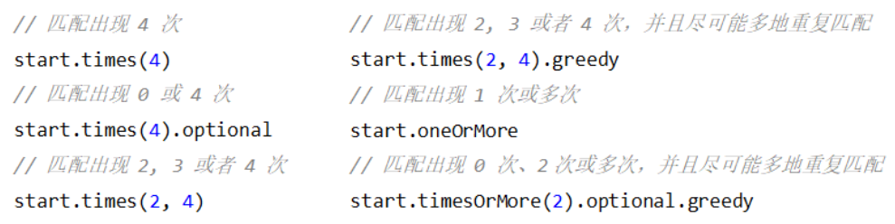
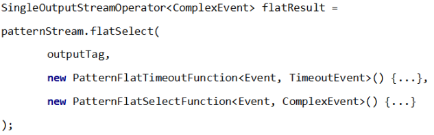

---

Created at: 2021-10-18
Last updated at: 2021-10-19


---

# 27-CEP


CEP（Complex Event Processing，复杂事件处理，事件就是数据，因为事件会产生数据，所以经常把事件等价于数据）是Flink对数据流进行模式匹配的一个包，与正则表达式对字符串进行模式匹配类似，使用CEP可以把符合匹配规则的数据提取出来。
CEP的依赖：
```
<dependency>
   <groupId>org.apache.flink</groupId>
   <artifactId>flink-cep_2.12</artifactId>
   <version>1.10.1</version>
</dependency>
```
简单例子：
数据：
```
a,1633947551
b,1633947552
b,1633947553
a,1633947555
c,1633947554
b,1633947555
b,1633947556
f,1633947557
c,1633947558
```
pojo类
```
@Data
@AllArgsConstructor
@NoArgsConstructor
public class Event {
   private String field;
   private Long timestamp;
}
```
找出5s内符合abb..c的4条数据，其中abb要紧挨着，c可以不紧挨着b：
```
public static void main(String[] args) throws Exception {
   StreamExecutionEnvironment env = StreamExecutionEnvironment.getExecutionEnvironment();
   env.setParallelism(1);
   env.setStreamTimeCharacteristic(TimeCharacteristic.EventTime);
   DataStream<Event> inputStream = env.readTextFile("Data/Event.csv")
           .map(new MapFunction<String, Event>() {
               @Override
               public Event map(String value) throws Exception {
                   String[] split = value.split(",");
                   return new Event(split[0], Long.valueOf(split[1]));
               }
           })
           .assignTimestampsAndWatermarks(
                   new BoundedOutOfOrdernessTimestampExtractor<Event>(Time.seconds(3)) {
                       @Override
                       public long extractTimestamp(Event element) {
                           return element.getTimestamp() * 1000L;
                       }
                   });

   //1.构建匹配模式
   Pattern<Event, Event> pattern = Pattern.
           <Event>begin("a").where(new SimpleCondition<Event>() {
               @Override
               public boolean filter(Event value) throws Exception {
                   return value.getField().equals("a");
               }
           })
           .next("b").where(new SimpleCondition<Event>() {
               @Override
               public boolean filter(Event value) throws Exception {
                   return value.getField().equals("b");
               }
           }).times(2).consecutive()
           .followedBy("c").where(new SimpleCondition<Event>() {
               @Override
               public boolean filter(Event value) throws Exception {
                   return value.getField().equals("c");
               }
           })
           .within(Time.seconds(5));

   //2.把匹配模式应用到DataStream上
   PatternStream<Event> patternStream = CEP.pattern(inputStream, pattern);

   //3.输出匹配的结果
   SingleOutputStreamOperator<String> singleOutputStreamOperator = patternStream.select(new PatternSelectFunction<Event, String>() {
       @Override
       public String select(Map<String, List<Event>> map) throws Exception {
           StringBuilder sb = new StringBuilder();
           List<Event> aList = map.get("a");
           sb.append(aList.iterator().next().toString()).append(" | ");
           List<Event> bList = map.get("b");
           bList.forEach(e -> sb.append(e.toString()).append(" | "));
           List<Event> cList = map.get("c");
           sb.append(cList.iterator().next().toString()).append(" | ");
           return sb.toString();
       }
   });
   singleOutputStreamOperator.print();
   env.execute();
}
```
输出：
```
Event(field=a, timestamp=1633947551) | Event(field=b, timestamp=1633947552) | Event(field=b, timestamp=1633947553) | Event(field=c, timestamp=1633947554) |
Event(field=a, timestamp=1633947555) | Event(field=b, timestamp=1633947555) | Event(field=b, timestamp=1633947556) | Event(field=c, timestamp=1633947558) |
```

**1.构建模式**
Pattern的三个概念：

* 个体模式（Individual Patterns）：以begin()、next()、followedBy()、 followedByAny()方法打头的一个匹配规则，这4个方法传递的字符串是为了方便能拿到匹配结果。
* 组合模式（ Combining Patterns，也叫模式序列）：个体模式组合起来称为模式序列，模式序列必须以“初始模式”开始，即必须以begin()开始
* 模式组（ Groups of patterns）：将一个模式序列作为条件嵌套在个体模式里，成为一组模式，太复杂了，用的少。

**个体模式**
个体模式可以包括“单例（ singleton）模式”和“循环（ looping）模式”:

* 单例模式是匹配结果只有一个事件的个体模式，比如上面匹配 "a" 和 "c" 的模式。
* 循环模式是匹配结果有多个事件的个体模式，比如上面匹配 "b" 的模式。所以最后获取结果时，select()方法的参数Map的Value是一个List。

**量词（ Quantifier）**
可以在个体模式后追加量词，表示该条件需要匹配的次数，量词有times()、optional()、greedy()、oneOrMore()、timesOrMore()，搭配起来用的含义如下：

注意：times()是非严格近邻，使用consecutive()可以使times表示严格近邻。

**条件（ Condition）**
每个个体模式都需要使用 where()、or() 和 until() 来指定条件指定匹配条件，有如下类型的条件：

* 简单条件（ Simple Condition）

where() 方法通过对事件的字段进行判断，决定该事件是否匹配：
```
.where(new SimpleCondition<Event>() {
   @Override
   public boolean filter(Event value) throws Exception {
       return value.getField().equals("a");
   }
})
```

* 组合条件（ Combining Condition）

连续对简单条件的调用称为组合条件， where()表示逻辑AND，or()表示逻辑或，比如该事件的字段是 "a" 或者 "m"（其实可以直接全写到一个where里）：
```
.where(new SimpleCondition<Event>() {
   @Override
   public boolean filter(Event value) throws Exception {
       return value.getField().equals("a");
   }
}).or(new SimpleCondition<Event>() {
   @Override
   public boolean filter(Event value) throws Exception {
       return value.getField().equals("m");
   }
})
```

* 终止条件（ Stop Condition）：如果使用了 oneOrMore 或者 oneOrMore.optional，建议使用 .until() 作为终止条件，以便清理状态。
* 迭代条件（ Iterative Condition）：在where中直接使用IterativeCondition（SimpleCondition是IterativeCondition的子类）可以对之前个体模式所有匹配的事件进行处理。

**模式序列**
个体模式以begin()、next()、followedBy()、 followedByAny()作为起始，其中begin()开头的个体模式是一个Pattern的开始，next()、followedBy()、 followedByAny()声明的个体模式接在后面，组合起来称为一个模式序列。next()、followedBy()、 followedByAny()3个方法的区别在于：

* next()是严格近邻（Strict Contiguity），即所有事件需要严格按照顺序出现，中间不能有任何不匹配的事件， 如 a next b，事件序列 \[a, c, b, b\] 没有匹配。
* followedBy()是宽松近邻（Relaxed Contiguity），即允许中间出现不匹配的事件， 如对于模式a followedBy b，事件序列 \[a, c, b, b\] 匹配为 {a, b}。
* followedByAny()是 非确定性宽松近邻（Non-Deterministic Relaxed Contiguity），即进一步放宽条件，之前已经匹配过的事件也可以再次使用， 如a followedByAny b，事件序列 \[a, c, b, b\] 匹配为 {a, b}，{a, b}。

以下数据，ab严格近邻：
```
b,1633947553
c,1633947554
a,1633947551
```
但是这样ab就不是严格近邻了，而是宽松近邻
```
b,1633947553
c,1633947552
a,1633947551
```

除以上模式序列外，还可以定义“不希望出现某种近邻关系”：

* notNext()：不想让某个事件严格紧邻前一个事件发生
* notFollowedBy()：不想让某个事件在两个事件之间发生

注意：

* 所有模式序列必须以 .begin() 开始
* 模式序列不能以 .notFollowedBy() 结束
* not 类型的模式不能被 optional 所修饰

此外还可以为模式指定时间约束.within(Time.seconds(5))，用来要求在多长时间内匹配有效，这个时间取决于具体的时间语义。

**2.将模式应用在DataStream上**
返回的结果是一个PatternStream
```
//2.把匹配模式应用到DataStream上
PatternStream<Event> patternStream = CEP.pattern(inputStream, pattern);
```

**3.获取匹配的结果**
使用 select() 或者 flatselect() 方法就可以从PatternStream 中获取到匹配的结果了，匹配的结果还是DataStream，只不过DataStream中全部都是符合Pattern的数据。 select() 方法需要输入一个 PatternSelectFunction作为参数，每个成功匹配的事件序列都会调用它的select()方法。flatselect() 方法需要输入一个PatternFlatSelectFunction作为参数，与select()方法只能返回一个值作为整个匹配序列的结果不同，flatselect()方法可以将整个匹配序列转化多个值用out.collect()输出。
select()：
```
patternStream.select(new PatternSelectFunction<Event, String>() {
    @Override
    public `String` select(Map<String, List<Event>> map) throws Exception {
    }
});
```
flatselect()：
```
patternStream.flatSelect(new PatternFlatSelectFunction<Event, String>() {
    @Override
    public void flatSelect(Map<String, List<Event>> map, `Collector<String> out`) throws Exception {
    }
});
```

**超时事件的提取**
在within规定的时间内只匹配到了前面部分个体模式的话，使用只传一个参数的select()是拿不到这部分数据的，也就是这部分数据会被丢弃，属于未匹配成功的情况，如果先拿到只匹配了前面部分个体模式的数据的话，就需要使用传递3个参数的select()方法了，这部分数据会被输出到侧输出流中，这就是所谓的超时事件提取。


