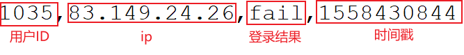

---

Created at: 2021-10-18
Last updated at: 2021-10-19


---

# 28-案例五（风控）：CEP的应用之检测连续登录失败事件


CEP特别适合用于复杂的风控业务，比如前面的案例三检测连续登录失败事件处理的数据的时间戳是升序的，如果是乱序，直接使用定时器实现的话，逻辑会特别复杂，而这种业务本身就是一种模式匹配，即检测一段时间内出现符合条件的序列，所以可以很方便使用CEP来处理。
数据：
```
1035,83.149.9.216,fail,1558430843
1035,83.149.9.216,success,1558430841
1035,83.149.9.216,fail,1558430842
1035,83.149.24.26,fail,1558430844
```

pojo:
登录事件
```
@Data
@AllArgsConstructor
@NoArgsConstructor
public class LoginEvent {
    private Long userId;
    private String ip;
    private String loginState;
    private Long timestamp;
}
```
输出结果类
```
@Data
@AllArgsConstructor
@NoArgsConstructor
public class LoginFailWarning {
    private Long userId;
    private Long firstFailTime;
    private Long lastFailTime;
    private String warningMsg;
}
```
检测2s内连续两次登录失败事件：
```
public static void main(String[] args) throws Exception {
    StreamExecutionEnvironment env = StreamExecutionEnvironment.getExecutionEnvironment();
    env.setParallelism(1);
    env.setStreamTimeCharacteristic(TimeCharacteristic.EventTime);
    KeyedStream<LoginEvent, Long> keyedStream = env.readTextFile("Data/LoginLog.csv")
            .map(line -> {
                String[] fields = line.split(",");
                return new LoginEvent(Long.valueOf(fields[0]), fields[1], fields[2], Long.valueOf(fields[3]));
            })
            .assignTimestampsAndWatermarks(
                    new BoundedOutOfOrdernessTimestampExtractor<LoginEvent>(Time.seconds(2)) {
                        @Override
                        public long extractTimestamp(LoginEvent element) {
                            return element.getTimestamp() * 1000L;
                        }
                    })
            //按用户id分组
            .keyBy(LoginEvent::getUserId);

    //1.构建匹配模式，检测连续登录失败事件
    Pattern<LoginEvent, LoginEvent> pattern = Pattern.<LoginEvent>begin("two-times-fail-login").where(new SimpleCondition<LoginEvent>() {
        @Override
        public boolean filter(LoginEvent value) throws Exception {
            return value.getLoginState().equals("fail");
        }
    }).times(2).within(Time.seconds(2));

    //2.把匹配模式应用到 keyedStream 上
    PatternStream<LoginEvent> patternStream = CEP.pattern(keyedStream, pattern);

    //3.输出匹配的结果
    patternStream.select(new PatternSelectFunction<LoginEvent, LoginFailWarning>() {
        @Override
        public LoginFailWarning select(Map<String, List<LoginEvent>> map) throws Exception {
            List<LoginEvent> events = map.get("two-times-fail-login");
            LoginEvent first = events.get(0);
            LoginEvent second = events.get(1);
            return new LoginFailWarning(first.getUserId(), first.getTimestamp(), second.getTimestamp(), "连续两次登录失败");
        }
    }).print();

    env.execute("login fail detect job");
}
```

输出结果：
```
LoginFailWarning(userId=1035, firstFailTime=1558430842, lastFailTime=1558430843, warningMsg=连续两次登录失败)
LoginFailWarning(userId=1035, firstFailTime=1558430843, lastFailTime=1558430844, warningMsg=连续两次登录失败)
```

