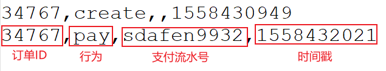

---

Created at: 2021-10-19
Last updated at: 2021-10-19


---

# 29-案例六：CEP检测订单支付超时


需求：订单创建之后，如果15分钟内没有支付，那么支付超时输出报警

数据：
```
34756,create,,1558430913
34767,create,,1558430949
34731,pay,35jue34we,1558430849
34731,create,,1558430846
34767,pay,sdafen9932,1558432021
```

pojo类：
订单
```
@Data
@AllArgsConstructor
@NoArgsConstructor
public class OrderEvent {
    private Long orderId;
    private String eventType;
    private String txId;
    private Long timestamp;
}
```
输出结果类：
```
@Data
@AllArgsConstructor
@NoArgsConstructor
public class OrderResult {
    private Long orderId;
    private String resultState;
}
```
需要用CEP匹配超时数据的情况，也就是如果在规定时间内只匹配到了前面一部分结果的话，就将这一部分结果输出到侧输出流，正好符合匹配订单支付超时的需求，因为订单支付超时也就意味着在规定时间内只会匹配到create事件，不会匹配后面的事件。
```
public static void main(String[] args) throws Exception {
    StreamExecutionEnvironment env = StreamExecutionEnvironment.getExecutionEnvironment();
    env.setStreamTimeCharacteristic(TimeCharacteristic.EventTime);
    env.setParallelism(1);
    //1.按订单分组
    KeyedStream<OrderEvent, Long> keyedStream = env.readTextFile("Data/OrderLog.csv")
            .map(line -> {
                String[] fields = line.split(",");
                return new OrderEvent(Long.valueOf(fields[0]), fields[1], fields[2], Long.valueOf(fields[3]));
            })
            .assignTimestampsAndWatermarks(new AscendingTimestampExtractor<OrderEvent>() {
                @Override
                public long extractAscendingTimestamp(OrderEvent element) {
                    return element.getTimestamp() * 1000L;
                }
            })
            .keyBy(OrderEvent::getOrderId);

    //2.创建模式
    Pattern<OrderEvent, OrderEvent> pattern = Pattern
            .<OrderEvent>begin("create").where(new SimpleCondition<OrderEvent>() {
                @Override
                public boolean filter(OrderEvent value) throws Exception {
                    return "create".equals(value.getEventType());
                }
            })
            .followedBy("pay").where(new SimpleCondition<OrderEvent>() {
                @Override
                public boolean filter(OrderEvent value) throws Exception {
                    return "pay".equals(value.getEventType());
                }
            })
            .within(Time.minutes(15));

    //3.应用模式
    PatternStream<OrderEvent> patternStream = CEP.pattern(keyedStream, pattern);
    //4.拿到匹配结果
    OutputTag<OrderResult> timeoutOrderOutputTag = new OutputTag<>("Timeout Order") {};
    SingleOutputStreamOperator<OrderResult> singleOutputStreamOperator = patternStream.select(timeoutOrderOutputTag, new OrderTimeoutFunction(), new OrderPayFunction());
    //4.1 完整匹配的结果
    singleOutputStreamOperator.print("normal");
    //4.2 在规定时间内未完整匹配，也就是只匹配到前面一部分的结果
    singleOutputStreamOperator.getSideOutput(timeoutOrderOutputTag).print("timeout");

    env.execute("order timeout detect job");
}

//处理匹配超时的数据，也就是在15分钟内只匹配到了一个create事件，迟迟没有等到pay事件的数据
private static class OrderTimeoutFunction implements PatternTimeoutFunction<OrderEvent, OrderResult> {
    @Override
    public OrderResult timeout(Map<String, List<OrderEvent>> map, long timeoutTimestamp) throws Exception {
        List<OrderEvent> events = map.get("create");
        Long orderId = events.iterator().next().getOrderId();
        return new OrderResult(orderId, "timeout, create time=" + (timeoutTimestamp / 1000 - 15 * 60));
    }
}

//处理正常匹配的数据
private static class OrderPayFunction implements PatternSelectFunction<OrderEvent, OrderResult> {
    @Override
    public OrderResult select(Map<String, List<OrderEvent>> map) throws Exception {
        Long orderId = map.get("create").iterator().next().getOrderId();
        Long payTime = map.get("pay").iterator().next().getTimestamp();
        return new OrderResult(orderId, "pay, pay time=" + payTime);
    }
}
```
输出：
```
timeout> OrderResult(orderId=34756, resultState=timeout, create time=1558430913)
normal> OrderResult(orderId=34731, resultState=pay, pay time=1558430849)
timeout> OrderResult(orderId=34767, resultState=timeout, create time=1558430949)
```

如果不用CEP，直接用定时器完成这个需求：
```
public class OrderPayTimeout {
    public static void main(String[] args) throws Exception {
        StreamExecutionEnvironment env = StreamExecutionEnvironment.getExecutionEnvironment();
        env.setStreamTimeCharacteristic(TimeCharacteristic.EventTime);
        env.setParallelism(1);
        OutputTag<OrderResult> exceptionOrderOutputTag = new OutputTag<>("Exception Order") {};
        OutputTag<OrderResult> timeoutOrderOutputTag = new OutputTag<>("Timeout Order") {};
        SingleOutputStreamOperator<OrderResult> singleOutputStreamOperator = env.readTextFile("Data/OrderLog.csv")
                .map(line -> {
                    String[] fields = line.split(",");
                    return new OrderEvent(Long.valueOf(fields[0]), fields[1], fields[2], Long.valueOf(fields[3]));
                })
                .assignTimestampsAndWatermarks(new AscendingTimestampExtractor<OrderEvent>() {
                    @Override
                    public long extractAscendingTimestamp(OrderEvent element) {
                        return element.getTimestamp() * 1000L;
                    }
                })
                .keyBy(OrderEvent::getOrderId)
                .process(new OrderPayTimeoutKeyedProcessFunction(exceptionOrderOutputTag, timeoutOrderOutputTag));
        singleOutputStreamOperator.print("Normal Order");
        singleOutputStreamOperator.getSideOutput(exceptionOrderOutputTag).print("Exception Order");
        singleOutputStreamOperator.getSideOutput(timeoutOrderOutputTag).print("Timeout Order");
        env.execute("order timeout detect job");
    }

    private static class OrderPayTimeoutKeyedProcessFunction extends KeyedProcessFunction<Long, OrderEvent, OrderResult> {
        OutputTag<OrderResult> exceptionOrderOutputTag;
        OutputTag<OrderResult> timeoutOrderOutputTag;

        public OrderPayTimeoutKeyedProcessFunction(OutputTag<OrderResult> exceptionOrderOutputTag, OutputTag<OrderResult> timeoutOrderOutputTag) {
            this.exceptionOrderOutputTag = exceptionOrderOutputTag;
            this.timeoutOrderOutputTag = timeoutOrderOutputTag;
        }

        private ValueState<Boolean> isPay;
        private ValueState<Boolean> isCreate;
        private ValueState<Long> onTimer;

        @Override
        public void open(Configuration parameters) throws Exception {
            onTimer = getRuntimeContext().getState(new ValueStateDescriptor<Long>("timeOutEvent", Long.class));
            isPay = getRuntimeContext().getState(new ValueStateDescriptor<Boolean>("Pay event has already come", Boolean.class));
            isCreate = getRuntimeContext().getState(new ValueStateDescriptor<Boolean>("Create event has already come", Boolean.class));
        }

        @Override
        public void processElement(OrderEvent value, Context ctx, Collector<OrderResult> out) throws Exception {
            //来了一个create事件
            if ("create".equals(value.getEventType())) {
                //有pay事件先到
                if (isPay.value() != null) {
                    out.collect(new OrderResult(value.getOrderId(), "pay"));
                } else { //没有pay事件先到
                    //注册一个15分钟的超时定时器等待pay事件到来
                    isCreate.update(true);
                    onTimer.update((value.getTimestamp() + 15 * 60) * 1000L);
                    ctx.timerService().registerEventTimeTimer(ctx.timestamp() + 15 * 60 * 1000);
                }
            } else if ("pay".equals(value.getEventType())) { //来了一个pay事件
                //有create事件先到
                if (isCreate.value() != null) {
                    //如果未超时，这里必须这样判断，不能使用判断定时器
                    if (value.getTimestamp() * 1000 < onTimer.value()) {
                        out.collect(new OrderResult(value.getOrderId(), "pay"));
                    } else { //支付超时
                        ctx.output(timeoutOrderOutputTag,
                                new OrderResult(ctx.getCurrentKey(),
                                        "timeout, create time: " + (onTimer.value() / 1000 - 15 * 60)));
                    }
                    isCreate.clear();
                    isPay.clear();
                    onTimer.clear();
                } else { //没有create事件先到
                    // 注册一个定时器等create事件的到来
                    // 这个定时器事件可以设置短一点，因为实际情况是先create再pay，pay都来了，create应该很快会到
                    isPay.update(true);
                    onTimer.update((value.getTimestamp() + 2) * 1000L);
                    ctx.timerService().registerEventTimeTimer(onTimer.value());
                }
            }
        }

        @Override
        public void onTimer(long timestamp, OnTimerContext ctx, Collector<OrderResult> out) throws Exception {
            if (isPay.value() != null) {
                //15分钟之内，create事件没有等到pay事件
                ctx.output(timeoutOrderOutputTag,
                        new OrderResult(ctx.getCurrentKey(),
                                "timeout, create time: " + (timestamp / 1000 - 15 * 60)));
            } else if (isCreate.value() != null) {
                //pay事件没有等到create事件
                ctx.output(exceptionOrderOutputTag,
                        new OrderResult(ctx.getCurrentKey(),
                                "exception 没有create事件就直接pay了, pay time: " + timestamp));
            }
            isCreate.clear();
            isPay.clear();
            onTimer.clear();
        }
    }
}
```

