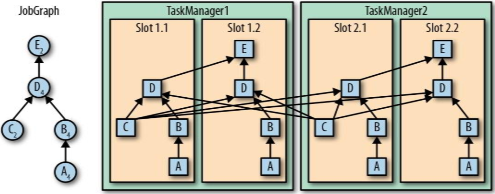
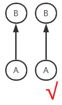
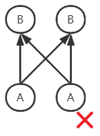
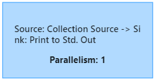

---

Created at: 2021-10-07
Last updated at: 2021-11-14


---

# 3-slot、并行度与任务


spark面向批数据，在计算前先对数据进行分区，并行度与分区的结果有关；但flink面向流数据，无法预先根据分区来决定并行度，只能提前设置算子的并行度。spark的每个阶段的并行度都可以不同，因为每个阶段的分区数可以不同，重点是spark每个阶段的任务会结束，只有前一个阶段的任务结束了才会开启下一个阶段的任务；但是Flink的所有任务都不会结束，开启之后会一直运行，所以需要提前决定每个算子的并行度。归根结底就是批数据与流数据的特点不同。

**并行度：**一个算子会在不同线程上执行，具体会被分配到多少个线程上执行就是这个算子的并行度。整个作业的并行度指的是所有算子中最大的并行度，并不是所有算子并行度之和。
**设置并行度的优先级由高到低：**
1.设置每一个算子的并行度：每个算子的setParallelism(2)方法
2.执行环境中设置所有算子的默认并行度：env.setParallelism(4);
3.提交作业时在命令行参数中指定并行度：-p参数
4.配置文件flink-conf.yaml中的设置的所有算子的默认并行度：parallelism.default: 1

**slot、并行度与任务之间的关系：**
1.TaskManager 在启动前就设置好了槽位数（slot），slot数就是TaskManager能启动的最大线程数，所以TaskManager的slot数推荐设置为cpu的线程数，TaskManager 从 JobManager 处接收任务后，就会启动线程来执行任务。

2.一个作业由许多算子构成一个数据流图，一个算子会被包装成许多相同的任务，在不同的线程上执行，处理不同的数据，这些任务称为这个算子的子任务，子任务数量也就是这个算子的并行度。
同一算子的子任务必须在不同的slot上执行，不同算子的子任务不管是否具有先后关系都可以在同一个slot上执行（这叫共享slot，前提是算子的slotSharingGroup相同），如下图所示，相同算子的子任务必须在不同的slot上执行，不同算子的具有先后顺序的子任务会被分配到一个线程中执行，不同算子的不具备先后顺序的子任务也可以在同一个slot上执行，如A和C，这样，一个 slot 就可以保存作业的整个管道（整个管道的意思是包含了数据流的从头至尾的所有操作）。


3.因为同一算子的子任务必须在不同的slot上执行，所以一个算子的并行度不能超过所有TaskManager总的slot数，不然就无法满足作业执行的最少资源。

4.如果没有给算子设置slotSharingGroup，那么该算子默认与前一个算子处于同一个slotSharingGroup，所以如果所有算子都没有设置slotSharingGroup，那么它们就属于相同的一个默认的slotSharingGroup，只有处于同一个slotSharingGroup的算子才能分配到同一个slot中。

5.如果相邻算子的并行度相同，并且处于同一个slotSharingGroup，而且中间的数据还不会被打乱，那么这两个算子就可被合并到一个任务之中，可见一个作业的任务数 并不等于 所有算子的并行度之和。
如下两张图表示相邻算子的并行度相同，左图数据没有被打乱，而右图数据被打乱了，所以左图的两个算子可以被合并到同一个任务之中。
左图在Flink中叫 one-to-one 或者 forwarding 数据传输模式，类似于spark的窄依赖；右图在Flink中叫Redistributing数据传输模式，类似于spark的宽依赖，不过Flink没有shuffle的概念，但是Flink有shuffle算子， Flink的shuffle算子会引起Redistributing，除shuffle算子外broadcast算子、rebalance算子和keyBy算子也会Redistributing。
  
所以多个算子能被合并到同一个任务之中需要满足三个条件：并行度相同、forwarding、同一个slotSharingGroup。在Flink中，将多个算子合并到同一个任务中的技术称为任务链（Operator Chains）， 任务链优化技术可以减少通信开销。
比如以下程序
```
public static void main(String[] args) throws Exception {
    StreamExecutionEnvironment env = StreamExecutionEnvironment.getExecutionEnvironment();
    DataStream<Integer> dataStream = env.fromElements(1, 2, 3);
    dataStream.print();
    env.execute();
}
```
提交时将并行度设置为1时，执行图如下，两个算子的并行度相同，并且满足另外两个条件，所以两个算子会合并到一个任务中。

提交时将并行度设置为2时，因为从集合中读取数据时的source的并行度始终为1，不会受到设置的影响，所以两个算子的并行度不同，于是就不能合并成一个任务。因为两个任务的并行度不同，所以上游数据到下游数据的过程就不是one-to-one的模式，数据在中间肯定会有Redistributing，默认的Redistributing模式是rebalance，即轮询传到下游的每个子任务中。


在多个算子并行度相同，数据传输模式是forwarding，而且还在同一个slotSharingGroup的情况下，如果不想合并成一个任务，可以让不进行合并的算子调用disableChaining()方法取消任务链。如果想直接全局禁用任务链，可以在执行环境上调用env.disableOperatorChaining()。调用算子的disableChaining()方法会导致该算子不会被合并到前后的任务中，如果只是想该算子不合并到前一个任务，而会合并到后一个任务中，可以调用该算子的startNewChain()方法。

```
public static void main(String[] args) throws Exception {
    //1.创建流处理执行环境
    StreamExecutionEnvironment env = StreamExecutionEnvironment.getExecutionEnvironment();
  `//设置并行度`
 `env.setParallelism(1);`
   `//关闭任务链`
 `env.disableOperatorChaining();`
    //2.从文件中读取数据
    DataStreamSource<String> dss = env.readTextFile("D:\\Project\\IdeaProjects\\Flink\\src\\main\\resources\\words.txt");
    //3.流式计算
    dss.flatMap(new FlatMapFunction<String, Tuple2<String, Integer>>() {
                @Override
                public void flatMap(String value, Collector<Tuple2<String, Integer>> out) throws Exception {
                    String[] words = value.split(" ");
                    for (String word : words) {
                        out.collect(new Tuple2<>(word, 1));
                    }
                }
            })`.shuffle().rebalance().broadcast()`
            .keyBy(0)
            .sum(1)`.slotSharingGroup("group1").disableChaining().startNewChain()`
            .print()`.setParallelism(2);`
    //4.启动流式计算
    env.execute();
}
```

