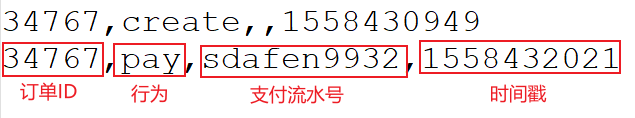
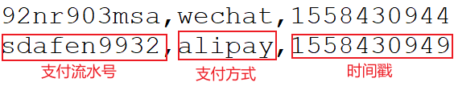

---

Created at: 2021-10-19
Last updated at: 2021-10-19


---

# 30-案例七-对账


需求：订单支付成功后5s内账单日志上要有相应的记录，比如：
订单日志OrderLog.csv：

账单日志ReceiptLog.csv：

订单日志和账单日志上都有支付流水号sdafen9932，则表示这笔交易正常，反之不正常。

涉及到两条流的操作可以用DataStream的connect()方法得到ConnectedStreams来解决
```
public class PayMatch {
    // 定义侧输出流标签
    private final static OutputTag<OrderEvent> unmatchedPays = new OutputTag<OrderEvent>("unmatched-pays") {};
    private final static OutputTag<ReceiptEvent> unmatchedReceipts = new OutputTag<ReceiptEvent>("unmatched-receipts") {};

    public static void main(String[] args) throws Exception {
        StreamExecutionEnvironment env = StreamExecutionEnvironment.getExecutionEnvironment();
        env.setStreamTimeCharacteristic(TimeCharacteristic.EventTime);
        env.setParallelism(1);

        // 读取订单支付事件数据
        KeyedStream<OrderEvent, String> orderEventKeyedStream = env.readTextFile("Data/OrderLog.csv")
                .map(line -> {
                    String[] fields = line.split(",");
                    return new OrderEvent(Long.valueOf(fields[0]), fields[1], fields[2], Long.valueOf(fields[3]));
                })
                .assignTimestampsAndWatermarks(new AscendingTimestampExtractor<OrderEvent>() {
                    @Override
                    public long extractAscendingTimestamp(OrderEvent element) {
                        return element.getTimestamp() * 1000L;
                    }
                })
                // 必须是pay事件
                .filter(data -> "pay".equals(data.getEventType()))
                .keyBy(OrderEvent::getTxId);

        // 读取到账事件数据
        KeyedStream<ReceiptEvent, String> receiptEventKeyedStream = env.readTextFile("Data/ReceiptLog.csv")
                .map(line -> {
                    String[] fields = line.split(",");
                    return new ReceiptEvent(fields[0], fields[1], Long.valueOf(fields[2]));
                })
                .assignTimestampsAndWatermarks(new AscendingTimestampExtractor<ReceiptEvent>() {
                    @Override
                    public long extractAscendingTimestamp(ReceiptEvent element) {
                        return element.getTimestamp() * 1000L;
                    }
                })
                .keyBy(ReceiptEvent::getTxId);

        ConnectedStreams<OrderEvent, ReceiptEvent> connectedStreams = orderEventKeyedStream.connect(receiptEventKeyedStream);
        SingleOutputStreamOperator<Tuple2<OrderEvent, ReceiptEvent>> singleOutputStreamOperator = connectedStreams.process(new PayMatchKeyedCoProcessFunction());
        singleOutputStreamOperator.print("normal");
        singleOutputStreamOperator.getSideOutput(unmatchedPays).print("unmatchedPays");
        singleOutputStreamOperator.getSideOutput(unmatchedReceipts).print("unmatchedReceipts");
        env.execute("tx match detect job");
    }

    private static class PayMatchKeyedCoProcessFunction extends KeyedCoProcessFunction<String, OrderEvent, ReceiptEvent, Tuple2<OrderEvent, ReceiptEvent>> {
        private ValueState<ReceiptEvent> receiptEvent;
        private ValueState<OrderEvent> orderEvent;
        private ValueState<Long> timer;

        @Override
        public void open(Configuration parameters) throws Exception {
            receiptEvent = getRuntimeContext().getState(new ValueStateDescriptor<ReceiptEvent>("ReceiptEvent", ReceiptEvent.class));
            orderEvent = getRuntimeContext().getState(new ValueStateDescriptor<OrderEvent>("OrderEvent", OrderEvent.class));
            timer = getRuntimeContext().getState(new ValueStateDescriptor<Long>("onTimer", Long.class));
        }

        `//orderEventKeyedStream来了一个OrderEvent会调这个方法`
        @Override
        public void processElement1(OrderEvent pay, Context ctx, Collector<Tuple2<OrderEvent, ReceiptEvent>> out) throws Exception {
            ReceiptEvent receipt = receiptEvent.value();
            if (receipt != null) { //如果ReceiptEvent来过了
                out.collect(new Tuple2<>(pay, receipt));
                ctx.timerService().deleteEventTimeTimer(timer.value());
                receiptEvent.clear();
                timer.clear();
            } else { //没来过就注册一个5s定时器等ReceiptEvent
                orderEvent.update(pay);
                timer.update((pay.getTimestamp() + 5) * 1000L);
                ctx.timerService().registerEventTimeTimer(timer.value());
            }
        }

       `//receiptEventKeyedStream来了一个ReceiptEvent会调这个方法`
        @Override
        public void processElement2(ReceiptEvent receipt, Context ctx, Collector<Tuple2<OrderEvent, ReceiptEvent>> out) throws Exception {
            OrderEvent pay = orderEvent.value();
            if (pay != null) { //如果OrderEvent来过了
                out.collect(new Tuple2<>(pay, receipt));
                ctx.timerService().deleteEventTimeTimer(timer.value());
                orderEvent.clear();
                timer.clear();
            } else { //没来过就注册一个5s定时器等OrderEvent
                receiptEvent.update(receipt);
                timer.update((receipt.getTimestamp() + 5) * 1000L);
                ctx.timerService().registerEventTimeTimer(timer.value());
            }
        }

        @Override
        public void onTimer(long timestamp, OnTimerContext ctx, Collector<Tuple2<OrderEvent, ReceiptEvent>> out) throws Exception {
            //这个定时器触发时肯定是有一个事件没有来，导致账对不上
            if (orderEvent.value() != null) { //如果是orderEvent没来
                ctx.output(unmatchedPays, orderEvent.value());
            }
            if (receiptEvent.value() != null) { //如果是receiptEvent没来
                ctx.output(unmatchedReceipts, receiptEvent.value());
            }
            receiptEvent.clear();
            orderEvent.clear();
            timer.clear();
        }
    }
}
```

