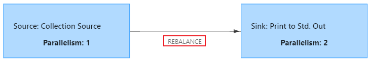

---

Created at: 2021-10-09
Last updated at: 2021-10-12


---

# 4-数据传输的方式


DataStream中keyBy、shuffle、broadcast、rebalance 和 global 并不是做计算的算子，而是对两个算子之间数据进行重新分区的操作，所谓的数据重新分区是指非one-to-one的数据传输模式。
所谓one-to-one的数据传输模式是指前一个算子的子任务只向后一个算子的子任务传输数据， one-to-one也称为forwarding，如下图所示：

非 one-to-one 的数据传输模式，是指前一个算子的子任务的数据会被打乱传向后一个算子的多个子任务中，非 one-to-one 的数据传输模式称为Redistributing，如下图所示：
                       

1.forward
forward算子就是one-to-one的传输模式，如果前后两个算子的并行度相同，并且没有调用下面的算子将数据打乱，那么默认就是forward，所以一般不会调用这个算子。如果调用这个算子，那么要求前后两个算子的并行度必须相同。

2.rebalance
当下游算子有多个子任务时， rebalance会轮询地将数据发到下游子任务中。
```
public static void main(String[] args) throws Exception {
    StreamExecutionEnvironment env = StreamExecutionEnvironment.getExecutionEnvironment();
    DataStream<Integer> dataStream = env.fromElements(1, 2, 3);
    dataStream.print();
    env.execute();
}
```
提交时将并行度设置为2时，因为从集合中读取数据时的source的并行度始终为1，不会受到设置的影响，所以两个算子的并行度不同，于是就不能合并成一个任务。因为两个任务的并行度不同，所以上游数据到下游数据的过程就不是one-to-one的模式，数据在中间肯定会有Redistributing，`默认的Redistributing模式是rebalance`，即轮询传到下游的每个子任务中。


或者明确指出数据需要rebalance
```
public static void main(String[] args) throws Exception {
    StreamExecutionEnvironment env = StreamExecutionEnvironment.getExecutionEnvironment();
    DataStream<Integer> dataStream = env.fromElements(1, 2, 3);
    dataStream.`rebalance`().print("rebalance");
    env.execute();
}
```
即使提交时指定并行度为1，那么两个算子也不能合并，因为中间有rebalance的过程。


3.keyBy
keyBy的作用是对数据进行分区。keyBy会按分组字段的hashcode值对下游子任务数量取余，将数据发往不同的子任务，这样可以保证同一组的数据发往同一个子任务（或者说分区），当然同一个子任务上可以有不同组的数据。
```
public static void main(String[] args) throws Exception {
    StreamExecutionEnvironment env = StreamExecutionEnvironment.getExecutionEnvironment();
    DataStream<Integer> dataStream = env.fromElements(1, 2, 3);
    dataStream.`keyBy(value -> value)`.print("keyBy");
    env.execute();
}
```
提交时并行度设置为2，执行图如下，从集合中读取数据时的source的并行度始终为1。


4.shuffle
当下游算子有多个子任务时，shuffle会将数据随机分配到下游子任务中。
```
public static void main(String[] args) throws Exception {
    StreamExecutionEnvironment env = StreamExecutionEnvironment.getExecutionEnvironment();
    DataStream<Integer> dataStream = env.fromElements(1, 2, 3);
    dataStream.`shuffle`().print("shuffle");
    env.execute();
}
```
提交时并行度设置为1，即使下游算子并行度为1也会有shuffle的过程，两个算子不能合并，keyBy也是一样。


5.broadcast
当下游算子有多个子任务时， broadcast会将每个数据发到下游算子的所有子任务中。
```
public static void main(String[] args) throws Exception {
    StreamExecutionEnvironment env = StreamExecutionEnvironment.getExecutionEnvironment();
    DataStream<Integer> dataStream = env.fromElements(1, 2, 3);
    dataStream.`broadcast`().print("broadcast").setParallelism(2);;
    env.execute();
}
```

输出：
```
broadcast:2> 1
broadcast:1> 1
broadcast:2> 2
broadcast:1> 2
broadcast:1> 3
broadcast:2> 3
```

6.global
global会将上游算子的所有子任务的数据汇聚下游算子的一个子任务中去，下游算子的其它子任务将会没有数据。
```
public static void main(String[] args) throws Exception {
    StreamExecutionEnvironment env = StreamExecutionEnvironment.getExecutionEnvironment();
    DataStream<Integer> dataStream = env.fromElements(1, 2, 3);
    dataStream.`global`().print("global");
    env.execute();
}
```


7.rescale
将上游算子的部分子任务的数据轮询地发送给下游算子的部分子任务，比如上游算子有2个子任务，下游算子有4个子任务，那么就会1对2的轮询发送数据：

如果上游算子有4个子任务，下游算子有2个子任务，那么就会2对1地发送数据。

