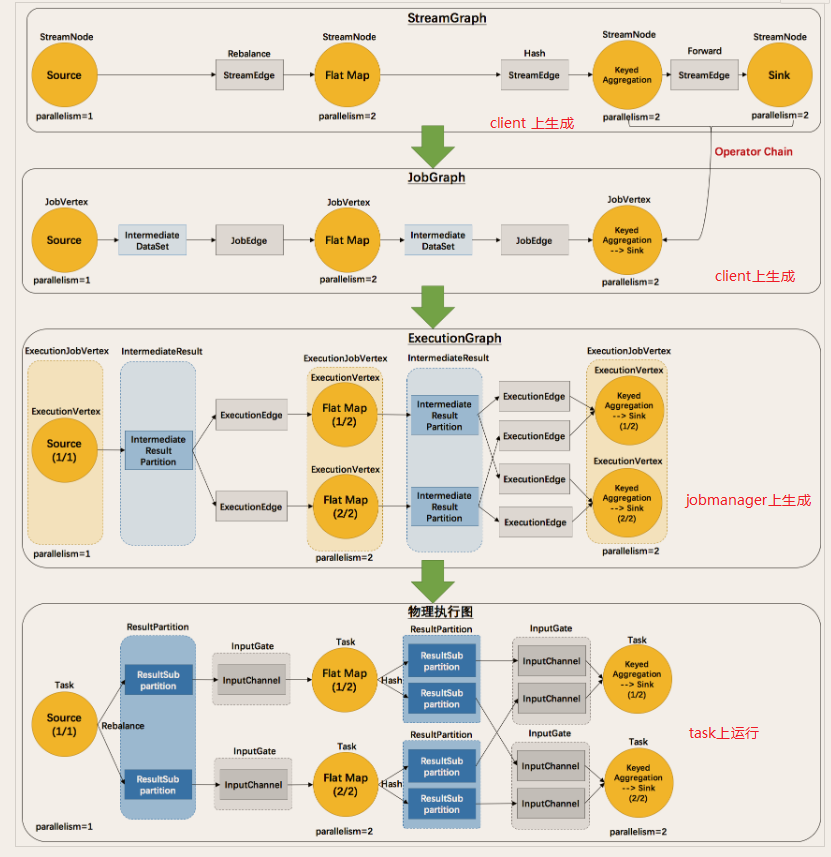

---

Created at: 2021-10-07
Last updated at: 2021-10-09

---

# 5-Flink程序与数据流

**Flink程序与数据流（ DataFlow）**
所有的Flink程序都是由三部分组成的： **Source 、 Transformation 和 Sink**。 Source 负责读取数据源， Transformation 利用各种算子进行处理加工， Sink负责输出。 每一个dataflow以一个或多个sources开始以一个或多个sinks结束， dataflow类似于任意的有向无环图（ DAG）。
Flink程序从提交到运行，整个dataflow需要经历4个图的变化过程： StreamGraph -> JobGraph ->ExecutionGraph -> 物理执行图。

* StreamGraph：是根据用户通过 Stream API 编写的代码生成的最初的图。用来表示程序的拓扑结构。
* JobGraph： StreamGraph经过优化后生成了 JobGraph，提交给 JobManager的数据结构。主要的优化为，将多个符合条件的节点合并为一个节点。
* ExecutionGraph： JobManager 根据 JobGraph 生成ExecutionGraph。ExecutionGraph是JobGraph的并行化版本，是调度层最核心的数据结构。
* 物理执行图： JobManager 根据 ExecutionGraph 对 Job 进行调度后，在各个TaskManager 上部署 Task 后形成的“图” ，并不是一个具体的数据结构。

