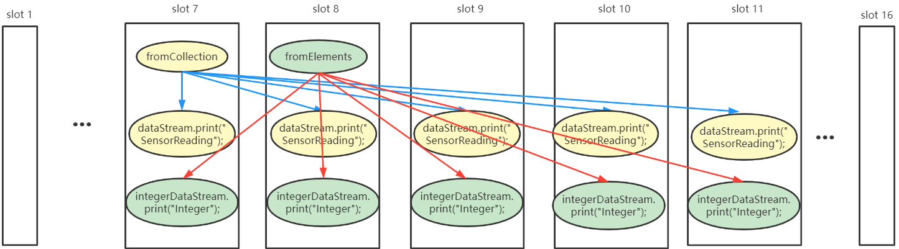
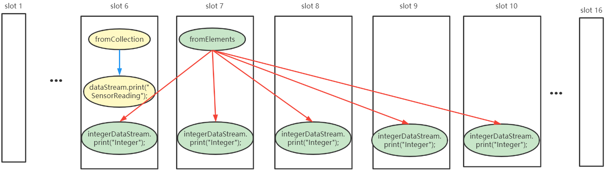
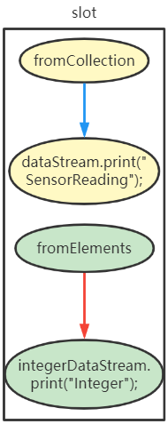

---

Created at: 2021-10-07
Last updated at: 2025-03-02


---

# 6-Source


source就是读取数据，添加source的通用方法是DataStream的addSource方法，addSource方法需要传入一个实现了SourceFunction接口的类，主要是实现SourceFunction接口的run方法 和 cancel方法。从集合、文件等其它数据源中读取数据其实都是addSource了一个实现了SourceFunction接口的类实例。
**1.从集合中读取数据**
java bean类，使用了lombok
```
// 传感器类
@Data
@NoArgsConstructor
@AllArgsConstructor
@ToString
public class SensorReading {
    // 属性：id，时间戳，温度值
    private String id;
    private Long timestamp;
    private Double temperature;
}
```
```
public static void main(String[] args) throws Exception{
    // 创建流式执行环境
    StreamExecutionEnvironment env = StreamExecutionEnvironment.getExecutionEnvironment();
    // 从集合中读取数据
    DataStream<SensorReading> dataStream = `env.fromCollection(`Arrays.asList(
            new SensorReading("sensor_1", 1547718199L, 35.8),
            new SensorReading("sensor_6", 1547718201L, 15.4),
            new SensorReading("sensor_7", 1547718202L, 6.7),
            new SensorReading("sensor_10", 1547718205L, 38.1)
    ));
    // 直接读取元素的集合
    DataStream<Integer> integerDataStream = `env.fromElements(`1, 2, 4, 67, 189);
    // 打印输出，参数为打印时的前缀
    dataStream.print("SensorReading");
    integerDataStream.print("Integer");
    // 执行，参数是jobName，即给作业取的一个名字
    env.execute("SourceTest1_Collection");
}
```
输出如下，因为print的并行度等于cpu的线程数，所以是多个线程同时打印，完全乱序。
```
Integer:9> 4
SensorReading:8> SensorReading(id=sensor_1, timestamp=1547718199, temperature=35.8)
SensorReading:10> SensorReading(id=sensor_7, timestamp=1547718202, temperature=6.7)
SensorReading:9> SensorReading(id=sensor_6, timestamp=1547718201, temperature=15.4)
SensorReading:11> SensorReading(id=sensor_10, timestamp=1547718205, temperature=38.1)
Integer:7> 1
Integer:8> 2
Integer:11> 189
Integer:10> 67
```
用于读取数据的 env.fromCollection 和 env.fromElements 的并行度为1，print的并行度等于cpu的线程数，所以任务执行情况如下：


如果设置其中一个print的并行度为1
```
public static void main(String[] args) throws Exception{
        // 创建流式执行环境
        StreamExecutionEnvironment env = StreamExecutionEnvironment.getExecutionEnvironment();
        // 从集合中读取数据
        DataStream<SensorReading> dataStream = env.fromCollection(Arrays.asList(
                new SensorReading("sensor_1", 1547718199L, 35.8),
                new SensorReading("sensor_6", 1547718201L, 15.4),
                new SensorReading("sensor_7", 1547718202L, 6.7),
                new SensorReading("sensor_10", 1547718205L, 38.1)
        ));
        // 直接读取元素的集合
        DataStream<Integer> integerDataStream = env.fromElements(1, 2, 4, 67, 189);
        // 打印输出，参数为打印时的前缀
        dataStream.print("SensorReading")`.setParallelism(1);`
        integerDataStream.print("Integer");
        // 执行，参数是jobName，即给作业取的一个名字
        env.execute("SourceTest1_Collection");
    }
```
那么并行度为1的print的输出就会保持读取数据时的顺序：
```
SensorReading> SensorReading(id=sensor_1, timestamp=1547718199, temperature=35.8)
SensorReading> SensorReading(id=sensor_6, timestamp=1547718201, temperature=15.4)
SensorReading> SensorReading(id=sensor_7, timestamp=1547718202, temperature=6.7)
SensorReading> SensorReading(id=sensor_10, timestamp=1547718205, temperature=38.1)
Integer:8> 4
Integer:6> 1
Integer:10> 189
Integer:7> 2
Integer:9> 67
```
这个时候任务执行的情况是：


如果直接设置执行环境的并行度为1，这两个print的并行度都为1：
```
public static void main(String[] args) throws Exception{
    // 创建流式执行环境
    StreamExecutionEnvironment env = StreamExecutionEnvironment.getExecutionEnvironment();
    //设置并行度为1
    env.setParallelism(1);
    // 从集合中读取数据
    DataStream<SensorReading> dataStream = env.fromCollection(Arrays.asList(
            new SensorReading("sensor_1", 1547718199L, 35.8),
            new SensorReading("sensor_6", 1547718201L, 15.4),
            new SensorReading("sensor_7", 1547718202L, 6.7),
            new SensorReading("sensor_10", 1547718205L, 38.1)
    ));
    // 直接读取元素的集合
    DataStream<Integer> integerDataStream = env.fromElements(1, 2, 4, 67, 189);
    // 打印输出，参数为打印时的前缀
    dataStream.print("SensorReading");
    integerDataStream.print("Integer");
    // 执行，参数是jobName，即给作业取的一个名字
    env.execute("SourceTest1_Collection");
}
```
则两个print的输出都会保持读取数据时的顺序：
```
Integer> 1
Integer> 2
Integer> 4
Integer> 67
Integer> 189
SensorReading> SensorReading(id=sensor_1, timestamp=1547718199, temperature=35.8)
SensorReading> SensorReading(id=sensor_6, timestamp=1547718201, temperature=15.4)
SensorReading> SensorReading(id=sensor_7, timestamp=1547718202, temperature=6.7)
SensorReading> SensorReading(id=sensor_10, timestamp=1547718205, temperature=38.1)
```
此时任务执行的情况是：


**2.从文件中读取数据**
```
public static void main(String[] args) throws Exception{
    StreamExecutionEnvironment env = StreamExecutionEnvironment.getExecutionEnvironment();
    // 从文件读取数据
    DataStream<String> dataStream = `env.readTextFile`("words.txt");
    // 打印输出
    dataStream.print();
    env.execute();
}
```

**3.从kafka中读取数据**
引入 kafka 连接器的依赖：
```
<dependency>
    <groupId>org.apache.flink</groupId>
    <artifactId>flink-connector-kafka-0.11_2.12</artifactId>
    <version>1.10.1</version>
</dependency>
```
```
public static void main(String[] args) throws Exception{
    StreamExecutionEnvironment env = StreamExecutionEnvironment.getExecutionEnvironment();
    Properties properties = new Properties();
    properties.setProperty("bootstrap.servers", "hadoop102:9092,hadoop103:9092,hadoop104:9092");
    properties.setProperty("group.id", "consumer-group");
    properties.setProperty("key.deserializer", "org.apache.kafka.common.serialization.StringDeserializer");
    properties.setProperty("value.deserializer", "org.apache.kafka.common.serialization.StringDeserializer");
    properties.setProperty("auto.offset.reset", "latest");
    // 从kafka中读取数据
    DataStream<String> dataStream = env.`addSource(new FlinkKafkaConsumer011<>("flink-topic01", new SimpleStringSchema(), properties));`
    // 打印输出
    dataStream.print();
    env.execute();
}
```

**4.自定义Source**
自定义的Source需要实现SourceFunction接口：
```
// 实现自定义的SourceFunction
public static class MySource `implements SourceFunction<Double>` {
    // 定义一个标识位，用来控制数据的产生
    private boolean flag = true;

    @Override
    public void run(SourceContext<Double> sourceContext) throws Exception {
        // 定义一个随机数发生器
        Random random = new Random();
        while (flag) {
            for (int i = 0; i < 10; i++) {
                sourceContext.collect(random.nextGaussian() * 20);
            }
            // 控制输出频率
            TimeUnit.SECONDS.sleep(1);
        }
    }

    @Override
    public void cancel() {
        flag = false;
    }
}
```
```
public static void main(String[] args) throws Exception {
    StreamExecutionEnvironment env = StreamExecutionEnvironment.getExecutionEnvironment();
    // 从文件读取数据
    DataStream<Double> dataStream = `env.addSource(new MySource());`
    // 打印输出
    dataStream.print();
    env.execute();
}
```
如果想要在自定义Source中获取运行时上下文可以实现SourceFunction接口子抽象类RichSourceFunction，如果想要并行的获取数据，可以实现ParallelSourceFunction接口或者RichParallelSourceFunction接口。

