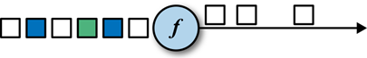
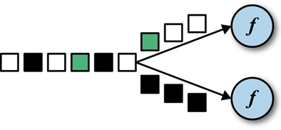

---

Created at: 2021-10-07
Last updated at: 2021-11-14


---

# 7-DataStream 的 Transform 算子


**1.map**
一对一的转换

```
public static void main(String[] args) throws Exception {
    //1.创建流处理执行环境
    StreamExecutionEnvironment env = StreamExecutionEnvironment.getExecutionEnvironment();
    //2.从文件中读取数据
    DataStreamSource<String> dss = env.readTextFile("words.txt");
    //3.map
    dss`.map(String::length)`.print("map");
    //4.启动流式计算
    env.execute();
}
```

**2.flatMap**
可以一对零，一对一，还可以一对多，看out.collect()中具体给的是什么。
```
public static void main(String[] args) throws Exception {
    //1.创建流处理执行环境
    StreamExecutionEnvironment env = StreamExecutionEnvironment.getExecutionEnvironment();
    //2.从文件中读取数据
    DataStreamSource<String> dss = env.readTextFile("words.txt");
    //3.flatMap
    dss`.flatMap(new FlatMapFunction<String, String>() {`
 `@Override`
 `public void flatMap(String value, Collector<String> out) throws Exception {`
 `String[] split = value.split(" ");`
 `for (String str : split) {`
 `out.collect(str);`
 `}`
 `}`
 `})`.print("FlatMap");
    //4.启动流式计算
    env.execute();
}
```

**3.filter**
过滤

```
public static void main(String[] args) throws Exception {
    //1.创建流处理执行环境
    StreamExecutionEnvironment env = StreamExecutionEnvironment.getExecutionEnvironment();
    //2.从文件中读取数据
    DataStreamSource<String> dss = env.readTextFile("words.txt");
    //3.filter
    `dss.filter(value -> value.startsWith("hello"))`.print("filter");
    //4.启动流式计算
    env.execute();
}
```

**4.keyBy**
使用Flink的聚合算子做聚合时必须先分组，使用keyBy可以对流数据按指定的字段分组，keyBy会将DataStream转换成KeyedStream，只有KeyedStream中才有聚合算子，不过KeyedStream也是继承自DataStream。
为什么不能直接对DataStream做聚合呢？因为流数据的特点是数据源源不断地来，没有尽头，所以无法做到像spark批处理那样可以先将数据划分到不同的分区做预聚合，再对预聚合的结果再做聚合，也就是说如果直接对DataStream做聚合的话就要求所有数据都到一个任务中做计算，这就不是分布式流计算了。所以我们应该先对数据分组，把每一组的数据分到不同slot的子任务上，再对每一组的数据做聚合。（如果想直接对所有数据做聚合，可以先map加上一个相同的分组字段然后聚合）
因为keyBy分组后会把数据发送到不同slot的下游子任务上，所以keyBy会发生数据的Redistributing，其重分区的具体做法是，keyBy会按分组字段的hashcode值对下游子任务数量取余，将数据发往不同的子任务，这样可以保证同一组的数据发往同一个子任务（或者说分区），当然同一个子任务上可以有不同组的数据。

keyBy有三个重载的方法，返回值均是KeyedStream<T, K>，第一个泛型参数是DataStream中数据类型，第二个泛型参数是指定的分组字段的类型。
此方法需要传递一个函数式接口的实现，该函数式接口的实现用于指明分组的字段
```
KeyedStream<T, K> keyBy(KeySelector<T, K> key)
```
此方法需要传递分组字段在元组中的位置，该方法只适用于DataStream中的数据是元组类型，由于分组的字段可以有多个，所以KeyedStream的第二个泛型参数是一个元组类型
```
KeyedStream<T, Tuple> keyBy(int... fields)
```
此方法需要传递Pojo类字段的名字，keyBy会以pojo类字段的值来分组，所以此方法只适用于DataStream中的数据是pojo类型，同样由于分组的字段可以有多个，所以KeyedStream的第二个泛型参数是一个元组类型
```
KeyedStream<T, Tuple> keyBy(String... fields)
```

以下聚合算子都是 KeyedStream 类中的方法，只有KeyedStream才可以使用，KeyedStream是DataStream的子类。
**5.滚动聚合算子**
滚动聚合算子可以对 KeyedStream 的每一个支流（即每一组）做聚合。

* sum()
* min()
* max()
* minBy()
* maxBy()

max算子有两个重载的方法：
第一个对指定的pojo类的字段做聚合
```
SingleOutputStreamOperator<T> max(String field)
```
第二个方法对指定的元组元素的位置做聚合
```
SingleOutputStreamOperator<T> max(int positionToMax)
```

pojo类
```
// 传感器类
@Data
@NoArgsConstructor
@AllArgsConstructor
@ToString
public class SensorReading {
    // 属性：id，时间戳，温度值
    private String id;
    private Long timestamp;
    private Double temperature;
}
```
按pojo类的id进行分组，然后对pojo类的temperature字段做聚合：
```
public static void main(String[] args) throws Exception {
        // 创建流式执行环境
        StreamExecutionEnvironment env = StreamExecutionEnvironment.getExecutionEnvironment();
        env.setParallelism(1);
        // 从集合中读取数据
        DataStream<SensorReading> dataStream = env.fromCollection(Arrays.asList(
                new SensorReading("sensor_1", 1547718199L, 35.8),
                new SensorReading("sensor_6", 1547718201L, 15.4),
                new SensorReading("sensor_1", 1547718202L, 6.7),
                new SensorReading("sensor_1", 1547718205L, 38.1)
        ));
        //KeyedStream<SensorReading, String> keyedStream = dataStream.keyBy(SensorReading::getId);
        KeyedStream<SensorReading, Tuple> keyedStream = `dataStream.keyBy("id");`
        DataStream<SensorReading> maxSensorReading = `keyedStream.max("temperature");`
        maxSensorReading.print();
        env.execute();
    }
```
输出：
```
SensorReading(id=sensor_1, timestamp=`1547718199`, temperature=35.8)
SensorReading(id=sensor_6, timestamp=1547718201, temperature=15.4)
SensorReading(id=sensor_1, timestamp=1547718199, temperature=35.8)
SensorReading(id=sensor_1, timestamp=`1547718199`, temperature=38.1)
```
从输出结果中可以看到：
1.流式计算是来一条数据就做一次计算，所以有4条数据就会有4个输出
2.max是对pojo类的temperature字段做聚合，所以当属于同一组的数据过来做计算时，max算子只会改变状态的temperature字段，不会改变状态的timestamp等其它字段的值。Flink是基于状态更新做流式计算的，这里的状态就是指前一次的聚合的结果，这个结果会保存在taskManager的内存中。

同样，sum算子和min算子也只会改变状态中指定做聚合字段的值，并不会改变状态中其它字段的值，但是，minBy算子和maxBy算子会改变状态中其它字段的值，也就minBy和maxBy会直接用符合要求的整个数据替换之前的状态。
```
public static void main(String[] args) throws Exception {
    // 创建流式执行环境
    StreamExecutionEnvironment env = StreamExecutionEnvironment.getExecutionEnvironment();
    env.setParallelism(1);
    // 从集合中读取数据
    DataStream<SensorReading> dataStream = env.fromCollection(Arrays.asList(
            new SensorReading("sensor_1", 1547718199L, 35.8),
            new SensorReading("sensor_6", 1547718201L, 15.4),
            new SensorReading("sensor_1", 1547718202L, 6.7),
            new SensorReading("sensor_1", 1547718205L, 38.1)
    ));
    KeyedStream<SensorReading, String> keyedStream = dataStream`.keyBy(SensorReading::getId);`
    DataStream<SensorReading> maxSensorReading = keyedStream`.maxBy("temperature");`
    maxSensorReading.print();
    env.execute();
}
```
输出：
```
SensorReading(id=sensor_1, timestamp=`1547718199`, temperature=35.8)
SensorReading(id=sensor_6, timestamp=1547718201, temperature=15.4)
SensorReading(id=sensor_1, timestamp=1547718199, temperature=35.8)
SensorReading(id=sensor_1, timestamp=`1547718205`, temperature=38.1)
```

**6.reduce**
sum算子只会改变状态中做聚合的字段的值，不会改变状态其它字段的值：
```
public static void main(String[] args) throws Exception {
    StreamExecutionEnvironment env = StreamExecutionEnvironment.getExecutionEnvironment();
    env.setParallelism(1);
    DataStream<SensorReading> dataStream = env.fromCollection(Arrays.asList(
            new SensorReading("sensor_1", 1547718199L, 35.8),
            new SensorReading("sensor_6", 1547718201L, 15.4),
            new SensorReading("sensor_1", 1547718202L, 6.7),
            new SensorReading("sensor_1", 1547718205L, 38.1)
    ));
    KeyedStream<SensorReading, String> keyedStream = dataStream.`keyBy(SensorReading::getId);`
    DataStream<SensorReading> maxSensorReading = keyedStream.`sum("temperature");`
    maxSensorReading.print();
    env.execute();
}
```
输出：
```
SensorReading(id=sensor_1, timestamp=`1547718199`, temperature=35.8)
SensorReading(id=sensor_6, timestamp=1547718201, temperature=15.4)
SensorReading(id=sensor_1, timestamp=`1547718199`, temperature=42.5)
SensorReading(id=sensor_1, timestamp=`1547718199`, temperature=80.6)
```

如果想要在聚合时会改变状态中其它字段的值，可以使用更通用的聚合操作reduce：
```
public static void main(String[] args) throws Exception {
    StreamExecutionEnvironment env = StreamExecutionEnvironment.getExecutionEnvironment();
    env.setParallelism(1);
    DataStream<SensorReading> dataStream = env.fromCollection(Arrays.asList(
            new SensorReading("sensor_1", 1547718199L, 35.8),
            new SensorReading("sensor_6", 1547718201L, 15.4),
            new SensorReading("sensor_1", 1547718202L, 6.7),
            new SensorReading("sensor_1", 1547718205L, 38.1)
    ));
    KeyedStream<SensorReading, String> keyedStream = dataStream.keyBy(SensorReading::getId);
    DataStream<SensorReading> maxSensorReading = `keyedStream.reduce((v1, v2) -> new SensorReading(v2.getId(), v2.getTimestamp(), v1.getTemperature() + v2.getTemperature()));`
    maxSensorReading.print();
    env.execute();
}
```
输出：
```
SensorReading(id=sensor_1, timestamp=`1547718199`, temperature=35.8)
SensorReading(id=sensor_6, timestamp=1547718201, temperature=15.4)
SensorReading(id=sensor_1, timestamp=`1547718202`, temperature=42.5)
SensorReading(id=sensor_1, timestamp=`1547718205`, temperature=80.6)
```

