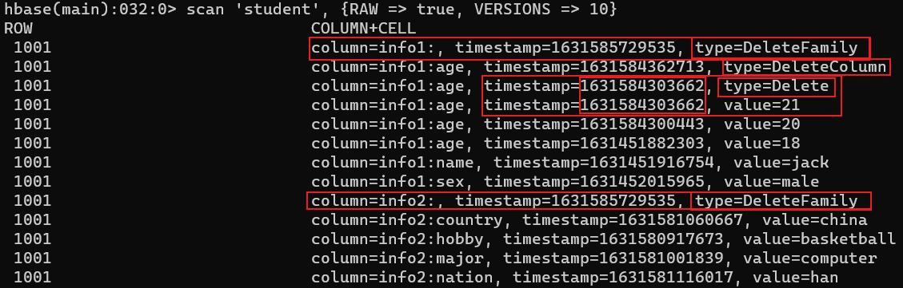

---

Created at: 2021-09-14
Last updated at: 2021-09-15


---

# 10-DDL 与 DML 操作的API


1.引入依赖
```
<dependency>
    <groupId>org.apache.hbase</groupId>
    <artifactId>hbase-client</artifactId>
    <version>1.4.13</version>
</dependency>
<dependency>
    <groupId>junit</groupId>
    <artifactId>junit</artifactId>
    <version>4.13.1</version>
</dependency>
```

2.DDL操作的API
命名空间和表的创建删除等ddl操作均是通过Admin对象完成，可以看到HBase的客户端只需要连接zookeeper即可，并且HBase数据库并不像MySQL那样需要密码，Redis默认也是没有密码的。
```
public class DDLTest {
    private Connection connection;
    //命名空间和表的创建删除等ddl操作均是通过Admin对象完成
    private Admin admin;

    /**
     * 建立连接 和 获取Admin对象
     */
    @Before
    public void connection() throws IOException {
        //创建设置配置信息的对象
        Configuration conf = HBaseConfiguration.create();
        //HBase的客户端只需要连接zookeeper即可
        conf.set("hbase.zookeeper.quorum", "hadoop102,hadoop103,hadoop104");
        //创建连接
        connection = ConnectionFactory.createConnection(conf);
        //获取Admin对象，命名空间和表的创建删除等ddl操作均是通过Admin对象完成
        admin = connection.getAdmin();
    }

    /**
     * 关闭资源
     */
    @After
    public void close() throws IOException {
        admin.close();
        connection.close();
    }

    /**
     * 创建命名空间
     */
    @Test
    public void createNameSpace() throws IOException {
        // 只能通过NamespaceDescriptor的create()方法拿到NamespaceDescriptor的静态内部类Builder的对象
        // 然后通过Builder对象创建NamespaceDescriptor的对象
        admin.createNamespace(NamespaceDescriptor.create("bigdata").build());
    }

    /**
     * 判断表是否存在
     */
    @Test
    public void isTableExist() throws IOException {
        TableName tableName = TableName.valueOf("student");
        System.out.println(admin.tableExists(tableName));
    }

    /**
     * 创建表
     */
    @Test
    public void createTable() throws IOException {
        TableName tableName = TableName.valueOf("test");
        //表描述符
        HTableDescriptor descriptor = new HTableDescriptor(tableName);
        //添加列族
        descriptor.addFamily(new HColumnDescriptor("info1"));
        descriptor.addFamily(new HColumnDescriptor("info2"));
        //创建表
        admin.createTable(descriptor);
    }

    /**
     * 删除表
     */
    @Test
    public void deleteTable() throws IOException {
        TableName tableName = TableName.valueOf("test");
        //先disable
        admin.disableTable(tableName);
        //再删除
        admin.deleteTable(tableName);
    }
}
```

3.DML操作的API
对表数据的增删改查操作均是通过Table对象完成，重点关注删除的方法
```
public class DMLTest {
    private Connection connection;
    private Table studentTable;

    /**
     * 创建连接 和 获取Table对象
     */
    @Before
    public void connection() throws IOException {
        //创建设置配置信息的对象
        Configuration conf = HBaseConfiguration.create();
        //HBase的客户端只需要连接zookeeper即可
        conf.set("hbase.zookeeper.quorum", "hadoop102,hadoop103,hadoop104");
        //创建连接
        connection = ConnectionFactory.createConnection(conf);
        //获取Table对象，对表数据的增删改查操作均是通过Table对象完成
        studentTable = connection.getTable(TableName.valueOf("student"));
    }

    /**
     * 关闭资源
     */
    @After
    public void close() throws IOException {
        connection.close();
        studentTable.close();
    }

    /**
     * 向表中put数据
     */
    @Test
    public void put() throws IOException {
        String rowKey = "1005";//RowKey
        Put put = new Put(Bytes.toBytes(rowKey));
        String columnFamily = "info1";//列族
        String column = "name";//列
        String value = "zhangsan";//值
        put.addColumn(Bytes.toBytes(columnFamily), Bytes.toBytes(column), System.currentTimeMillis(), Bytes.toBytes(value));
        studentTable.put(put);
    }

    /**
     * 打印一行数据的方法
     */
    private void printRow(Cell cell) {
        System.out.println("------------------------");
        System.out.println("RowKey: " + Bytes.toString(CellUtil.cloneRow(cell)));
        System.out.println("ColumnFamily: " + Bytes.toString(CellUtil.cloneFamily(cell)));
        System.out.println("Column: " + Bytes.toString(CellUtil.cloneQualifier(cell)));
        System.out.println("value: " + Bytes.toString(CellUtil.cloneValue(cell)));
        System.out.println("Timestamp: " + new Date(cell.getTimestamp()));
        System.out.println("------------------------");
    }

    /**
     * 获取一行数据
     */
    @Test
    public void getRow() throws IOException {
        String rowKey = "1001";
        Get get = new Get(Bytes.toBytes(rowKey));
        //通过RowKey拿到一行数据
        Result result = studentTable.get(get);
        //一行数据有许多cell，也就是有数据的列
        Cell[] cells = result.rawCells();
        for (Cell cell : cells) {
            printRow(cell);
        }
    }

    /**
     * 获取某一行指定“列族:列”的数据
     */
    @Test
    public void getRowQualifier() throws IOException {
        String rowKey = "1001";//RowKey
        Get get = new Get(Bytes.toBytes(rowKey));
        String columnFamily = "info1";//列族
        String columnQualifier = "name";//列
        get.addColumn(Bytes.toBytes(columnFamily), Bytes.toBytes(columnQualifier));
        //通过RowKey拿到一行数据
        Result result = studentTable.get(get);
        //byte[] value = result.getValue(Bytes.toBytes(columnFamily), Bytes.toBytes(columnQualifier));
        //System.out.println(new String(value));
        Cell cell = result.rawCells()[0];
        printRow(cell);
    }

    /**
     * 获取所有数据
     */
    @Test
    public void scanTable() throws IOException {
        Scan scan = new Scan();
        ResultScanner results = studentTable.getScanner(scan);
        //每一行
        for (Result result : results) {
            //每一列
            for (Cell cell : result.rawCells()) {
                printRow(cell);
            }
        }
    }

    /**
     * 删除某个RowKey的某个列族的某一列的数据
     * 只删除一列指定的一个版本的数据，type=delete，如果不指定版本就是删除最近的一个的版本
     * 使用这个方法删除数据会造成一个问题：
     * 比如，列族设置只保留一个版本的额数据，然后put一个数据两次之后，使用delete之后，会返回第一个版本的数据，这没问题，
     * 但是如果put一个数据两次之后，HBase发生了flush，这时使用delete之后，就不会返回数据了
     * 上述两个过程都是用户所做的操作是一样的，即put两次、delete一次，但是返回的结果却不一致，
     * 所以这个方法删除数据需要慎重。
     */
    @Test
    public void deleteColumn() throws IOException {
        String rowKey = "1001";//RowKey
        Delete delete = new Delete(Bytes.toBytes(rowKey));
        String columnFamily = "info1";//列族
        String columnQualifier = "age";//列
        // 删除一列最近的一个版本，type=delete，该操作的timestamp等于上一个版本的timestamp，
        // 也就是 type=delete 的意思是删除指定版本的数据
        //delete.addColumn(Bytes.toBytes(columnFamily), Bytes.toBytes(columnQualifier));
        // 删除指定版本的数据，type=delete，和上面一样，只不过上面的timestamp是HBase找到最近的一个版本后添加的，然而这里是你指定的
        delete.addColumn(Bytes.toBytes(columnFamily), Bytes.toBytes(columnQualifier),1631586501750L);
        studentTable.delete(delete);
    }

    /**
     * 删除某个RowKey的某个列族的某一列的数据
     * 删除一列所有版本，type=DeleteColumn
     */
    @Test
    public void deleteColumns() throws IOException {
        String rowKey = "1001";//RowKey
        Delete delete = new Delete(Bytes.toBytes(rowKey));
        String columnFamily = "info1";//列族
        String columnQualifier = "age";//列
        //删除一列所有版本，type=DeleteColumn
        delete.addColumns(Bytes.toBytes(columnFamily), Bytes.toBytes(columnQualifier));
        studentTable.delete(delete);
    }

    /**
     * 删除某个RowKey的某个列族的全部数据，type=deleteFamily
     */
    @Test
    public void deleteColumnFamily() throws IOException {
        String rowKey = "1001";//RowKey
        Delete delete = new Delete(Bytes.toBytes(rowKey));
        String columnFamily = "info1";//列族
        //删除一个列族的数据，type=deleteFamily
        delete.addFamily(Bytes.toBytes(columnFamily));
        studentTable.delete(delete);
    }

    /**
     * 删除一行数据，具体过程是分别删除每一个列族的数据
     */
    @Test
    public void delete() throws IOException {
        String rowKey = "1002";//RowKey
        //删除一行数据，具体过程是分别删除每一个列族的数据
        Delete delete = new Delete(Bytes.toBytes(rowKey));
        studentTable.delete(delete);
    }

    /**
     * 删除多行数据
     */
    @Test
    public void deleteMultiRow() throws IOException {
        ArrayList<Delete> deletes = new ArrayList<>();
        deletes.add(new Delete(Bytes.toBytes("1003")));
        deletes.add(new Delete(Bytes.toBytes("1005")));
        studentTable.delete(deletes);
    }
}
```

总结删除数据：
删除数据的type有三种类型：delete、deleteColumn、deleteFamily
type=delete：删除一列指定的一个版本的数据，如果在api在没有指定版本就是删除最近的一个的版本
type=deleteColumn：删除一列所有版本的数据
type=deleteFamily：删除列族的全部数据
删除一行数据，具体过程是分别删除每一个列族的数据


