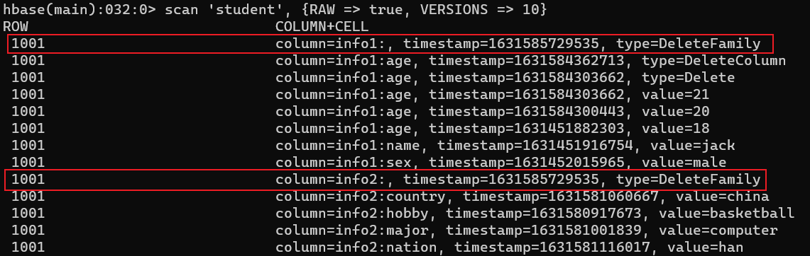

---

Created at: 2021-09-12
Last updated at: 2021-11-02


---

# 2-HBase的shell命令


**一、基本操作**
进入 HBase 客户端命令行
```
bin/hbase shell
```
查看帮助命令
```
help
```
查看当前数据库中有哪些表
```
list
```
不知道哪个命令的用法，直接输入该命令，会有用法的例子

**二、表的操作**
**DDL**
创建表，不指定namespace，则使用默认的namespace，即default
```
create 'namespace:表名','列族1','列族2','列族3'
```
```
create 'student','info1','info2'
```

删除表
  首先需要先让该表为 disable 状态：
```
disable 'student
```
  然后才能 drop 这个表：
```
drop 'student'
```

变更表信息
修改student表的 info 列族存放 3 个版本（该操作会造成flush）：
```
alter 'student',{NAME=>'info',VERSIONS=>3}
```

查看表结构
```
describe 'student'
```

**DML**
插入 或 更新 都是put命令
```
put 'namespace:表名','rowkey','列族:列','值'
```
```
put 'student','1001','info1:sex','male'
```
  指定时间戳的put
```
put 'student','1001','info1:name','zhaoliu',1631445905050
```

查看表数据
```
scan 'student'
```
  指明rowkey的范围，左闭右开
```
scan 'student',{STARTROW => '1001', STOPROW => '1003'}
```
```
scan 'student',{STARTROW => '1001'}
```
  查看10个版本内的数据
```
scan 'student', {RAW => true, VERSIONS => 10}
```

查看指定行，也就是指定rowkey的数据
```
get 'student','1001'
```
查看指定“列族”的数据
```
get 'student','1001','info1'
```
查看指定“列族:列”的数据
```
get 'student','1001','info1:name'
```
查看指定“列族:列”的历史版本数据，注意表的列族的VERSIONS属性设置的是多少，通过get命令最多也就只能查出多少个版本的数据，这与scan命令不同，scan命令可以查出所有版本的数据（scan在刷写之后就不一定了，因为刷写之后HFile只会保存列族的VERSIONS设置的个数，不过并不是说该列的数据在所有HFile中最多保存了列族VERSIONS设置的个数，要等到所有HFile文件合并之后才敢说列的数据最多只保存了列族VERSIONS设置的个数）
```
get 'student','1002',{COLUMN => 'info1:sex',VERSIONS => 4}
```

统计表数据行数
```
count 'student'
```

删除数据
  删除某个 rowkey 的某一列的最新一个版本的数据（ type=Delete）：
```
delete 'student','1002','info1:sex'
```
 删除某个 rowkey 的某一列的所有版本的数据，也就是把该rowkey的这一列给删除了（type=DeleteColumn）:
```
deleteall 'student','1002','info1:sex'
```
 删除某个 rowkey 一个列族的所有数据（type=DeleteFamily），但是shell命令里面没有单独删除一个列族数据的命令，API里面有，只能使用下面的命令一下子删除某 rowkey 的全部数据，删除的过程是依次删除该rowkey的每一个列族的数据。
```
deleteall 'student','1001'
```


清空表数据
```
truncate 'student'
```

**三、命名空间的操作**
命名空间类似于MySQL中的数据库名
创建命名空间
```
create_namespace 'bigdata'
```
查看有哪些命名空间
```
list_namespace
```
查看命名空间下有哪些表
```
list_namespace_tables 'default'
```
删除命名空间，前提是命名空间下没有表
```
drop_namespace 'bigdata'
```

