---

Created at: 2021-09-12
Last updated at: 2021-11-18
Source URL: https://blog.csdn.net/YQlakers/article/details/75673724

---

# 3-HBase表的逻辑结构 和 物理存储结构

HBase表的逻辑结构：
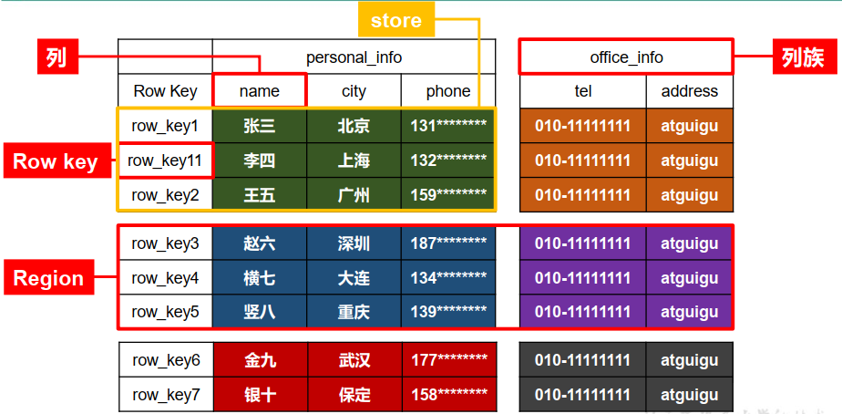

* RowKey：每一行数据都有一个唯一的RowKey，类似于MySQL的主键，但是，HBase的RowKey在建表时不需要指定，因为默认就必须要有，插入数据时必须给出，可以是任意字符串(最大长度是 64KB，实际应用中长度一般为10-100bytes)。 **数据是按照 RowKey的字典顺序存储的**，并且查询数据时只能根据 RowKey 进行检索，所以 RowKey 的设计十分重要。
* 列族：HBase的列族类似于MySQL的列，列族在建表时必须给出，列族下面可以许多列。
* 列：列族下面的列是动态的，也就是可以动态增减，像下面这样，所以说HBase表具有稀疏性，并不是所有单元格都有数据。

              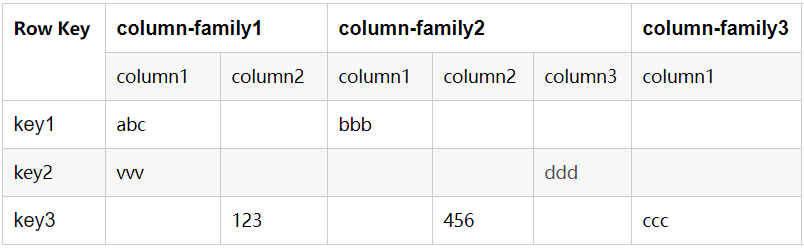

* Region：Region就是将表横向切分的一段，刚开始时只有一个Region，数据量大了之后才会切分成多个Region，每个Region由一个HRegionServer来维护。
* store：就是一个Region的一个列族的数据，是数据存储在HDFS上的最小单位，也叫StoreFile或HFile。

命名空间：类似于MySQL中的数据库，表需要建在命名空间下。HBase有两个默认存在的命名空间，hbase和default。hbase命名空间下有两张表hbase:meta和hbase:namespace，hbase:meta中存的是表的元数据信息以及表的HRegion正在被哪些HRegionServer所维护的信息，hbase:namespace中存的是所有的命名空间的信息。用户建表时不指定命名空间，表就会在default命名空间下。

以上概念在HDFS上存储时的物理结构：
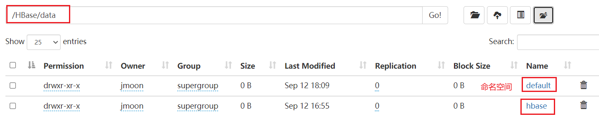
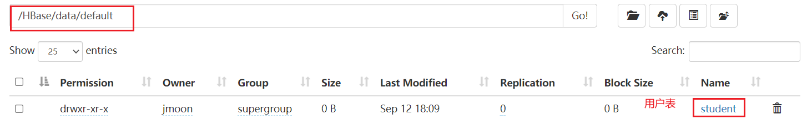
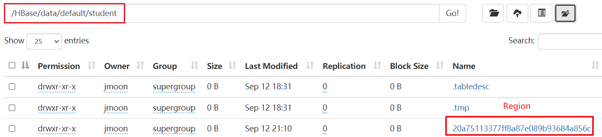
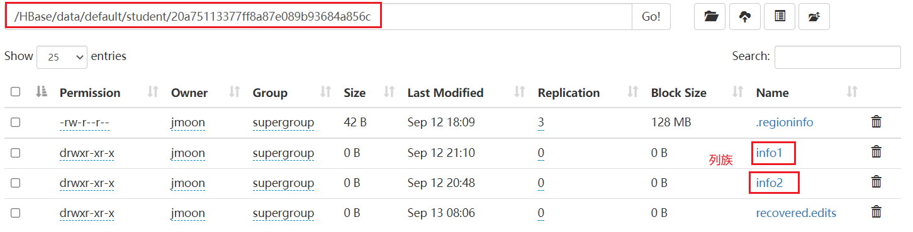
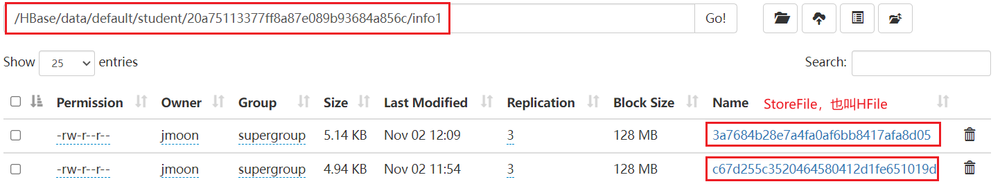

HBase的物理存储结构：
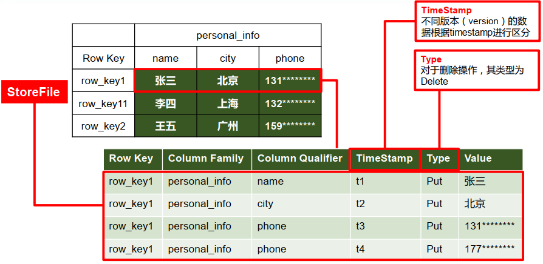

* 在表的逻辑结构中，通过 rowkey+列族+列 确定的一个单元格cell在物理存储时会保存成一行数据，这行数据包含了RowKey、列族、列限定符、时间戳、操作类型、值。
* 时间戳（timestamp）：在逻辑结构中通过 rowkey+列族+列 确定的一个单元格会保存多个版本的数据，每个版本都有自己的时间戳，时间戳最大的为数据的最新版本。时间戳的类型是 64 位整型，精确到毫秒，可以在数据写入时自动赋值，也可以由客户显式赋值。
* 逻辑结构中的单元格需要保留多少个版本的数据，可以在建表时通过指定该单元格所在列族的VERSIONS属性的值来确定，默认只保留一个版本，也可以在建表以后修改列族的VERSIONS属性的值，每个列族的VERSIONS属性的值可以不同。

每个列最新版本的数据（下面显示的结果是1 row(s)，这是因为在使用HBase时应该考虑的是数据的逻辑结构，也就是一个RowKey代表着一行数据）：
        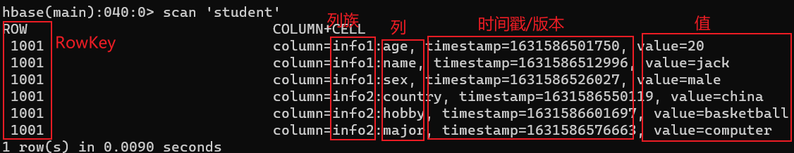
某个RowKey的某个列的所有版本数据：
        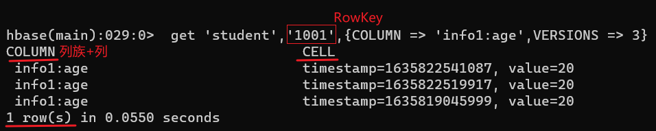

* 操作类型（Type）：插入或更新数据为put（查询时不会显示），删除数据根据删除的范围不同分为3种类型：Delete、DeleteColumn、DeleteFamily，Delete表示删除某个RowKey的某个列的最新一个版本，DeleteColumn表示删除某个RowKey的某个列的所有版本，即删除该RowKey的该列，DeleteFamily表示删除该RowKey整个列族的数据。

        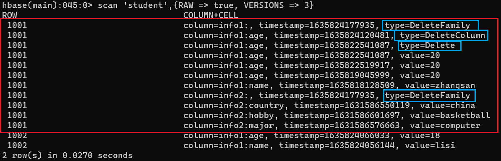

* 物理存储时的value是没有数据类型的，以字节数组的形式存储。
* 从 HBase 的底层物理存储结构来看，HBase 更像是一个对维度的K-V数据库。通过RowKey可以查出该行所有列族的数据，通过列族可以查出该行该列族下所有列的数据，通过列可以查出多个版本的value。

总结，单纯使用HBase存取数据的时候思考的是逻辑结构，也就是这几个概念：RowKey、列族、列、timestamp。由 RowKey + 列族 + 列 确定一个单元格，一个单元格有多个版本的历史数据，靠timestamp标识。

考虑HBase原理的时候思考的是物理结构，也就是这几个概念：Region、列族、store、StoreFile。由Region和列族划分出stroe，物理存储时的单位就是store，在HDFS上通过Region+列族定位到的目录下的所有文件就是store的数据，每个文件称为StoreFile或HFile，StoreFile的数量视刷写和合并情况而定。HRegionServer维护表的单位是Region。

