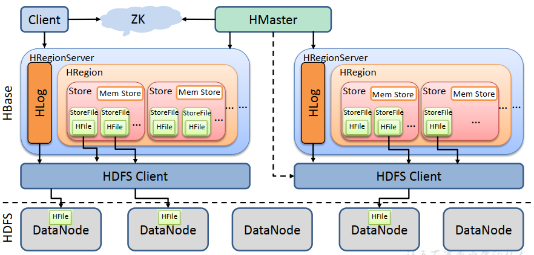
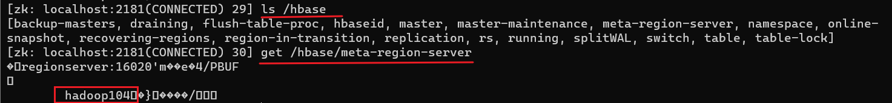
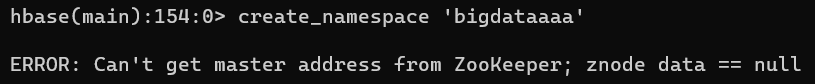
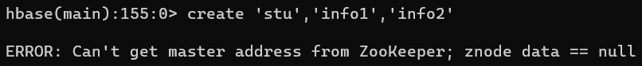
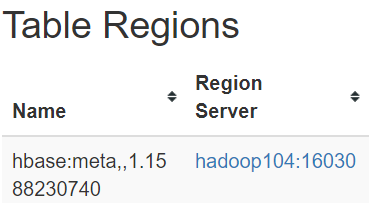
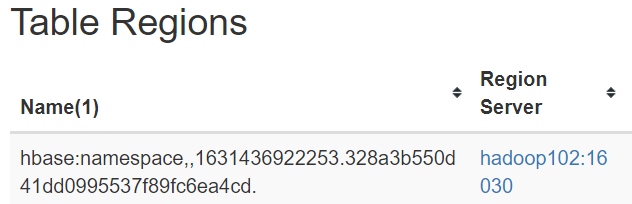
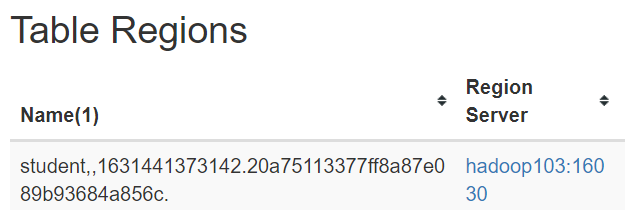

---

Created at: 2021-09-12
Last updated at: 2021-11-03

---

# 4-HBase架构

**HBase架构：**

**HMaster：**
1.处理客户端对命名空间和表的ddl操作
处理客户端的对命名空间和表的创建和删除请求。HMaster会把命名空间的元数据写到hbase:namespace表，把表的元数据写到hbase:meta表中，hbase:meta中不仅保存着表的元数据，还保存着这张表的所有HRegion正在被哪些HRegionServer所维护的信息。hbase:namespace表和hbase:meta表与用户创建的表一样，同样也需要被HRegionServer维护的，所以HMaster是作为HRegionServer的客户端将元数据信息写到系统表。
2.监控和管理着HRegionServer集群
HMaster会将所有表的HRegion分摊到每个HRegionServer中进行维护，实现HRegionServer集群的负载均衡，接着HMaster还会把表的这些HRegion正在被哪些HRegionServer所维护的信息写到hbase:meta表中，最后HMaster会把hbase:meta表正在被哪个HRegionServer所维护的信息写到zookeeper中，注意，hbase:meta表的维护任务只会交给一个HRegionServer，是因为hbase:meta表存的是表的元数据信息，所以hbase:meta表的数据量并不会达到划分HRegion的程度，也就是hbase:meta表只会有一个HRegion。
还有就是当有HRegionServer挂掉了，HMaster会把挂掉的HRegionServer所维护的HRegion的任务分给其它的存活的HRegionServer，接着HMaster会修改hbase:meta表中关于HRegion正在被哪些HRegionServer所维护的信息。

**zookeeper：**
zookeeper的数据存储服务：zookeeper保存了hbase:meta表正在被哪个HRegionServer所维护的信息，以及其它很多信息，比如master和/backup-masters所在的主机；

zookeeper的监听通知服务：master集群的高可用也依赖于zookeeper，所有HMaster会在zookeeper上创建临时节点，当主HMaster挂掉之后，其它备份Master就会收到通知，正如Kafka集群controller的选举一样，这里的备份HMaster也应该是争抢着创建同一个节点，谁创建成功就会称成为主HMaster。（HMaster收到HRegionServer的动态上下线的通知可能也是基于zookeeper的临时节点机制。）

**Client：**
HBase的客户端并不需要与HMaster连接，因为HMaster已经将Client所需要的集群的信息存到zookeeper了，所以HBase的客户端只需要与zookeeper建立连接即可，Client会从zookeeper中获取到相关的信息，然后再与具体的主机连接完成请求。
比如，如果是对命名空间和表的ddl操作，那么Client会从zookeeper中会找到HMaster的信息，然后与HMaster连接并发送请求，所以当HMaster挂掉之后对命名空间和表的ddl操作将不能进行，见下图。

如果是读写数据的请求，Client会先在zookeeper中找到hbase:meta表所在的HRegionServer，然后再与该HRegionServer连接，从 hbase:meta表中找到要查的数据所在的HRegion（通过RowKey与HRegion的Start Key和End Key一比较就知道了），以及该HRegion所在HRegionServer，最后再与这个HRegionServer连接并完成数据查询，读写数据的详细流程见7和9两篇笔记。

**HRegionServer：**
HRegionServer是维护表的Region的进程，所有的HRegionServer进程就组成了HRegionServer集群，维护的意思是指由HRegionServer处理来自客户端对该HRegion的读写请求。每一张表都是以Region为单位划分之后再交给同一个或者不同的HRegionServer进行维护的，一个HRegionServer可以维护许多来自不同表的Region，当然也可以是同一张表的不同Region。
（注：HRegion与Region指的是同一个东西，硬要做区分的话，Region是对于表的逻辑结构来说，HRegion是对于程序或者说对于HRegionServer进程来说的）
如下图所示系统表hbase:meta和hbase:namespace都只有一个Region，分别在hadoop104和hadoop102上，用户表student也只有一个Region，在hadoop103上，可以将hadoop103上的 HRegionServer进程杀死，这时在HMaster的调度下该HRegion的维护任务就会转移到hadoop104或者hadoop102上，直接将HRegionServer进程杀死并不会造成数据的丢失，HRegionServer可以根据WAL和HDFS上的HFile还原数据。

**HRegion：**
每一张表都是以Region为单位划分之后再交给同一个或者不同的HRegionServer进行维护的。一个Region里面有多个Store，Store的数量取决于Region对应的表有多少个列族，一个Store对应于HRegion中的一个MemStore，所以也一个HRegion里面有多个MemStore。

**Store：**
Store是表的逻辑结构中的概念，一个Region的一个列族就是一个Store，对应到实际存储就是，内存中的Mem Store 和 HDFS上的HFile。

**MemStore：**
表的Store的数据在内存中就是MemStore，客户端在该 Store上的写请求会先向写到HDFS上的WAL中，如果成功地将写请求日志写入WAL，那么接着会在MemStore记录下这条数据，然后向客户端返回写入成功，接着数据会在MemStore按RowKey排序，所以Mem Store里面存放的是还没有刷写到HDFS上数据。

**HLog：**
也就是HBase的WAL（Write Ahead Log，预写日志），为保证持久性，每次数据的增删改操作会先记录到HDFS上的WAL中，然后再修改Mem Store中的数据，如果这两步成功了，就直接向客户端返回成功，不必等到Mem Store中的数据刷写到HDFS上，因为将修改操作先记录到HDFS上的WAL的过程是顺序写，而且数据量小，比起每次直接将Mem Store中的数据刷写到HDFS上要快得多。更多关于WAL的内容见第6篇笔记。
WAL在HDFS的/HBase/WALs目录下，前面说用户表student的Region在hadoop103上，所以往student增删改的操作都首先会记录在/HBase/WALs目录下的hadoop103的WAL上，通过实验验证确实是这样的，hadoop103的WAL会追加一段内容，但是/HBase/data/default/student/20a75113377ff8a87e089b93684a856c/info1下的HFile并没有变化，因为HFile只在刷写Mem Store 或者 合并 或者 切分 时才会变化。

**StoreFile与HFile：**
StoreFile与HFile可以说是同一种东西，硬要区分的话，StoreFile以HFile的格式保存在HDFS上。MemStore里面记录的是所有版本的数据，刷写到HDFS上时，只会保存表列族设置的VERSIONS个版本，将MemStore刷写到HDFS上就成了HFile。因为MemStore可能会经历许多次刷写，所以图上就画了多个StoreFile和HFile，于是表的Store（一个Region的一个列族）在HDFS上会有多个HFile，不过不用担心，所有的HFile合并之后才是该表的这个Store的最终数据。因为合并并不是简单把文件拼接起来，在HBase中数据是存在多个版本的，表列族设置的VERSIONS是最多保留多少个版本，所以合并其实是会删除不要的版本的数据。

**HDFS：**
HBase是依赖于HDFS来存储表中的数据的，HDFS为HBase提供了高可靠的数据存储服务。

