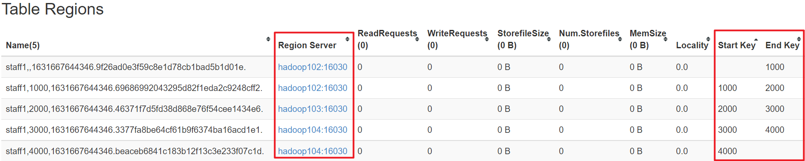
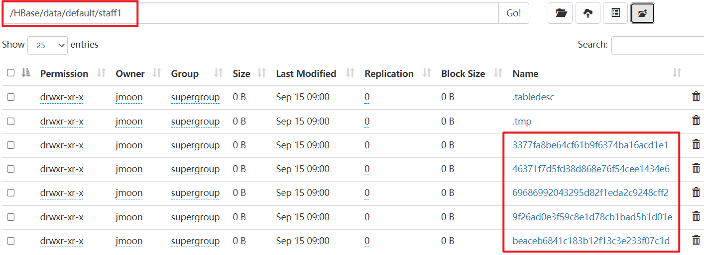
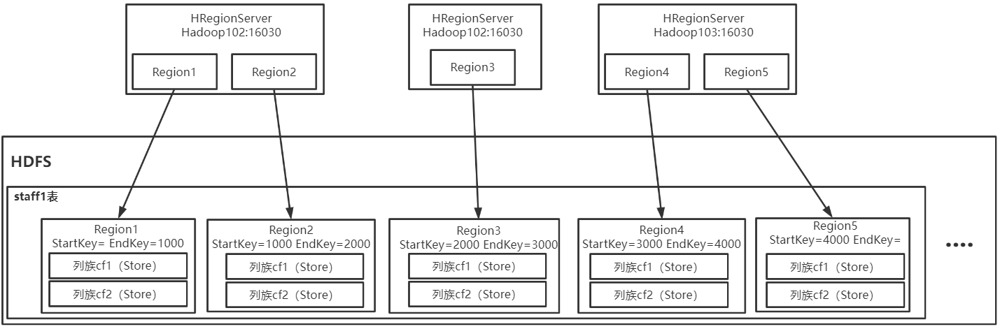
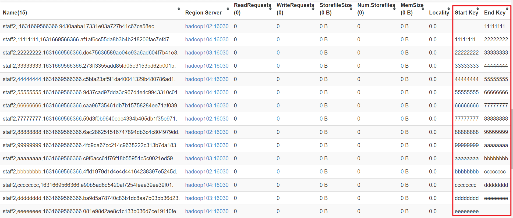
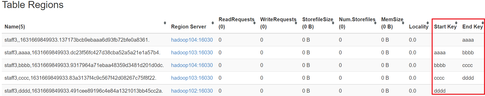
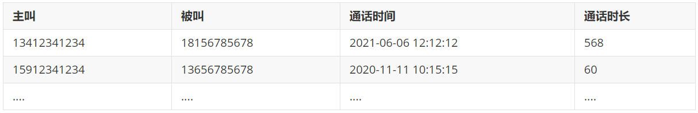

---

Created at: 2021-09-14
Last updated at: 2021-11-02


---

# 5-预分区 与 RowKey设计


**预分区**需要在创建表时指定，有三种方式：
1.直接指定，指定4个分区键就会有5个范围，于是就有5个Region
```
create 'staff1','cf1','cf2',SPLITS => ['1000','2000','3000','4000']
```
5个Region被分散在HRegionServer集群中进行维护，插入数据时RowKey会与Region的StartKey和EndKey进行比较，从而将数据会散落在不同的Region中。


Region和RegionServer的关系：


2\. 生成 16 进制序列预分区
```
create 'staff2','cf1','cf2',{NUMREGIONS => 15, SPLITALGO => 'HexStringSplit'}
```


3\. 按照文件中设置的规则预分区
创建 splits.txt 文件内容如下：
```
aaaa
bbbb
cccc
dddd
```
然后执行：
```
create 'staff3','cf1','cf2',SPLITS_FILE => 'splits.txt'
```


**RowKey设计：**
RowKey的设计要与预分区结合起来考虑，因为插入数据时的RowKey会与Region的StartKey和EndKey进行比较，比较规则是**按位比较，有比没有大**，从而数据会落在不同的Region中，所以RowKey的设计就非常重要了。RowKey的设计的目标主要关注两点，**散列性**和**集中性**。散列性是指不同类的数据尽量均匀的分散在不同的Region中；集中性是指同一类数据要放在同一个Region中，这样就可以使用 STARTROW 和 STOPROW 快速查出同一类数据了。至于同一类和不同类具体指的是什么要结合业务来分析。

案例：电信公司有如下通话数据，为了方便后续数据分析，需要将数据存到HBase，请设计RowKey


分区键的设计比较固定，假设设置300个预分区，那么分区键如下，后面加一个竖杠是因为竖杠的ascii码值大，在设计RowKey的时候会以三个数字加一个下划线\_开头，这样分区键的竖杠就可以起到一个拦截的作用，即以000\_开头的RowKey就一定会进入到第一个Region，不然当分区键是000，RowKey是0001就会进到第二个Region，因为有比没有大。
```
000|
001|
...
298|
```
考虑集中性：
根据业务场景来看，因为有的一个手机号一年的通话记录可能非常多，有的却非常少，所以如果将一个主叫号一年数据放进一个Region可能会产生数据倾斜，即有的Region数据非常多，有的非常少；如果将一个主叫号一天的数据放进一个Region又不方便后期进行统计；综上，所以选择把一个主叫号的一个月的数据放进一个Region。
考虑散列性：
因为要把一个主叫号一个月的数据放进一个Region，所以要把一个主叫号不同月的数据散列到不同的Region中。
综上两点考虑，RowKey这样设计，拿第一条数据举例，其RowKey为：xxx\_`13412341234\_202106`06121212
xxx根据hash(`13412341234\_202106`)%300得到，因为计算的是一个手机号某个月的hash值，所以同一个主叫号同一个月的数据会进到同一Region，这就是集中性；又因为取的hash值，所以同一个主叫号不同月的数据的hash值不同，进而取余就不同，所以会进到不同Region中，这就是散列性（不过散列值和取余操作只能尽量保证结果不同）。
后面取一个手机号同一个月的所以数据时，就可以用相同的算法得到前三位数字，然后拼接手机号和年月，再 STARTROW 和 STOPROW 就可以拿到该手机号这个月的数据了，比如拿13412341234的2021-06月份的数据，假设hash(13412341234\_202106)%300=000，于是；
```
scan 'call',{STARTROW => '000_13412341234_202106', STOPROW => '000_13412341234_202106|'}
```

