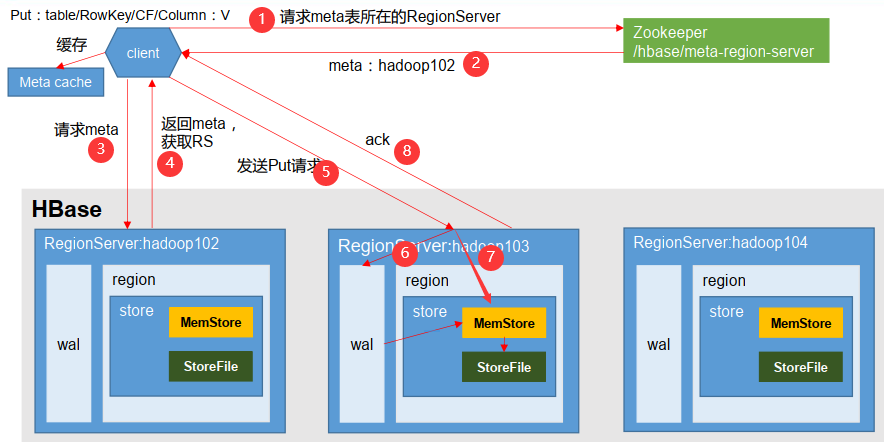

---

Created at: 2021-09-13
Last updated at: 2022-07-25


---

# 7-HBase写数据流程 以及 MemStore的刷写时机


**HBase写数据流程：**


1. Client 先访问 zookeeper，获取 hbase:meta 表位于哪个 HRegionServer，并将 meta 表的位置信息缓存在客户端的 meta cache。
2. 访问对应的 HRegionServer，获取 hbase:meta 表，根据读请求的 namespace:table/rowkey，查询出目标数据位于哪个 HRegionServer 中的哪个 HRegion 中。并将该 table 的 region 信息（meta表中的数据）缓存在客户端的 meta cache。
3. 将写请求发送到目标 HRegionServer。
4. HRegionServer 将写请求顺序写入（追加）到 WAL中。
5. HRegionServer 根据列族将数据写入对应Store的 MemStore，数据会在 MemStore 进行排序。
6. 向客户端发送 ack，此时客户端的写请求已经完成，但修改的数据没有保存到HDFS中，因为要等到 MemStore 的刷写，才会将数据写到 HFile。

MemStore的刷写：
切记，一个HRegionServer有多个HRegion，一个Region有多个Store，于是一个HRegionServer有多个MemStore。每个MemStore会经历多次刷写，每次刷写都会将MemStore中的数据只保留表列族设置的VERSIONS个版本，然后将数据写到HDFS上即HFile，最后清空MemStore。

**MemStore Flush 的时机：**

1. 当 HRegionServer 中 MemStore 的总大小达到 java\_heapsize \*  hbase.regionserver.global.memstore.size.lower.limit（低水位，默认值 0.45）时，HRegionServer将对所有 MemStore 的按由大到小的顺序依次进行刷写。如果MemStore 的总大小大于 java\_heapsize \* hbase.regionserver.global.memstore.size（高水位，默认值 0.95），那么HRegionServer将会阻塞用户的写请求并刷写，直到MemStore 的总大小降到高水位以下。
2. 当某个MemStore的大小达到了 hbase.hregion.memstore.flush.size（默认值 128M），那么其所在HRegion的所有MemStore都会刷写。
3. 距离MemStore写入的最后一条数据的时间间隔到达设置的自动刷写的时间间隔，也会触发 memstore flush。设置自动刷写的时间间隔的参数是 hbase.regionserver.optionalcacheflushinterval（默认 1 小时）。
4. 当 WAL 文件的数量超过 hbase.regionserver.max.logs， region 会按照时间顺序依次进行刷写，直到 WAL 文件数量减小到 hbase.regionserver.max.logs 以下（该属性现已不能手动设置， 默认为 32）。

还可以手动刷写，命令是flush，如刷写一张表的所有数据：
```
flush 'studennt'
```

