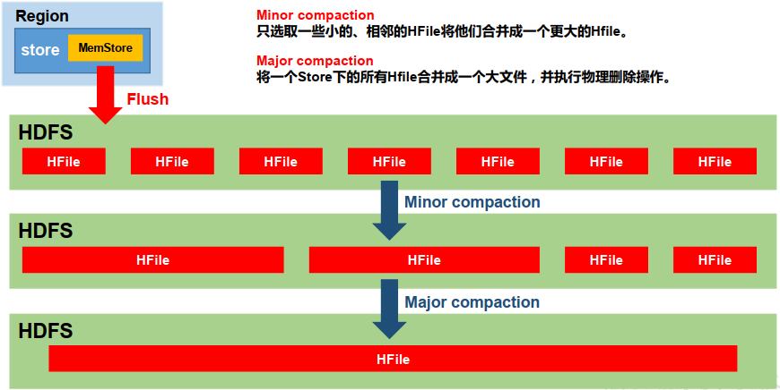

---

Created at: 2021-09-13
Last updated at: 2021-11-02


---

# 8-StoreFile Compaction 和 Region Split


**StoreFile Compaction：**
即HFile的合并， 由于memstore每次刷写都会生成一个新的HFile，于是逻辑结构一个单元格的不同版本（timestamp）和不同类型（Put/Delete）的记录有可能会分布在不同的 HFile 中，因此查询时需要遍历所有的 HFile。 为了减少 HFile 的个数，以及清理掉 过期(超过表列族设置的VERSIONS) 和 删除(type=Delete) 的数据，会进行 StoreFile Compaction。Compaction 分为两种，分别是 Minor Compaction 和 Major Compaction。Minor Compaction只是单纯地将临近的若干个较小的 HFile 合并成一个较大的 HFile，不会清理过期和删除的数据。Major Compaction 会将一个 Store 下的所有的 HFile 合并成一个大 HFile，并且会清理掉过期和删除的数据。因为HDFS不支持随机写操作，所以合并的过程一定是先把文件下载下来之后，然后合并再上传。


手动合并的命令是compact和major\_compact，如对一张表的所有HFile进行Minor Compaction合并：
```
compact 'student'
```
还可以手动地指定对一张表的某个Region进行合并，也可以指定对一张表的列族的进行合并，还可以指定对一张表的某个Region的某个列族进行合并。

自动合并的参数：
1.hbase.hregion.majorcompaction，默认为 604800000，即7天进行一次major compact。
2.hbase.hstore.compactionThreshold，默认为3，意思是Hfile超过3个就会自动合并成1个，如果是手动触发合并，那么就会使得compact变成major compact。

**总结：何时会清理掉 过期(超过表列族设置的VERSIONS) 和 删除(type=Delete) 的数据？**
1.flush的时候
2.compact的时候
测试：
先多次修改同一条数据
```
put 'stu','1001','info:name','zhangsan'
put 'stu','1001','info:name','lisi'
```
然后scan可以看到多个版本的数据
```
scan 'stu', {RAW => true, VERSIONS => 10}
```
接着flush，flush会先清理掉MemStore中 过期(超过表列族设置的VERSIONS) 和 删除(type=Delete) 的数据，然后在写到HDFS上
```
flush 'stu'
```
最后scan，只可以看到1个版本的数据，因为列族默认只保留一个版本
```
scan 'stu', {RAW => true, VERSIONS => 10}
```
接着再修改一次
```
put 'stu','1001','info:name','wangwu'
```
然后flush
```
flush 'stu'
```
再scan，会看到2个版本的数据，因为每次flush都会生成一个HFile，所以同一个数据的两个版本在不同的HFile中
```
scan 'stu', {RAW => true, VERSIONS => 10}
```
这时只有major\_compact才能清除，但是因为这时只有2个HFile，所以使用compact并不会触发HFile的合并，只有大于等于3个时，使用compact才能触发HFile的合并，并且Minor Compaction并不会删除数据，所以这里应该使用major\_compact
```
major_compact 'stu'
```
再scan，只能看到1个版本的数据，稍等两分钟后，HDFS上的HFile也就只有一个了。
同样，如果是type=Delete的删除数据，flush之后会 删除数据 会保存在HFile中，但在major\_compact之后就没有这条 删除数据 的记录了

**Region Split：**
默认情况下，每个 Table 起初只有一个 Region，随着数据的不断写入，Region 会自动进行拆分。刚拆分时，两个子 HRegion 都位于当前的HRegionServer，但处于负载均衡的考虑，HMaster 有可能会将某个 HRegion 转移给其他的 HRegionServer。
Region Split 时机：默认所有表的某一个Region超过10G（ hbase.hregion.max.filesize）就会切分。

