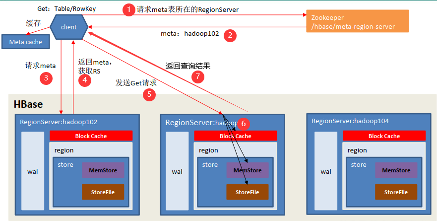

---

Created at: 2021-09-13
Last updated at: 2021-11-02

---

# 9-HBase读数据流程

**HBase读数据流程：**

1. Client 先访问 zookeeper，获取 hbase:meta 表位于哪个 HRegionServer，并将 meta 表的位置信息缓存在客户端的 meta cache。
2. 访问对应的 HRegionServer，获取 hbase:meta 表，根据读请求的 namespace:table/rowkey，查询出目标数据位于哪个 HRegionServer 中的哪个 HRegion 中。并将该 table 的 region 信息（meta表中的数据）缓存在客户端的 meta cache。
3. 将读数据请求发送到目标 HRegionServer。
4. HRegionServer 先从 MemStore 找数据，如果没有，再到 BlockCache 里面读，BlockCache 还没有，再到 StoreFile 上读。如果是从 StoreFile 里面读取的数据，则将查询到的数据缓存到 Block Cache（Block，HFile 的存储单元，默认大小为 64KB）。
5. 将查询到的数据返回给客户端。

