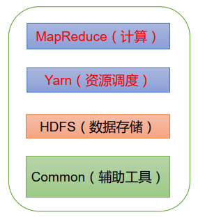

---

Created at: 2021-08-25
Last updated at: 2021-08-30
Source URL: https://www.zhihu.com/question/19730582/answer/2092785608

---

# 1-Hadoop的理解

Hadoop2.x 和 Hadoop3.x 的组成：

HDFS ( Hadoop Distributed File System ) 是分布式文件系统，负责组织管理文件
YARN ( Yet Another Resource Negotiator ) 是 Hadoop 的资源协调者，负责调度MapReduce程序的运行，达到合理地管理系统计算资源的目的。

HDFS和YARN都是以进程的形式存在来管理文件和系统资源，就像Redis和消息中间件一样，我们需要以客户端的形式与这种软件进行交互，而MapReduce和Common都是jar包，是程序所依赖的，它们是静态的，需要与用户程序结合在一起组成完整的程序才能以进程的形式运行起来。

框架与中间件的区别或许就是：框架不是可直接运行的程序，它是以程序依赖的形式的存在，需要与业务代码结合才能形成完整可运行的程序，框架解决的重复编码的问题，或者说是对问题解决方法的公共部分的抽取。而中间件是可以直接运行的程序，需要用客户端与之交互。总结为一句话就是， 框架是一个半成品软件，而中间件是一个成品软件，所以框架的使用方式是导jar包，中间件的使用方式是启动软件，然后与它交互，使用它提供的服务。

