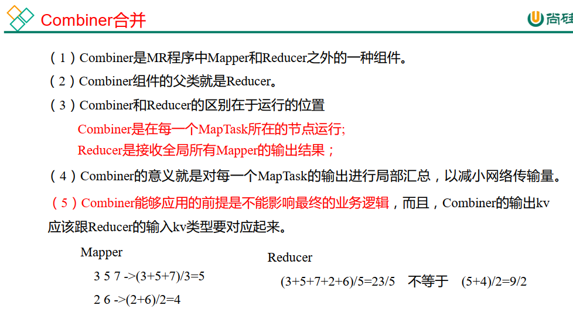

---

Created at: 2021-08-27
Last updated at: 2021-10-20

---

# 10-MapReduce之Combiner合并

Combiner本质上其实就是在MapTask主机上运行的一个Reduce任务，目的是对MapTask任务的输出进行局部汇总，减少网络传输。（Combiner运行在Shuffle阶段，运行的时机是在每次排序生成文件时，包括溢写时的排序和归并为一个文件时排序）
引用Combiner的前提是不能影响最终的业务逻辑，比如求平均值，先在Combiner上平均一次，然后再在Reducer上平均一次，与只在Reducer上进行一次平均，两种情况的结果是不同的。再比如如果是求和的业务，那么Combiner就没有影响。

自定义 Combiner 的步骤：

1. 自定义一个 Combiner 继承 Reducer，重写 Reduce 方法

2. 在驱动类中设置： job.setCombinerClass(WordCountCombiner.class);

通常来说Combiner的业务逻辑其实和Reducer的业务逻辑一致，所以一般直接 job.setCombinerClass(WordCountReducer.class);

需要注意的是，如果设置设置ReduceTask的数量为0，即job.setNumReduceTasks(0); 那么将只会有Map阶段，没有Reduce阶段，Shuffle阶段也会跟着就没有了，Shuffle阶段没有了那么 Combiner 也就不会有了。

