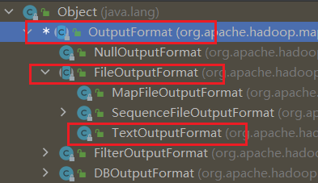
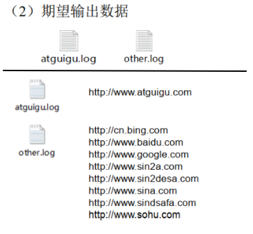
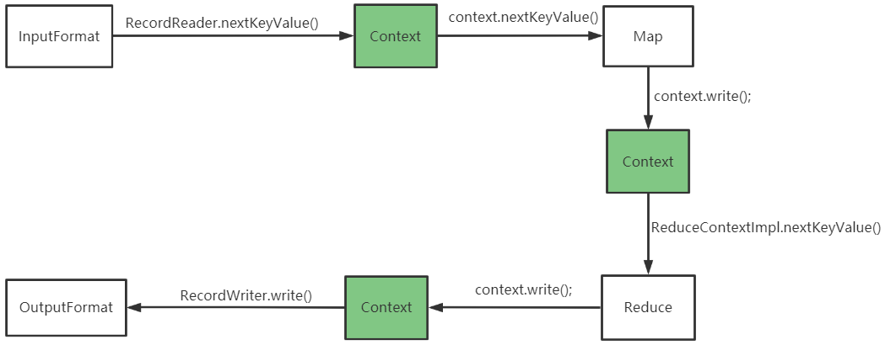

---

Created at: 2021-08-27
Last updated at: 2021-08-28
Source URL: about:blank


---

# 11-MapReduce之OutputFormat


OutputFormat是MapReduce输出的基类，其有众多子类，默认使用的是TextOutputFormat，用 \\t 作为分隔符按行将key-value写到文件中。


我们也可以自定义OutputFormat以满足我们输出的需求，比如输出数据到MySQL、HBase、Elasticsearch中。
自定义OutputFormat步骤：

1. 自定义类继承FileOutputFormat，重写getRecordWriter()方法
2. 自定义类继承RecordWriter，重写write()方法和close()方法
3. Driver需要设置自定义的Outputformat类，和\_SUCCESS文件的输出目录

案例： 过滤输入的 log 日志，包含 atguigu 的网站输出到atguigu.log，不包含 atguigu 的网站输出到other.log。


Map不做任何处理，直接将输入的value作为key输出，输出的value直接使用NullWritable
```
public class LogMapper extends Mapper<LongWritable, Text, Text, NullWritable> {
    @Override
    protected void map(LongWritable key, Text value, Context context) throws IOException, InterruptedException {
        // 不做任何处理
        context.write(value, NullWritable.get());
    }
}
```

Reduce也不做任何处理，直接将输入作为输出，不过要注意一点，具有相同key的记录会作为一组进入reduce()方法，所以需要用while循环写出
```
public class LogReducer extends Reducer<Text, NullWritable, Text, NullWritable> {
    @Override
    protected void reduce(Text key, Iterable<NullWritable> values, Context context) throws IOException, InterruptedException {
        // 防止有相同数据，丢数据
        for (NullWritable value : values) {
            context.write(key, NullWritable.get());
        }
    }
}
```

自定义类继承FileOutputFormat，重写getRecordWriter()方法
```
public class LogOutputFormat extends FileOutputFormat<`Text, NullWritable`> {
    @Override
    public RecordWriter<Text, NullWritable> getRecordWriter(TaskAttemptContext job) throws IOException, InterruptedException {
        return new LogRecordWriter(job);
    }
}
```

自定义类继承RecordWriter，重写write()方法和close()方法
```
public class LogRecordWriter extends RecordWriter<Text, NullWritable> {
    private FSDataOutputStream atguiguOut;
    private FSDataOutputStream otherOut;

    public LogRecordWriter(TaskAttemptContext job) {
        try {
            FileSystem fs = FileSystem.get(job.getConfiguration());
            atguiguOut = fs.create(new Path("D:\\hadoop\\atguigu.log"));
            otherOut = fs.create(new Path("D:\\hadoop\\other.log"));
        } catch (IOException e) {
            e.printStackTrace();
        }
    }

    @Override
    public void write(Text key, NullWritable value) throws IOException, InterruptedException {
        String log = key.toString();
        // 具体写
        if (log.contains("atguigu")) {
            atguiguOut.writeBytes(log + "\n");
        } else {
            otherOut.writeBytes(log + "\n");
        }
    }

    @Override
    public void close(TaskAttemptContext context) throws IOException, InterruptedException {
        // 关流
        IOUtils.closeStream(atguiguOut);
        IOUtils.closeStream(otherOut);
    }
}
```

Driver需要设置自定义的Outputformat类，和\_SUCCESS文件的输出目录
```
public class LogDriver {
    public static void main(String[] args) throws IOException, ClassNotFoundException, InterruptedException {
        Configuration conf = new Configuration();
        Job job = Job.getInstance(conf);
        job.setJarByClass(LogDriver.class);
        job.setMapperClass(LogMapper.class);
        job.setReducerClass(LogReducer.class);
        job.setMapOutputKeyClass(Text.class);
        job.setMapOutputValueClass(NullWritable.class);
        job.setOutputKeyClass(Text.class);
        job.setOutputValueClass(NullWritable.class);

  `//设置自定义的outputformat`
 `job.setOutputFormatClass(LogOutputFormat.class);`

        FileInputFormat.setInputPaths(job, new Path("D:\\input\\inputoutputformat"));
 `//而 FileOutputFormat 要输出一个 _SUCCESS 文件，此处定义的是 _SUCCESS 的输出目录`
 `FileOutputFormat.setOutputPath(job, new Path("D:\\hadoop\\output1111"));`

        boolean b = job.waitForCompletion(true);
        System.exit(b ? 0 : 1);
    }
}
```

综合 InputFormat、 Map、Reduce、 OutputFormat 以及 Context 的工作流程，大致是这样的：


由Context上下文串联起整个流程。
InputFormat和OutputFormat当然不是只在最开读文件和最末尾写文件的用到，它俩在MapReduce整个流程中只要是涉及读写地方都有用到，比如Shuffle阶段从缓冲区向文件中写，合并文件时需要先将文件读到内存中。

