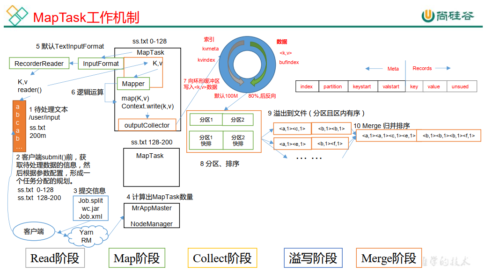
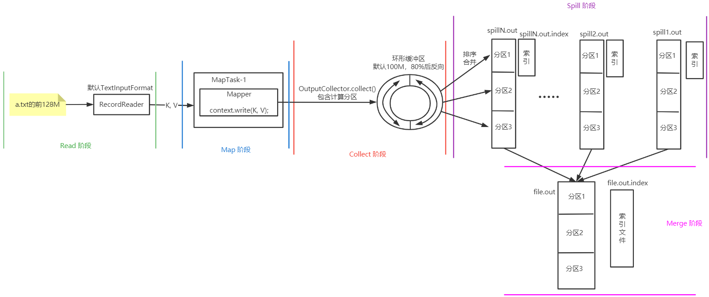

---

Created at: 2021-08-27
Last updated at: 2022-07-21

---

# 12-MapReduce 源码之 MapTask 工作机制

（1）Read阶段：MapTask通过InputFormat获得的RecordReader，从输入InputSplit中解析出一个个key/value。
（2）Map阶段：该节点主要是将解析出的key/value交给用户编写map()函数处理，并产生一系列新的key/value。
（3）Collect收集阶段：在用户编写map()函数中，当数据处理完成后，一般会调用OutputCollector.collect()输出结果。在该函数内部，它会将生成的key/value分区（调用Partitioner），并写入一个环形内存缓冲区中。
（4）Spill阶段：即“溢写”，当环形缓冲区满后（当输入数据量本身就比较小，Collect阶段结束后环形缓冲区没满也会溢写），MapReduce会将数据写到本地磁盘上，生成一个临时文件。需要注意的是，将数据写入本地磁盘之前，先要对数据进行一次本地排序，如果有设置合并操作，还会对数据进行合并。
    溢写阶段详情：
    步骤1：利用**快速排序**算法对缓存区内的数据进行排序，排序方式是，先按照分区编号Partition进行排序，然后按照key进行排序。这样，经过排序后，数据以分区为单位聚集在一起，且同一分区内所有数据按照key有序。
    步骤2：按照分区编号由小到大依次将每个分区中的数据写入任务工作目录下的临时文件output/spillN.out（N表示当前溢写次数）中。如果用户设置了Combiner，则写入文件之前，对每个分区中的数据进行一次聚集操作。
    步骤3：将分区数据的元信息写到内存索引数据结构SpillRecord中，其中每个分区的元信息包括在临时文件中的偏移量、压缩前数据大小和压缩后数据大小。如果当前内存索引大小超过1MB，则将内存索引写到文件output/spillN.out.index中。
（5）Merge阶段：当所有数据处理完成后，MapTask对所有临时文件进行一次归并排序和合并，以确保最终只会生成一个数据文件。
当所有数据处理完后，MapTask会将所有临时文件合并成一个大文件，并保存到文件output/file.out中，同时生成相应的索引文件output/file.out.index。
在进行文件合并过程中，MapTask以分区为单位进行合并。对于某个分区，它将采用多轮递归合并的方式。每轮合并mapreduce.task.io.sort.factor（默认10）个文件，并将产生的文件重新加入待合并列表中，对文件排序后，重复以上过程，直到最终得到一个大文件。
让每个MapTask最终只生成一个数据文件，可避免同时打开大量文件和同时读取大量小文件产生的随机读取带来的开销，并且在map端对同一分区数据排序后，可以减少reduce端排序的工作量。

