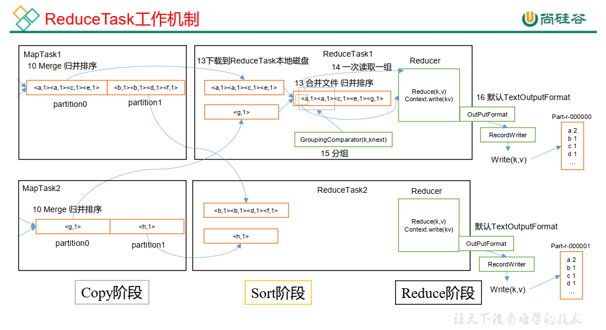
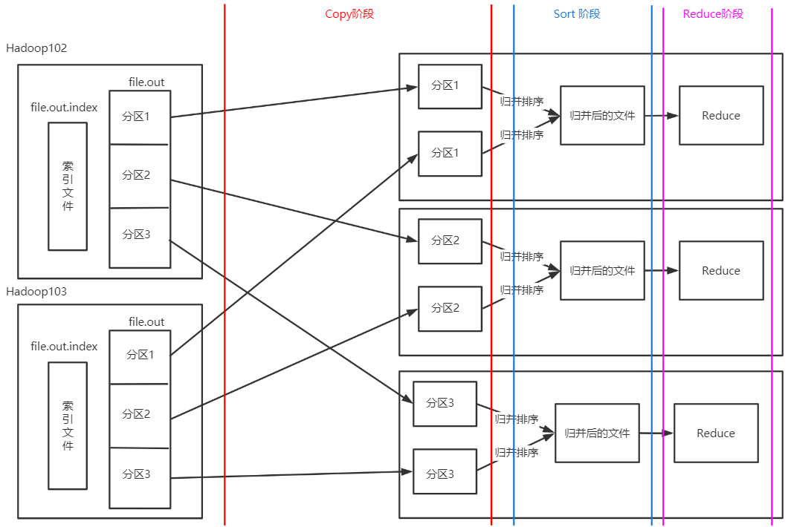

---

Created at: 2021-08-27
Last updated at: 2025-03-01

---

# 13-MapReduce 源码之 ReduceTask 工作机制

（1） Copy阶段：ReduceTask从各个MapTask上远程拷贝属于同一个分区的数据，如果其大小超过一定阈值，则写到磁盘上，否则直接放到内存中。
（2）Sort阶段：在远程拷贝数据的同时，ReduceTask启动了两个后台线程对内存和磁盘上的文件进行合并，以防止内存使用过多或磁盘上文件过多。由于各个MapTask已经实现对自己的处理结果进行了局部排序，因此，ReduceTask只需对所有数据进行一次归并排序即可。
（3）Reduce阶段：reduce()函数将计算结果写到HDFS上。

