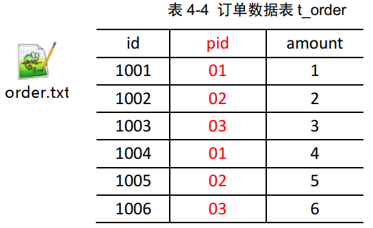
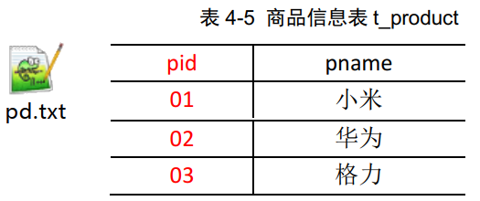
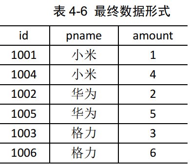
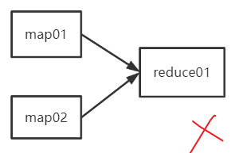
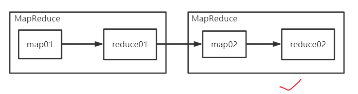

---

Created at: 2021-08-28
Last updated at: 2021-11-03
Source URL: about:blank


---

# 14-MapReduce 之 Reduce Join


案例：实现SQL中的join效果
输入数据：

输出数据：


分析：输入文件两个，具有不同的格式，那是不是需要写两个map方法来处理呢，处理完成之后再把结果都发送到同一个reduce方法处理？显然这是行不通的，因为一个MapReduce只能有一个map方法和一个reduce方法，然后根据这个map方法和reduce方法在不同的主机上创建MapTask和ReduceTask，这些MapTask是都是根据同一个map方法创建的，只是分布在不同的机器上执行，读取的数据不同而已，ReduceTask也是一样，只接受与它配套的那一个map的输出（当然ReduceTask的输入是经过Shuffle阶段的分区、排序、合并等操作处理的）。总结一点就是，不能有两个map方法一个reduce方法，这点从Driver类job.setMapperClass()和job.setReducerClass()也可以看出，但是可以将MapReduce流程串联起来工作，比如前面对手机号总流量的排序的需求就是两个MapReduce，前一个Reduce的输出作为后一个Map的输入。


但是将两个MapReduce串联起来的解决方案并不能解决本例的问题，所以还是得只用一个MapReduce，具体解决方案是：将两种不同的格式的数据封装到一个bean类，然后map的输出以pid作为key，bean对象作为value，这样到reduce方法时，处理的数据就是具有相同pid的bean对象。既然是在同一个map方法中处理，那如何区分两种不同格式的数据呢？方法一是将一行数据分割后判断字符串的个数，这要求两表列的数目不一致，本例就是不一致，所以可以使用这个方法；方法二是使用TextInputFormat，因为TextInputFormat的分片是对单个文件进行的，又每个分片都会启动一个MapTask来处理，所以一个MapTask的输入（也就是同一个分片的内容）一定是来自同一个文件的，这样在只需要在Mapper的setUp()方法里向判断一下分片是来自哪一个文件，然后在map()方法里做执行对应的封装逻辑即可，不像CombineFileInputFormat会把多个文件看作是一个整体进行分片，这样一个MapTask的输入（也就是同一个分片的内容）就可能是来自不同文件，判断分片是来自哪一个文件的方法就不奏效了。所以方法一不管使用TextInputFormat，还是使用CombineFileInputFormat都行。

方法二的代码如下：
自定义bean类实现Writable接口，两种格式的数据都封装在这个bean类中
```
public class TableBean implements Writable {

    private String id; // 订单id
    private String pid; // 商品id
    private int amount; // 商品数量
    private String pname;// 商品名称
    private String flag; // 标记是什么表 order pd

    // 空参构造
    public TableBean() {
    }
    public String getId() {
        return id;
    }
    public void setId(String id) {
        this.id = id;
    }
    public String getPid() {
        return pid;
    }
    public void setPid(String pid) {
        this.pid = pid;
    }
    public int getAmount() {
        return amount;
    }
    public void setAmount(int amount) {
        this.amount = amount;
    }
    public String getPname() {
        return pname;
    }
    public void setPname(String pname) {
        this.pname = pname;
    }
    public String getFlag() {
        return flag;
    }
    public void setFlag(String flag) {
        this.flag = flag;
    }

    @Override
    public void write(DataOutput out) throws IOException {
        out.writeUTF(id);
        out.writeUTF(pid);
        out.writeInt(amount);
        out.writeUTF(pname);
        out.writeUTF(flag);
    }

    @Override
    public void readFields(DataInput in) throws IOException {
        this.id = in.readUTF();
        this.pid = in.readUTF();
        this.amount = in.readInt();
        this.pname = in.readUTF();
        this.flag = in.readUTF();
    }

    @Override
    public String toString() {
        return  id + "\t" +  pname + "\t" + amount ;
    }
}
```

setup()方法不在run()方法的while循环中只会执行一次，并且在map方法之前执行，所以判断输入切片来自哪一个文件可以在这个方法中进行，然后在map()方法中根据数据来自的文件的不同做不同的封装。
```
public class TableMapper extends Mapper<LongWritable, Text, Text, TableBean> {
    private String fileName;
    private Text outK  = new Text();
    private TableBean outV = new TableBean();

    @Override
    protected void setup(Context context) throws IOException, InterruptedException {
        // 初始化  order  pd
        FileSplit split = (FileSplit) context.getInputSplit();
        fileName = split.getPath().getName();
    }

    @Override
    protected void map(LongWritable key, Text value, Context context) throws IOException, InterruptedException {
        // 1 获取一行
        String line = value.toString();
        String[] split = line.split("\t");
        // 2 判断是哪个文件的
        if (fileName.contains("order")){// 处理的是订单表
            // 封装k
            outK.set(split[1]);
            // 封装v
            outV.setId(split[0]);
            outV.setPid(split[1]);
            outV.setAmount(Integer.parseInt(split[2]));
            outV.setPname("");
            outV.setFlag("order");
        }else {// 处理的是商品表
            // 封装k
            outK.set(split[0]);
            // 封装v
            outV.setId("");
            outV.setPid(split[0]);
            outV.setAmount(0);
            outV.setPname(split[1]);
            outV.setFlag("product");
        }
        // 写出
        context.write(outK, outV);
    }
}
```

每次进入到reduce方法时所接收到数据是具有相同pid的<pid，bean对象>的集合，显然bean对象中只有一条来自产品表，其它多个来自订单表。
```
public class TableReducer extends Reducer<Text, TableBean, TableBean, NullWritable> {

    @Override
    protected void reduce(Text key, Iterable<TableBean> values, Context context) throws IOException, InterruptedException {
        // 准备初始化集合
        ArrayList<TableBean> orderBeans = new ArrayList<>();
        TableBean pdBean = new TableBean();
        // 循环遍历
        for (TableBean value : values) {
            if ("order".equals(value.getFlag())) {// 订单表
                TableBean tmp = new TableBean();
                try {
                    BeanUtils.copyProperties(tmp, value);
                } catch (Exception e) {
                    e.printStackTrace();
                }
                orderBeans.add(tmp);
            } else {// 商品表
                try {
                    BeanUtils.copyProperties(pdBean, value);
                } catch (Exception e) {
                    e.printStackTrace();
                }
            }
        }
        // 循环遍历orderBeans，赋值 pdname
        for (TableBean orderBean : orderBeans) {
            orderBean.setPname(pdBean.getPname());
            context.write(orderBean, NullWritable.get());
        }
    }
}
```

Driver类注意一点，输入路径是一个目录，里面包含order.txt和product.txt
```
public class TableDriver {
    public static void main(String[] args) throws IOException, ClassNotFoundException, InterruptedException {
        Job job = Job.getInstance(new Configuration());
        job.setJarByClass(TableDriver.class);
        job.setMapperClass(TableMapper.class);
        job.setReducerClass(TableReducer.class);
        job.setMapOutputKeyClass(Text.class);
        job.setMapOutputValueClass(TableBean.class);
        job.setOutputKeyClass(TableBean.class);
        job.setOutputValueClass(NullWritable.class);
        String classPath = Thread.currentThread().getContextClassLoader().getResource("").getPath();
        FileInputFormat.setInputPaths(job, new Path(classPath + "/input/join"));
        FileOutputFormat.setOutputPath(job, new Path(classPath + "/output222"));
        boolean b = job.waitForCompletion(true);
        System.exit(b ? 0 : 1);
    }
}
```

优化方法：Hash join，即对连接字段使用hash分区，这样具有相同pid的数据就会进到同一个Reduce中，从而不会影响连接结果的正确性，此方法可以避免只使用一个Reduce造成的数据倾斜问题，同时也加快了运算速度。

