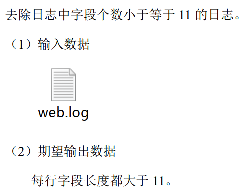

---

Created at: 2021-08-28
Last updated at: 2021-08-28


---

# 16-MapReduce 之 ETL


ETL，是英文 Extract-Transform-Load 的缩写，用来描述将数据从来源端经过抽取（Extract）、转换（Transform）、加载（Load）至目的端的过程，目的是进行数据清洗。 ETL 一词较常用在数据仓库，但其对象并不限于数据仓库。使用 MapReduce 进行数据清理往往只需要运行 Mapper 程序，不需要运行 Reduce 程序。

案例：


Map
```
public class LogMapper extends Mapper<LongWritable, Text, Text, NullWritable> {
    @Override
    protected void map(LongWritable key, Text value, Context context) throws IOException, InterruptedException {
        // 1 获取一行
        String line = value.toString();
        // 2 ETL
        String[] fields = line.split(" ");
        if (fields.length > 11){
            context.write(value, NullWritable.get());
        }
    }
}
```

Driver
```
public class LogDriver {
    public static void main(String[] args) throws Exception {
        // 输入输出路径需要根据自己电脑上实际的输入输出路径设置
        args = new String[]{"D:/input/inputlog", "D:/hadoop/output11111"};
        // 1 获取job信息
        Configuration conf = new Configuration();
        Job job = Job.getInstance(conf);
        // 2 加载jar包
        job.setJarByClass(LogDriver.class);
        // 3 关联map
        job.setMapperClass(WebLogMapper.class);
        // 4 设置最终输出类型
        job.setOutputKeyClass(Text.class);
        job.setOutputValueClass(NullWritable.class);
        // 设置reducetask个数为0
        job.setNumReduceTasks(0);
        // 5 设置输入和输出路径
        FileInputFormat.setInputPaths(job, new Path(args[0]));
        FileOutputFormat.setOutputPath(job, new Path(args[1]));
        // 6 提交
        boolean b = job.waitForCompletion(true);
        System.exit(b ? 0 : 1);
    }
}
```

