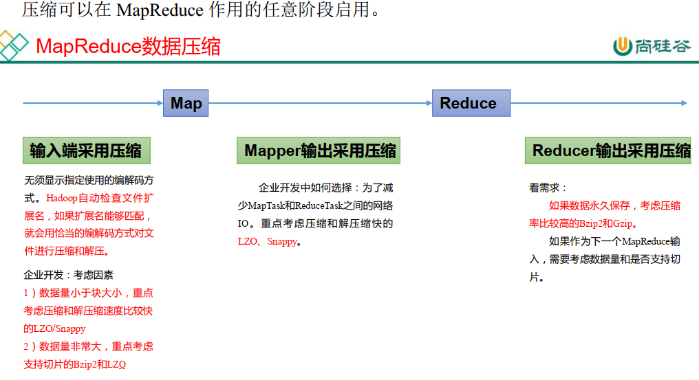

---

Created at: 2021-08-28
Last updated at: 2021-10-21

---

# 17-压缩

压缩方式选择时重点考虑： 压缩/解压缩速度、压缩率（压缩后存储大小）、压缩后是否可以支持切片。

MR 支持的压缩编码

|     |     |     |     |
| --- | --- | --- | --- |
| 压缩格式 | 算法  | 文件扩展名 | 是否可切分 |
| DEFLATE | DEFLATE | .deflate | 否   |
| Gzip | DEFLATE | .gz | 否   |
| bzip2 | bzip2 | .bz2 | 是   |
| LZO | LZO | .lzo | 是   |
| Snappy | Snappy | .snappy | 否   |

压缩格式对应的编码/解码器

|     |     |
| --- | --- |
| 压缩格式 | 对应的编码/解码器 |
| DEFLATE | org.apache.hadoop.io.compress.DefaultCodec |
| gzip | org.apache.hadoop.io.compress.GzipCodec |
| bzip2 | org.apache.hadoop.io.compress.BZip2Codec |
| LZO | com.hadoop.compression.lzo.LzopCodec |
| Snappy | org.apache.hadoop.io.compress.SnappyCodec |

压缩性能的比较：

|     |     |     |     |     |
| --- | --- | --- | --- | --- |
| 压缩算法 | 原始文件大小 | 压缩文件大小 | 压缩速度 | 解压速度 |
| gzip | 8.3GB | 1.8GB | 17.5MB/s | 58MB/s |
| bzip2 | 8.3GB | 1.1GB | 2.4MB/s | 9.5MB/s |
| LZO | 8.3GB | 2.9GB | 49.3MB/s | 74.6MB/s |

要在 Hadoop 中启用压缩，可以配置如下参数（mapred-site.xml 文件中）：

|     |     |     |     |
| --- | --- | --- | --- |
| 参数  | 默认值 | 阶段  | 含义  |
| io.compression.codecs （在 core-site.xml 中配置） | org.apache.hadoop.io.compress.DefaultCodec, org.apache.hadoop.io.compress.GzipCodec, org.apache.hadoop.io.compress.BZip2Codec, org.apache.hadoop.io.compress.Lz4Codec | 输入压缩 | Hadoop 使用文件扩展名判断是否支持某种 编解码器 |
| mapreduce.map.output.compress | false | mapper 输出 | 这个参数设为 true 启 用压缩 |
| mapreduce.map.output.compress.codec | org.apache.hadoop.io.compress.DefaultCodec | mapper 输出 | 使用 LZO、LZ4 或 snappy 编解码器在此 阶段压缩数据 |
| mapreduce.output.fileoutputformat.compress | false | reducer 输出 | 这个参数设为 true 启 用压缩 |
| mapreduce.output.fileoutputformat.compress.codec | org.apache.hadoop.io.compress. DefaultCodec | reducer 输出 | 使用标准工具或者编 解码器，如 gzip 和 bzip2 |
| mapreduce.output.fileoutputformat.compress.type | RECORD | reducer 输出 | SequenceFile 输出使用的压缩类型：NONE  和 BLOCK |

