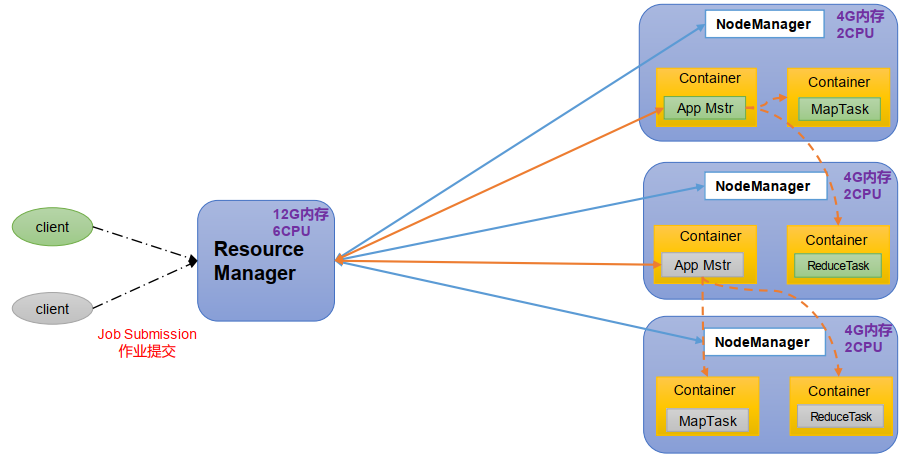
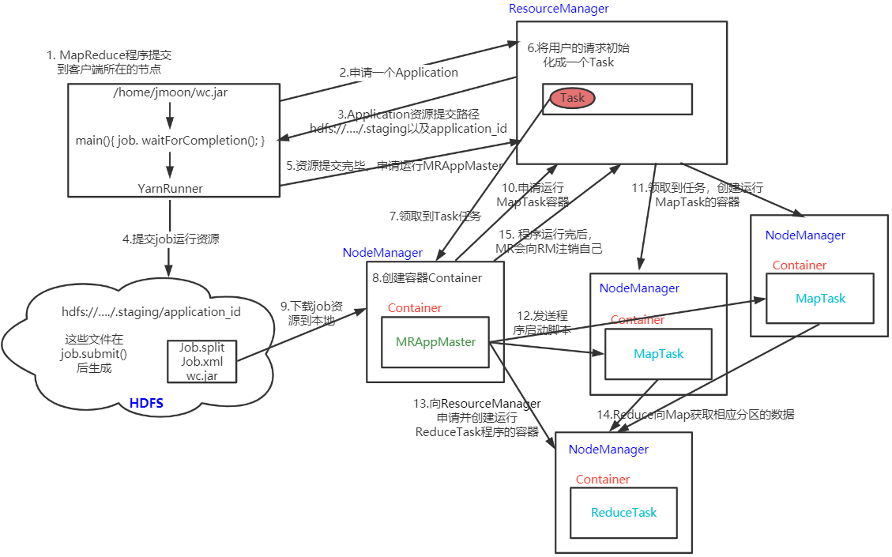

---

Created at: 2021-08-28
Last updated at: 2022-07-21

---

# 18-Yarn

Yarn是一个资源调度平台，负责为MapReduce程序分配系统资源。 YARN 主要由 ResourceManager、 NodeManager、 ApplicationMaster和 Container 等组件构成。
ResourceManager（RM）主要作用如下：
（1）处理客户端请求
（2）监控NodeManager
（3）启动或监控ApplicationMaster
（4）资源的分配与调度
NodeManager（NM）主要作用如下：
（1）管理单个节点上的资源
（2）处理来自ResourceManager的命令
（3）处理来自ApplicationMaster的命令
ApplicationMaster（ AM）作用如下：
（1）为MapTask和ReduceTask申请资源
（2）任务的监控与容错
Container是 YARN中的资源抽象， 它封装了某个节点上的多维度资源， 如内存、 CPU、 磁盘、网络等。
这四个组件所处的位置和大致关系如下图所示：

Yarn的具体工作流程如下：

1\. MR程序提交到客户端所在的节点。
2\. YarnRunner向ResourceManager申请一个Application。
3\. ResourceManager将该应用程序的资源路径返回给YarnRunner。
4\. 该程序将运行的资源提交到HDFS上。
5\. 程序资源提交完毕后，申请运行MRAppMaster。
6\. ResourceManager将用户的请求初始化成一个Task，并将Task加入到调度队列中。
（ResourceManager中的任务Task应该只是一个用来排队被调度的数据结构，里面存储的是这个任务的信息，比如任务的application\_id以及Job.split、Job.xml和wc.jar这三个文件的位置，并不是真正要被运行的MR程序，在后面几步中，NodeManager领取到任务之后，会根据这些信息去HDFS上下载运行任务所需要的资源）
7\. 其中一个NodeManager领取到Task任务。
8\. 该NodeManager创建容器Container，并产生MRAppMaster。
9\. Container从HDFS上拷贝资源到本地。
10\. MRAppMaster向ResourceManager申请运行MapTask资源。
（Map任务同样应该会被ResourceManager初始化成一个Task，一个用来排队被调度的数据结构，里面存储的是这个任务的信息）
11\. ResourceManager将Map任务初始化成一个Task，然后另外两个NodeManager分别领取任务并创建容器。
12\. MRAppMaster向两个接收到任务的NodeManager发送程序启动脚本，这两个NodeManager分别启动MapTask，MapTask对数据分区排序。
（这个程序启动脚本应该就是真正的Map程序，是MRAppMaster根据Job.split、Job.xml和wc.jar生成的）
13\. MRAppMaster等待所有MapTask运行完毕后，向ResourceManager申请容器，运行ReduceTask。
（13和14步之间应该还有一些步骤，就是ResourceManager将Reduce任务初始化成一个Task等待NodeManager来领取任务，NodeManager领取到任务之后创建Container，MRAppMaster向接收到ReduceTask的NodeManager发送程序启动脚本，于是ReduceTask就运行起来了）
14\. ReduceTask向MapTask获取相应分区的数据。
15\. 程序运行完毕后，MRAppMaster会向ResourceManager申请注销自己。

从上面流程可以看到Yarn的调度队列中有三种任务，第一种是运行MRAppMaster的任务，第二种是MapTask任务，第三种是ReduceTask任务。每一种任务都会被放到Yarn的调度队列中，有NodeManager领取任务然后启动Container运行任务。这三种任务的运行是有先后顺序的，最先运行MRAppMaster，然后由 MRAppMaster控制着MapTask和ReduceTask的产生。

