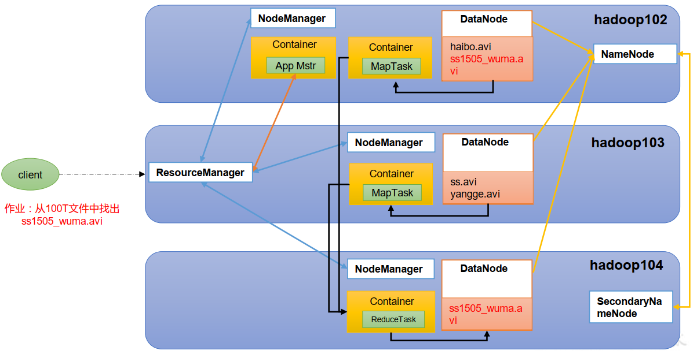

---

Created at: 2021-08-28
Last updated at: 2021-08-28

---

# 19-HDFS、 YARN、 MapReduce三者关系 以及 MapReduce提交并执行的整个流程

HDFS、 YARN、 MapReduce三者关系

作业提交并执行的全过程：
（1）作业提交
第1步：调用job.waitForCompletion方法，与Yarn建立连接。
第2步：通过YarnClient向ResourceManager申请一个作业id。
第3步：ResourceManager给YarnClient返回该job资源的提交路径和作业id。
第4步：通过HDFSClient向HDFS提交jar包、切片信息和配置文件到指定的资源提交路径。
第5步：向RM申请运行MRAppMaster。
（2）作业初始化
第6步：当ResourceManager收到YarnClient的请求后，将该job添加到容量调度器中。
第7步：某一个空闲的NodeManager领取到该Job。
第8步：该NodeManager创建Container，并产生MRAppMaster。
第9步：通过HDFSClient下载Job资源到本地。
（3）任务分配
第10步：MRAppMaster向ResourceManager申请运行多个MapTask任务资源。
第11步：ResourceManager将运行MapTask任务分配给另外两个NodeManager，另两个NodeManager分别领取任务并创建容器。
（4）任务运行
第12步：MRAppMaster向两个接收到任务的NodeManager发送程序启动脚本，这两个NodeManager分别启动MapTask，MapTask对数据分区排序。
第13步：MrAppMaster等待所有MapTask运行完毕后，向ResourceManager申请容器，运行ReduceTask。
第14步：ReduceTask向MapTask获取相应分区的数据。
第15步：程序运行完毕后MRAppMaster会向ResourceManager申请注销自己。
（5）进度和状态更新
YARN中的任务将其进度和状态(包括counter)返回给应用管理器, 客户端每秒(通过mapreduce.client.progressmonitor.pollinterval设置)向应用管理器请求进度更新, 展示给用户。
（6）作业完成
除了向应用管理器请求作业进度外, 客户端每5秒都会通过调用waitForCompletion()来检查作业是否完成。时间间隔可以通过mapreduce.client.completion.pollinterval来设置。作业完成之后, 应用管理器和Container会清理工作状态。作业的信息会被作业历史服务器存储以备之后用户核查。

