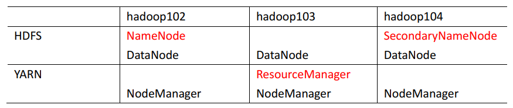
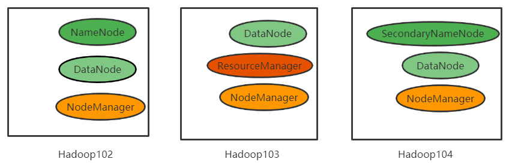

---

Created at: 2021-08-24
Last updated at: 2022-12-18
Source URL: https://blog.csdn.net/yljphp/article/details/88926491


---

# 2-Hadoop集群搭建


centos8安装时设置安装源：
```
https://mirrors.aliyun.com/centos/8-stream/BaseOS/x86_64/os/
```

修改主机名
vim /etc/hostname
 

安装epel-release
yum install -y epel-release

安装ifconfig
yum install -y net-tools

安装vim
yum install -y vim

关闭防火墙
systemctl stop firewalld
systemctl disable firewalld.service

配置VMWare的虚拟网络设置

配置静态ip
vim /etc/sysconfig/network-scripts/ifcfg-ens33
```
BOOTPROTO="static"
#IP地址
IPADDR=192.168.10.100  
#网关
GATEWAY=192.168.10.2      
#域名解析器
DNS1=192.168.10.2
```

修改Linux的hosts文件
vim /etc/hosts
```
192.168.10.100 hadoop100
192.168.10.101 hadoop101
192.168.10.102 hadoop102
192.168.10.103 hadoop103
192.168.10.104 hadoop104
```

同上，修改Windows的hosts文件 C:\\Windows\\System32\\drivers\\etc

重启Linux
reboot

查看主机名 hostname

创建新用户
useradd jmoon
passwd jmoon

配置jmoon用户具有root权限，方便后期加sudo执行root权限的命令
vim /etc/sudoers
```
root    ALL=(ALL)       ALL

## Allows members of the 'sys' group to run networking, software,
## service management apps and more.
# %sys ALL = NETWORKING, SOFTWARE, SERVICES, STORAGE, DELEGATING, PROCESSES, LOCATE, DRIVERS

## Allows people in group wheel to run all commands
%wheel  ALL=(ALL)       ALL

jmoon   ALL=(ALL)       NOPASSWD:ALL
```

切换用户
su jmoon

创建文件夹，以后的资源放在里面统一管理
sudo mkdir /opt/module
sudo mkdir /opt/software

修改文件夹所属用户和组
sudo chown jmoon:jmoon /opt/module/ /opt/software/

在root用户下卸载OpenJDK（如果是最小安装无需进行此步）
rpm -qa | grep -i java | xargs -n1 rpm -e --nodeps

* rpm -qa：表示查询所有已经安装的软件包
* grep -i：表示过滤时不区分大小写
* xargs -n1：表示一次获取上次执行结果的一个值
* rpm -e --nodeps：表示卸载软件

下载JDK8后上传到/opt/software然后解压到/opt/module
tar -zxvf /opt/software/jdk-8u301-linux-x64.tar.gz -C /opt/module/

下载hadoop后上传到/opt/software然后解压到/opt/module
tar -zxvf /opt/software/hadoop-3.3.1.tar.gz -C /opt/module/

配置环境变量
sudo vim /etc/profile.d/my\_env.sh
```
#JAVA_HOME
export JAVA_HOME=/opt/module/jdk-11.0.12
export PATH=$PATH:$JAVA_HOME/bin

#HADOOP_HOME
export HADOOP_HOME=/opt/module/hadoop-3.3.1
export PATH=$PATH:$HADOOP_HOME/bin
export PATH=$PATH:$HADOOP_HOME/sbin
```
$HADOOP\_HOME/bin目录下是hadoop、hdfs、yarn、mapreduce的操作命令
$HADOOP\_HOME/sbin目录下是启动停止hadoop、yarn的命令

使环境变量生效
source /etc/profile

测试
java -version
hadoop version

安装rsync
sudo yum install -y rsync

在/home/jmoon目录下创建bin目录（/home/jmoon/bin已被添加到用户jmoon的环境变量中了，所以直接创建这样一个目录，在下面编写脚本就不用再另外配置环境变量了），然后编写同步分发脚本
vim xsync
```
#!/bin/bash

#1. 判断参数个数
if [ $# -lt 1 ]
then
    echo Not Enough Arguement!
    exit;
fi

#2. 遍历集群所有机器
for host in hadoop102 hadoop103 hadoop104
do
    echo ====================  $host  ====================
    #3. 遍历所有目录，挨个发送
    for file in $@
    do
        #4. 判断文件是否存在
        if [ -e $file ]
            then
                #5. 获取父目录
                pdir=$(cd -P $(dirname $file); pwd)

                #6. 获取当前文件的名称
                fname=$(basename $file)
                ssh $host "mkdir -p $pdir"
                rsync -av $pdir/$fname $host:$pdir
            else
                echo $file does not exists!
        fi
    done
done
```

给xsync增加可执行权限 chmod +x xsync

终端配色：
在~/.bashrc中添加
```
PS1="\[\e[33m\][\[\e[35m\]\u\[\e[33m\]@\[\e[36m\]\h \[\e[32m\]\W\[\e[33m\]]\\$\[\e[0m\] "
```
然后 source .bashrc

取消 SELINUX ：
修改/etc/selinux/config 中的 SELINUX=disabled
```
sudo vim /etc/selinux/config
```
```
SELINUX=disabled
```

克隆三台hadoop主机：hadoop102、hadoop103、hadoop104，修改主机名和静态ip地址设置之后重启

配置免密登录：
在三台主机上执行ssh-keygen -t rsa，然后在三台主机上执行 ssh-copy-id hadoop102，接着把Windows（宿主机）的公钥复制到~/.ssh/authorized\_keys，最后在hadoop102上执行 xsync ~/.ssh/authorized\_keys

集群部署规划
  注意：
    NameNode和SecondaryNameNode不要安装在同一台服务器
    ResourceManager也很消耗内存，不要和NameNode、SecondaryNameNode配置在同一台机器上。



按以上规划修改hadoop102上的$HADOOP\_HOME/etc/hadoop路径下的自定义配置文件 core-site.xml、 hdfs-site.xml、 yarn-site.xml、 mapred-site.xml
配置 core-site.xml
vim $HADOOP\_HOME/etc/hadoop/core-site.xml
```
<configuration>

    <!-- 指定 NameNode 的地址 -->
    <property>
        <name>fs.defaultFS</name>
        <value>hdfs://hadoop102:8020</value>
    </property>

    <!-- 指定 hadoop 数据的存储目录 -->
    <property>
        <name>hadoop.tmp.dir</name>
        <value>/opt/module/hadoop-3.3.1/data</value>
    </property>

    <!-- 配置 HDFS 网页登录使用的静态用户为 jmoon，不配置无法在网页端删除文件 -->
    <property>
        <name>hadoop.http.staticuser.user</name>
        <value>jmoon</value>
    </property>

</configuration>
```

配置 hdfs-site.xml
vim $HADOOP\_HOME/etc/hadoop/hdfs-site.xml
```
<configuration>

    <!-- nn web 端访问地址-->
    <property>
        <name>dfs.namenode.http-address</name>
        <value>hadoop102:9870</value>
    </property>

    <!-- 2nn web 端访问地址-->
    <property>
        <name>dfs.namenode.secondary.http-address</name>
        <value>hadoop104:9868</value>
    </property>

</configuration>
```

配置 yarn-site.xml
vim $HADOOP\_HOME/etc/hadoop/yarn-site.xml
```
<configuration>

    <!-- 指定 MR 走 shuffle -->
    <property>
        <name>yarn.nodemanager.aux-services</name>
        <value>mapreduce_shuffle</value>
    </property>

    <!-- 指定 ResourceManager 的地址-->
    <property>
        <name>yarn.resourcemanager.hostname</name>
        <value>hadoop103</value>
    </property>

    <!-- 环境变量的继承，不配置没法运行mapreduce程序，提示找不到类-->
    <property>
        <name>yarn.nodemanager.env-whitelist</name>
        <value>JAVA_HOME,HADOOP_COMMON_HOME,HADOOP_HDFS_HOME,HADOOP_CONF_DIR,CLASSPATH_PREPEND_DISTCACHE,HADOOP_YARN_HOME,HADOOP_MAPRED_HOME</value>
    </property>

</configuration>
```

配置 mapred-site.xml
vim $HADOOP\_HOME/etc/hadoop/mapred-site.xml
```
<configuration>

    <!-- 指定 MapReduce 程序运行在 Yarn 上 -->
    <property>
        <name>mapreduce.framework.name</name>
        <value>yarn</value>
    </property>

</configuration>
```

配置 workers
vim $HADOOP\_HOME/etc/hadoop/workers
```
hadoop102
hadoop103
hadoop104
```

将修改好的配置文件从hadoop102分发到hadoop103、hadoop104
xsync $HADOOP\_HOME/etc/hadoop/

第一次启动集群，需要在 hadoop102 节点格式化 NameNode
hdfs namenode -format
格式化完毕之后，会在Hadoop的安装目录下多出data和logs目录
（注意：格式化 NameNode，会产生新的集群 id，导致 NameNode 和 DataNode 的集群 id 不一致，集群找不到已往数据。 如果集群在运行过程中报错，需要重新格式化 NameNode 的话， 一定要先停止 namenode 和 datanode 进程， 并且要删除所有机器的 data 和 logs 目录，然后再进行格式化。）

在任何一台主机上输入 start-dfs.sh 命令 就可以群启动hdfs，群起的前提是需要配置workers和主机之间的免密登录（待验证）：
start-dfs.sh
`查看hdfs：hadoop102:9870`
单节点启动命令：
hdfs --daemon start datanode
hdfs --daemon start namenode

在hadoop103上输入 start-yarn.sh 命令 可以在hadoop103上启动ResourceManager，并且群起所有主机上的NodeManager（如果在其它主机上输入start-yarn.sh 命令只能群起所有主机上的NodeManager，不能启动Hadoop103的ResourceManager，这与hdfs群起不同，不知道为什么）
start-yarn.sh
`查看yarn：hadoop103:8088`
单节点启动命令：
yarn --daemon start resourcemanager
yarn --daemon start nodemanager

上传文件到hdfs
创建目录：hadoop fs -mkdir /input
上传：hadoop fs -put ~/word.txt /input

下载
hadoop fs -get /input/word.txt ./

执行 wordcount 程序测试yarn
hadoop jar $HADOOP\_HOME/share/hadoop/mapreduce/hadoop-mapreduce-examples-3.3.1.jar wordcount /input /output

删除文件
hadoop fs -rm -r /output

停止集群
stop-all.sh

配置历史服务器
vim $HADOOP\_HOME/etc/hadoop/mapred-site.xml
```
<!-- 历史服务器端地址 -->
<property>
    <name>mapreduce.jobhistory.address</name>
    <value>hadoop102:10020</value>
</property>
<!-- 历史服务器 web 端地址 -->
<property>
    <name>mapreduce.jobhistory.webapp.address</name>
    <value>hadoop102:19888</value>
</property>
```
分发配置
xsync $HADOOP\_HOME/etc/hadoop/mapred-site.xml

因为配置的是在hadoop102，所以要在 hadoop102 启动历史服务器
mapred --daemon start historyserver

`查看historyserver：hadoop102:19888/jobhistory`

开启日志聚集功能
vim $HADOOP\_HOME/etc/hadoop/yarn-site.xml
```
<!-- 开启日志聚集功能 -->
<property>
    <name>yarn.log-aggregation-enable</name>
    <value>true</value>
</property>
<!-- 设置日志聚集服务器地址 -->
<property>
    <name>yarn.log.server.url</name>
    <value>http://hadoop102:19888/jobhistory/logs</value>
</property>
<!-- 设置日志保留时间为 7 天 -->
<property>
    <name>yarn.log-aggregation.retain-seconds</name>
    <value>604800</value>
</property>
```

分发配置
xsync $HADOOP\_HOME/etc/hadoop/yarn-site.xml

关闭 NodeManager 、 ResourceManager 和 HistoryServer
stop-yarn.sh
mapred --daemon stop

启动 NodeManager 、 ResourceManage 和 HistoryServer
start-yarn.sh
mapred --daemon start historyserver

脚本启动和停止集群
与xsync一样放在/home/jmoon/bin下
vim cluster.sh
```
#!/bin/bash

if [ $# -lt 1 ]
then
    echo "No Args Input..."
    exit ;
fi

case $1 in
"start")
        echo " =================== 启动 hadoop集群 ==================="

        echo " --------------- 启动 hdfs ---------------"
        ssh hadoop102 "/opt/module/hadoop-3.3.1/sbin/start-dfs.sh"
        echo " --------------- 启动 yarn ---------------"
        ssh hadoop103 "/opt/module/hadoop-3.3.1/sbin/start-yarn.sh"
        echo " --------------- 启动 historyserver ---------------"
        ssh hadoop102 "/opt/module/hadoop-3.3.1/bin/mapred --daemon start historyserver"
;;
"stop")
        echo " =================== 关闭 hadoop集群 ==================="

        echo " --------------- 关闭 historyserver ---------------"
        ssh hadoop102 "/opt/module/hadoop-3.3.1/bin/mapred --daemon stop historyserver"
        echo " --------------- 关闭 yarn ---------------"
        ssh hadoop103 "/opt/module/hadoop-3.3.1/sbin/stop-yarn.sh"
        echo " --------------- 关闭 hdfs ---------------"
        ssh hadoop102 "/opt/module/hadoop-3.3.1/sbin/stop-dfs.sh"
;;
*)
    echo "Input Args Error..."
;;
esac
```

可执行权限：chmod +x ~/bin/cluster.sh
分发：xsync ~/bin/cluster.sh

查看所有主机的jps
vim ~/bin/jpsall
```
#!/bin/bash

for host in hadoop102 hadoop103 hadoop104
do
    echo =============== $host ===============
    ssh $host jps
done
```
chmod +x ~/bin/jpsall
xsync ~/bin/jpsall

面试题：

1. 常用端口号 hadoop3.x

        HDFS NameNode 服务端口：`8020`/9000/9820 web端口：`9870`
        Yarn 服务端口：8032 web端口：`8088`
        历史服务器historyserver web端口：`19888`

2. 常用的配置文件 hadoop3.x

        core-site.xml  hdfs-site.xml  yarn-site.xml  mapred-site.xml workers

