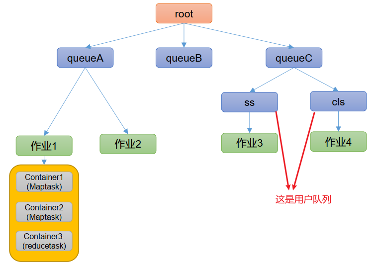

---

Created at: 2021-08-28
Last updated at: 2021-08-28

---

# 20-Yarn 调度器和调度算法

Hadoop 作业调度器主要有三种： FIFO、 容量（Capacity Scheduler） 和公平（Fair Scheduler） 。 Apache Hadoop3.1.3 默认的资源调度器是 Capacity Scheduler。 CDH 框架默认调度器是 Fair Scheduler。
调度器的调度算法在逻辑上是一个树形结构，像这样：

默认只有一个default队列，只有树的叶子节点才是真正可以容纳作业的队列，资源分配的流程是，先给队列分配资源，再把队列分得的资源分给作业，再把作业分得的资源分给容器。

