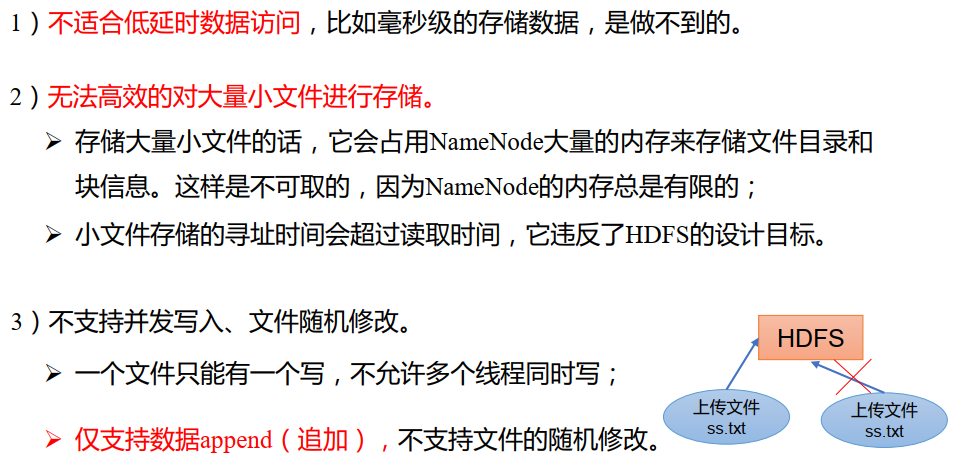
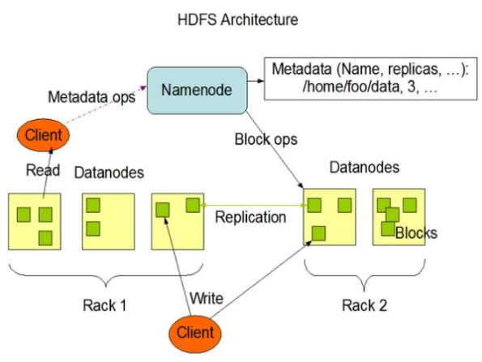
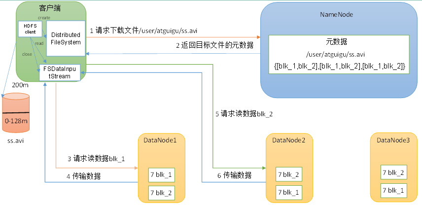
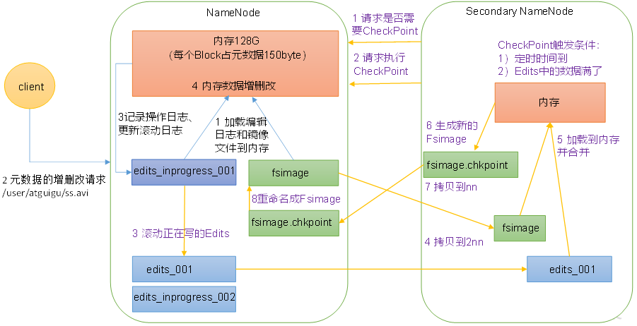
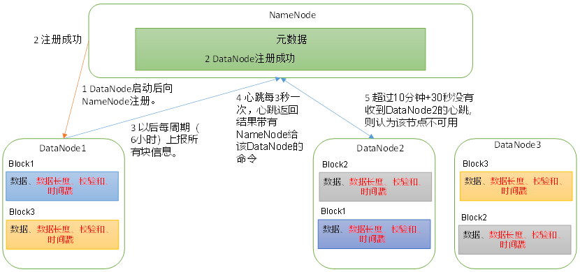

---

Created at: 2021-08-24
Last updated at: 2022-07-20
Source URL: https://www.huaweicloud.com/articles/c20ea5cd4c790d52801925ad52a746b1.html


---

# 3-HDFS


HDFS（Hadoop Distributed File System）是分布式文件系统，与Redis那样的分布式数据库不同，Redis分布式数据库可以一条数据一条数据的增删改查，所以Redis要解决的问题是如何将数据均匀的散列在每台机器上，但是HDFS则完全不同，它是针对文件的存储，并不能实时的进行改和查。它们俩面对的问题不同，就像数据库和本地电脑上的文件系统一样，也确实是，本地文件系统本来和数据库解决的问题不同， 本地文件系统升级成分布式文件系统就成了HDFS，单机数据库升级就成了分布式数据库。
本地文件系统和HDFS针对是文件，数据库和分布式数据库针对的是一条一条的数据。

HDFS的优点：

1. 高容错性

① 数据自动保存多个副本
② 副本丢失之后自动恢复到指定的数量

2. 适合处理大数据

        ① 数据量可达PB级别
        ② 文件数量可达百万级别

3. 可构建在廉价的机器上

HDFS的缺点：


HDFS 组成架构

HDFS采用主从（Master/Slave）架构，由HDFSClient、NameNode、DataNode和SecondaryNameNode四部分组成。

NameNode（ nn）：即Master，namenode管理着文件系统的命名空间，维护着整棵文件系统树，这些信息称为文件系统的元数据，namenode将文件系统的元数据存储在内存中，因此文件系统所能存储的文件总数受限于namenode的内存容量，每个文件、目录和数据块的存储信息大约占150个字节，为了保证可靠性，当然不能仅仅只把元数据放在内存中，namenode还会把元数据信息以两个文件的形式永久地保存本地磁盘上：命名空间镜像文件fsimage 和 编辑日志文件edits。namenode也记录着每个文件各个块所在的数据节点信息，但它并不永久的保存块的位置信息，因为这些信息由datanode保存，在集群启动时以及启动后的每60分钟，datanode会像namenode汇报这些信息。namenode还有一个职责就是处理客户端的读写请求。

DataNode：即Slave，datanode是文件系统的工作节点， 执行数据块的读/写操作。datanode根据需要存储并检索数据块（受客户端或namenode调度），并定期向namenode发送所存储的块的列表。

Client：就是客户端，负责：

1. 文件切分，文件上传HDFS的时候，Client将文件切分成一个一个的Block，然后进行上传
2. 与NameNode交互， 获取文件的位置信息
3. 与DataNode交互， 读取或者写入数据

SecondaryNameNode（2NN）： 辅助NameNode， 分担其工作量，即定期合并Fsimage和Edits， 并推送给NameNode 。SecondaryNameNode并非NameNode的热备，当NameNode挂掉的时候，它并不能马上替换NameNode并提供服务，不过在紧急情况下， 可辅助恢复NameNode。

HDFS 文件块大小在Hadoop2.x/3.x版本中默认是128M，为什么块的大小不能设置太小，也不能设置太大？
因为HDFS的块设置太小， 会增加寻址时间；由于MapReduce任务的切片大小默认等于块大小，所以一个map任务通常只处理一个块中的数据，如果块设置太大，会导致map任务数太少，作业运行效率就变低了。

HDFS 的 Shell 操作
基本语法： hadoop fs 具体命令 或者 hdfs dfs 具体命令

上传：

1. \-moveFromLocal：从本地剪切粘贴到 HDFS

```
hadoop fs -moveFromLocal ./shuguo.txt /sanguo
```

2. \-copyFromLocal：从本地文件系统中拷贝文件到 HDFS 路径去

```
hadoop fs -copyFromLocal weiguo.txt /sanguo
```
        等同于 -put
```
hadoop fs -put ./wuguo.txt /sanguo
```

3. \-appendToFile：追加一个文件到已经存在的文件末尾

```
hadoop fs -appendToFile liubei.txt /sanguo/shuguo.txt
```

下载：
     -copyToLocal：从 HDFS 拷贝到本地
```
  hadoop fs -copyToLocal /sanguo/shuguo.txt ./
```
     等同于-get：
```
hadoop fs -get /sanguo/shuguo.txt ./shuguo2.txt
```

其它：

1. \-mkdir 创建文件夹： hadoop fs -mkdir /sanguo
2. \-ls 显示目录信息： hadoop fs -ls /sanguo
3. \-cat 显示文件内容： hadoop fs -cat /sanguo/shuguo.txt
4. \-chgrp、 -chmod、 -chown： Linux 文件系统中的用法一样，修改文件所属权限

            hadoop fs -chmod 666
            hadoop fs -chown jmoon:jmoon /sanguo/shuguo.txt

5. \-cp 从 HDFS 的一个路径拷贝到 HDFS 的另一个路径：hadoop fs -cp /sanguo/shuguo.txt /jinguo
6. \-mv 在 HDFS 目录中移动文件： hadoop fs -mv /sanguo/wuguo.txt /jinguo
7. \-tail 显示一个文件的末尾 1kb 的数据： hadoop fs -tail /jinguo/shuguo.txt
8. \-rm 删除文件或文件夹： hadoop fs -rm /sanguo/shuguo.txt
9. \-rm -r 递归删除目录及目录里面内容： hadoop fs -rm -r /sanguo
10. \-du 统计文件夹的大小信息： hadoop fs -du -s -h /jinguo

         结果：27 81 /jinguo  27 表示文件大小； 81 表示 27\*3 个副本； /jinguo 表示查看的目录

11. \-setrep 设置 HDFS 中文件的副本数量： hadoop fs -setrep 10 /jinguo/shuguo.txt

HDFS 写数据流程

（1）客户端通过Distributed FileSystem模块向NameNode请求上传文件。
（2）NameNode检查目标文件是否已存在，父目录是否存在，NameNode返回是否可以上传。
（3）客户端请求第一个 Block上传到哪几个DataNode服务器上。
（4）NameNode返回3个DataNode节点，分别为dn1、dn2、dn3。
（5）客户端通过FSDataOutputStream模块请求dn1上传数据，dn1收到请求会继续调用dn2，然后dn2调用dn3，将这个通信管道建立完成。
（6）dn1、dn2、dn3逐级应答客户端。
（7）客户端开始往dn1上传第一个Block（先从磁盘读取数据放到一个本地内存缓存），以Packet为单位，dn1收到一个Packet就会传给dn2，dn2传给dn3；dn1每传一个packet会放入一个应答队列等待应答。
（8）当一个Block传输完成之后，客户端再次请求NameNode上传第二个Block的服务器。（重复执行3-7步）。

HDFS 读数据流程

（1）客户端通过DistributedFileSystem向NameNode请求下载文件，NameNode通过查询元数据，找到文件块所在的DataNode地址。
（2）挑选一台DataNode（就近原则，然后随机）服务器，请求读取数据。
（3）DataNode开始传输数据给客户端（从磁盘里面读取数据输入流，以Packet为单位来做校验）。
（4）客户端以Packet为单位接收，先在本地缓存，然后写入目标文件。

NN 和 2NN 工作机制
NameNode在内存中维护着元数据信息，每次接收增删的请求会直接修改内存中的元数据信息，但不可能在每次修改过后都将元数据信息直接保存到本地磁盘上，因为这样造成的磁盘IO代价太大了，但是又必须把修改后的信息保存到磁盘上，怎么办呢，NameNode采取的做法是追加写的方式，也就是将修改操作追加写到磁盘中，但这样又会带来一个问题，一直追加写会导致磁盘上的这个文件变得特别大，如果下次重启NameNode将会花费大量时间来合并原始元数据文件和追加写文件，如果NameNode采用隔一段时间就合并一次又会造成NameNode节点负担太重，于是这时就引出SecondaryNameNode了，每当NN追加写时将修改操作保存到edits\_inprogress文件中，当edits\_inprogress达到1kb停止往这个文件上写，把这个edits\_inprogress更名为edits，然后再开启另外一个edits\_inprogress继续追加写，2NN负责拉取NN上的edits与自己之前的fsimage合并，合并完之后再把fsimage传送给NN。

具体工作流程如下：



第一阶段：NameNode启动
（1）第一次启动NameNode格式化后，创建Fsimage和Edits文件。如果不是第一次启动，直接加载编辑日志和镜像文件到内存。
（2）客户端对元数据进行增删改的请求。
（3）NameNode记录操作日志，更新滚动日志。
（4）NameNode在内存中对元数据进行增删改。
第二阶段：Secondary NameNode工作
（1）Secondary NameNode询问NameNode是否需要CheckPoint。直接带回NameNode是否检查结果。
（2）Secondary NameNode请求执行CheckPoint。
（3）NameNode滚动正在写的Edits日志。
（4）将滚动前的编辑日志和镜像文件拷贝到Secondary NameNode。
（5）Secondary NameNode加载编辑日志和镜像文件到内存，并合并。
（6）生成新的镜像文件fsimage.chkpoint。
（7）拷贝fsimage.chkpoint到NameNode。
（8）NameNode将fsimage.chkpoint重新命名成fsimage。

DataNode工作机制

（1）一个数据块在DataNode上以文件形式存储在磁盘上，包括两个文件，一个是数据本身，一个是元数据包括数据块的长度，块数据的校验和，以及时间戳。
（2）DataNode启动后向NameNode注册，通过后，周期性（6小时）的向NameNode上报所有的块信息。
（3）心跳是每3秒一次，心跳返回结果带有NameNode给该DataNode的命令如复制块数据到另一台机器，或删除某个数据块。如果超过10分钟没有收到某个DataNode的心跳，则认为该节点不可用。
（4）集群运行中可以安全加入和退出一些机器。

